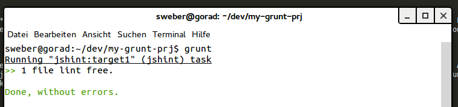

Ich möchte mit diesem Beitrag eine Beitragsreihe starten zum Thema Frontend-Entwicklung mit Grunt. Teil 1 beschreibt, was Grunt ist und wie man es verwendet.

# Was ist Grunt?

Ben Alman [veröffentlichte im März 2012](http://benalman.com/news/2012/03/introducing-grunt/) Grunt und beschrieb die damalige Version als Task-basiertes Kommandozeilenwerkzeug für Javascript-Projekte. Mittlerweile geht es weit über diesen Anwendungsfall hinaus. [Grunt](http://gruntjs.com/) stellt inzwischen einen mächtigen Javascript Task Runner dar, mit dem viele anfallenden Aufgaben bei der Entwicklung von Web-Projekten automatisiert werden können, wie beispielsweise das Überführen von Sass-Code in CSS-Code, minifying von CSS oder uglifying von Javascript-Code. Eine große Stärke von Grunt ist es, dass aufwändige, manuelle, immerwiederkehrende Tasks während des Entwicklungsprozesses automatisiert werden können. Damit kann eine Art "Entwicklungsfließband" aufgebaut werden.

Neben einem Task Runner wird Grunt oft auch als Build Tool bezeichnet, da es sich wie oben bereits beschrieben auch wunderbar für die Konvertierung von Quellcode in neue Artefakte (z.B. [Sass](http://sass-lang.com/) / [Less](http://lesscss.org/) nach CSS) eignet. Grunt ist aber mehr als ein reines Build Tool, weil auch andere Tasks im Entwicklungsprozess behandelt werden können, wie  z.B. "file watching", "unit testing" oder auch "end-to-end testing", um nur einige wenige zu nennen. Diese Dinge werden über [Grunt-Plugins](http://gruntjs.com/plugins) bereitgestellt.

# Wie hängt Grunt mit Node.js zusammen?

Bei [Node.js](http://nodejs.org/) handelt es sich um eine Plattform zur Entwicklung von Javascript command-line Tools. Grunt ist ein solches command-line tool.

Wenn Node.js auf dem System installiert ist, können die verschiedenen Bestandteile von Grunt mit dem Paketmanager für Node.js [npm](https://www.npmjs.com/) installiert werden. Wie auf der [offiziellen Seite](http://gruntjs.com/upgrading-from-0.3-to-0.4) beschrieben, besteht Grunt aus 3 Teilen (zumindest seit Version 0.4):

- Das npm Modul *grunt* beinhaltet die Grunt-Logik um Tasks auszuführen, Grunt-Plugins zu laden, usw. und wird lokal zum Entwicklungsprojekt installiert.
- Das npm Modul *grunt-cli* wird global im System installiert und fügt lediglich den *grunt* Befehl in den Systempfad hinzu, so dass dieser im Terminal ausgeführt werden kann.
- Auf das npm Modul *grunt-init* gehe ich nicht weiter ein, da [das Projekt](https://github.com/gruntjs/grunt-init) auf Kurz oder Lang durch das Node.js command-line Tool [Yeoman](http://yeoman.io/) ersetzt werden wird. Letzteres ermöglicht u.a. das Generieren von boilerplate Projekten, um einen schnellen Einstieg im Entwicklungsprojekt zu haben.

# Aufsetzen eines Grunt-Projekts

Das initiale Setup für die Verwendung von Grunt ist in wenigen Schritten erledigt. Hat man das ein paar mal gemacht, geht das recht zügig von der Hand.

## grunt-cli installieren

Als erstes benötigen wir das command-line interface, welches wir wie folgt global installieren.


$ npm install -g grunt-cli


Dieser Schritt ist auch nur einmal nötig, dann steht der Befehl für zukünftige Entwicklungsprojekte zur Verfügung.

## Gruntfile.js erzeugen

Anstatt uns ein Projekt-Template mit *grunt-init* oder Yeoman generieren zu lassen, welches die für Grunt nötigen Dateien generiert, setzen wir unser Grunt-Projekt von Hand auf. Dazu legen wir einen Projektordner an und wechseln in diesen.


$ mkdir my-grunt-prj && cd my-grunt-prj


Als nächstes legen wir im root-Verzeichnis des Projekts ein *Gruntfile.js* an und fügen folgenden Code ein.


module.exports = function(grunt) {

  grunt.loadNpmTasks('grunt-contrib-jshint');

  grunt.initConfig({
    jshint: {
      target1: ['Gruntfile.js']
    }
  });

  grunt.registerTask('default', ['jshint']);
};


In diesem Beispielcode verwenden wir das [Jshint Plugin](https://github.com/gruntjs/grunt-contrib-jshint), konfigurieren einen Task "jshint" so, dass die Datei *Gruntfile.js* analysiert wird und definieren unseren Task im letzten Schritt als Default-Task. Mit *loadNpmTasks* laden wir das Plugin.

Alternativ hätten wir das Gruntfile auch wie folgt generieren lassen können.


$ grunt-init gruntfile


## package.json erzeugen und konfigurieren

Im nächsten Schritt müssen wir eine Datei *package.json* im root-Verzeichnis anlegen und folgenden Inhalt einfügen. Alternativ hätten wir das auch wieder mit *grunt-init* machen können.


{
  "name": "my-grunt-prj",
  "version": "0.0.1",
  "description": "Mein Grunt Projekt"
}


Als nächstes müssen wir den eigentlichen Task Runner als npm Modul zu unserem Projekt als Entwicklungsabhängigkeit (development dependency) hinzufügen. Sprich, wir müssen *grunt* in unser *package.json* aufnehmen. Weiterhin fügen wir noch das [Grunt Plugin JShint](https://github.com/gruntjs/grunt-contrib-jshint) hinzu, mit dem wir Javascript Dateien in unserem Projekt [validieren](http://jshint.com/docs/) können. Ansatt das Hinzufügen der Abhängigkeiten per Hand zu tun, verwenden wir npm wie folgt:


$ npm install grunt --save-dev
$ npm install grunt-contrib-jshint --save-dev


Wenn wir uns nun *package.json* erneut anschauen, sollte es so oder so ähnlich (Versionsummern können sich unterscheiden) aussehen:


{
  "name": "my-grunt-prj",
  "version": "0.0.1",
  "description": "Mein Grunt Projekt",
  "devDependencies": {
    "grunt": "^0.4.5",
    "grunt-contrib-jshint": "^0.10.0"
  }
}


Mit *--save-dev* fügen wir Abhängigkeiten in den *devDependencies* Bereich hinzu. In diesem Bereich listen wir die Abhängigkeiten auf, die für die Entwicklungszeit benötigt werden, wie z.B. Kompilieren von Sass nach CSS, testen, usw. 

Wir können aber auch Abhängigkeiten in den *dependencies* Bereich aufnehmen, wenn wir *--save* anstatt *--save-dev* verwenden. Hier werden die Abhängigkeiten gelistet, die im Produktivsystem, also auch zur Laufzeit, benötigt werden.

Für eine Grunt-Entwicklungsumgebung werden sowohl *package.json* als auch *Gruntfile.js* benötigt. Der *grunt* Befehl sucht nach einer *Gruntfile.js* Datei und wirft eine Fehlermeldung, falls diese Datei nicht existiert. Es existiert quasi eine Beziehung zwischen *grunt* und *Gruntfile.js*, wie sie auch zwischen dem Befehl *npm* und der Datei *package.json* existiert.

## Warum wird zwischen grunt und grunt-cli unterschieden?

Das Grunt Command-line interface (CLI) *grunt-cli* wird als seperates Modul bereitgestellt und wird im Gegensatz zu *grunt* global auf dem Entwicklungssystem installiert. Aber warum? Der Grund ist, dass wir Grunt auf einem System in verschiedenen Projekten mit unterschiedlichen, möglicherweise rückwärts-inkompatiblen, Grunt-Versionen verwenden können. *grunt-cli* sucht nach einer Instanz von Grunt, d.h. dem *grunt* Modul, ausgehend vom aktuellen Verzeichnis, indem der Befehl ausgeführt wurde.

## Abhängigkeiten / npm Module installieren

Wenn eine *package.json* Datei existiert, können die darin definierten Abhängigkeiten im Projekt installiert werden, indem im root-Verzeichnis folgender Befehl ausgeführt wird:


$ npm install


Anschließend findet man ein Verzeichnis *node_modules*, welches die in *package.json* beschriebenen Module enthält. In einem Entwicklungsprojekt, in dem ein Versionskontrollsystem wie z.B. Git verwendet wird, sollte dieser Ordner aus der Versionkontrolle exkludiert werden, da er durch den eben beschriebenen Befehl automatisch erzeugt und "befüllt" wird.

## Grunt ausführen

Nachdem wir *package.json* und *Gruntfile.js* erzeugt und konfiguriert haben, können wir in unserem Projektverzeichnis den *grunt* Befehl ausführen. In unserem kleinen Beispiel wird dadurch der "jshint" Task ausgeführt.


$ grunt


Da "jshint" als default Task definiert wurde, reicht es, den *grunt* Befehl ohne Argument aufzurufen. Folgende beiden Aufrufe würden zum selben Ergebnis führen:


$ grunt default
$ grunt jshint


Dadurch wird unser *Gruntfile.js* validiert, wie im folgende Bild zu sehen ist.

# Wie funktioniert das Gruntfile?

Wenn wir uns unser *Gruntfile.js* anschauen, so "umhüllt" folgender Code die eigentliche Grunt-Konfiguration.


module.exports = function(grunt) {
	// Grunt-related things go here
}


Wie auf der [offiziellen Grunt Seite](http://gruntjs.com/getting-started) beschrieben, wird dieser Teil als "wrapper function" bezeichnet, den jedes Gruntfile (und Gruntplugin) haben muss. Es handelt sich um eine Funktion, die lediglich ein Objekt als Argument entgegen nimmt: das *grunt* Objekt. Grunt ruft unsere Funktion dann mit dem *grunt* Objekt als einziges Argument auf. Dieses *grunt* Objekt stellt die API von Grunt dar und ist das Objekt, welches wir verwenden, um mit Grunt zu interagieren. Das Objekt stellt Properties und Methoden bereit, mit denen u.a.Konfigurationen geladen und aktualisiert (*grunt.config*) oder auch Tasks registriert und geladen (*grunt.task*) werden können. 

Die Funktion *grunt.initConfig* (welches ein Alias für *grunt.config.init* darstellt) nimmt ein Objekt entgegen, welches als Ausgangspunkt für die weitere Konfiguration verwendet wird. Die Funktionen *grunt.config.get* und *grunt.config.set* können verwendet werden, um individuelle Properties zu holen oder zu setzen. In unserem Beispiel haben wir eine Konfiguration "jshint" erzeugt.


grunt.initConfig({
	jshint: {
	  target1: ['Gruntfile.js']
	}
});


Mit der Funktion *grunt.loadNpmTasks* können Plugins und Tasks geladen werden. In unserem Beispiel haben wir dadurch das Grunt Plugin *grunt-contrib-jshint* geladen. 


grunt.loadNpmTasks('grunt-contrib-jshint');


Mit der Funktion *grunt.registerTask* (Alias für *grunt.task.registerTask*) haben wir einen Default-Task definiert und den "jshint" Task zugewiesen, so dass dieser automatisch ausgeführt wird, wenn wir *grunt* ohne Argument aufrufen.


grunt.registerTask('default', ['jshint']);


Dieser Abschnitt möchte lediglich ein grundlegendes Verständnis der Funktionsweise von *Gruntfile.js* und der Grunt API vermitteln. Die [Grunt Dokumentation](http://gruntjs.com/api/grunt) bietet einen guten Überblick, welche Funktionen und Properties durch das *grunt* Objekt zur Verfügung gestellt werden. 

# Wie geht es weiter?

Dieser Beitrag bietet eine Einführung in das Thema Grunt. Im Teil 2 der Beitragsreihe gehe ich näher auf nützliche Grunt Plugins und deren Verwendung ein.
