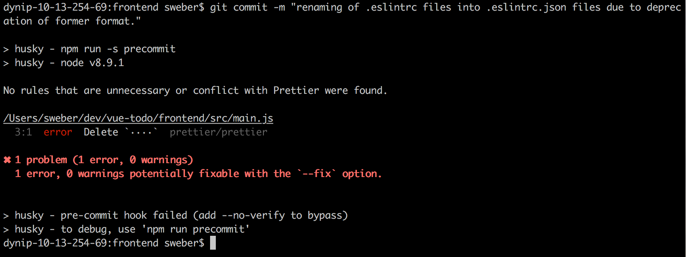
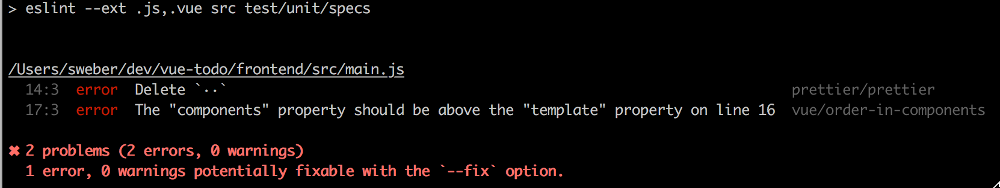
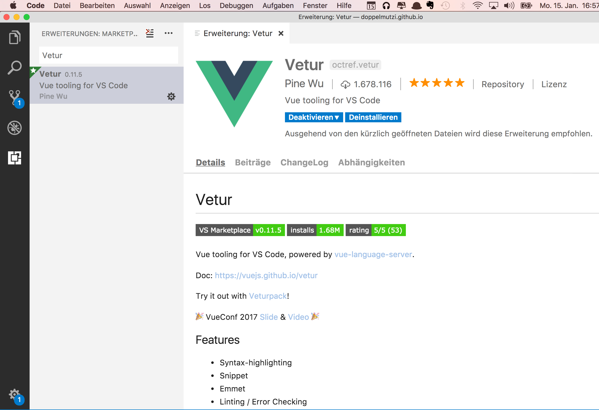
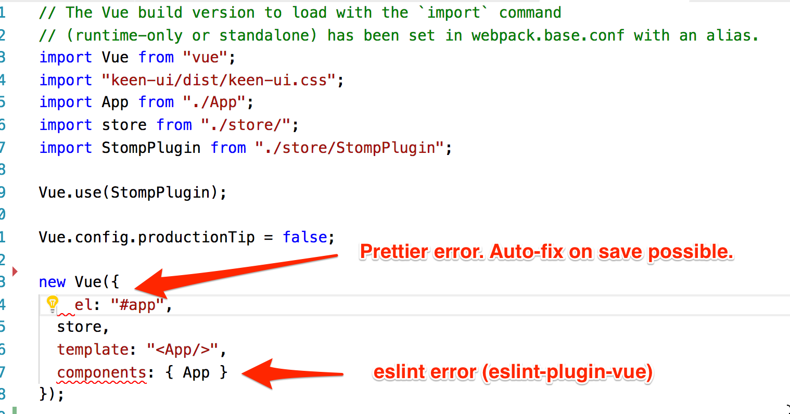
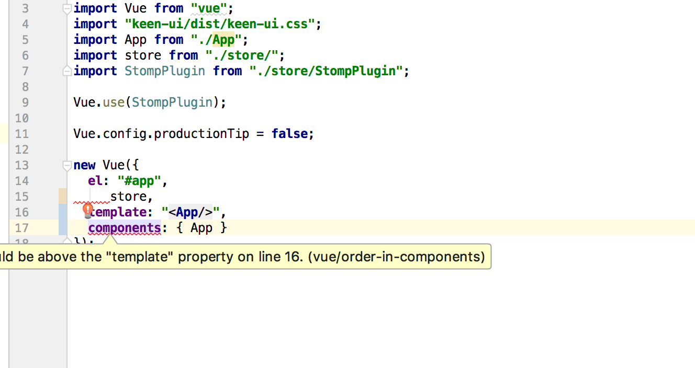
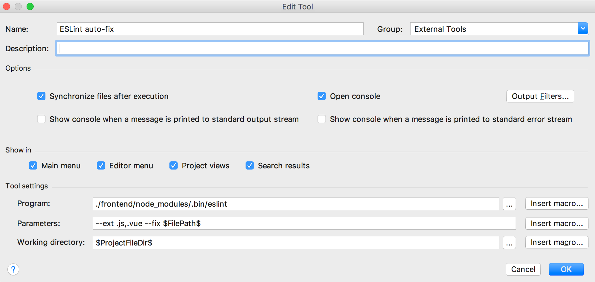
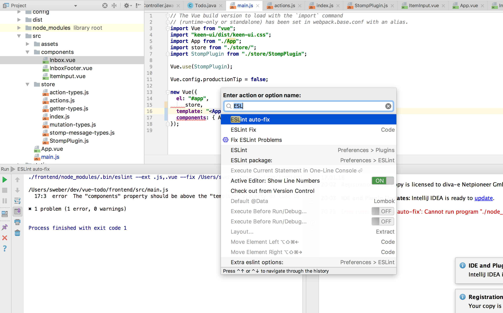

Lately, I have been investigating quite some time into linting and formatting of JavaScript code for large projects with many developers and diverse set of editors or IDEs. In many projects at work, tools like _JSHint_, _ESLint_, or _Prettier_ are all over the place. I realized that I didn't have a thorough overview of concepts and technologies for static code analyzing and formatting. Thus, I have started to get a better idea on how to establish a robust development workflow that works from within different editors as well as from npm scripts.

# Automation is the Key &ndash; Improving Productivity

The talk of [Chris Heilman](https://twitter.com/codepo8) at [Beyond Tellerrand 2018 at Munich](https://beyondtellerrand.com/events/munich-2018/speakers/christian-heilmann#talk) inspired me to emphasize what the motivation behind this article is all about. A main point of his talk is automating things in software projects.

Automation and early feedback are two key points of this article. Professional software projects with many stakeholders involved are complex. Time is mostly a rare good and, thus, development teams should automate tedious, repeatable, error-prone, and boring tasks as much as possible. Thereby, it's more time for the actual work (and also for the interesting things).

There are many parts in a software development project that should be automated. I do not cover all parts of it, e.g., the crucial concept of automated tests is not part of this article. However, in the following I deal with automating static code analysis with the help of linters in order to find coding problems and inconsistencies as early as possible; it's best to find them at development time and try to fix them automatically. The same applies to automatic code formatting based on a common ruleset.

I'm convinced that consistent [code formatting matters](https://www.smashingmagazine.com/2012/10/why-coding-style-matters/). However, in large project you have different types of developers. There are developers who strive for a consistent, high-quality code base. And there are developers who basically are advocates but are quickly annoyed of linting errors. Those developers are reluctant of manual code formatting. Additionally, there are also developers who have a low opinion on the whole subject (and skip the pre-commit check that triggers linting). With the workflow I point out below, every type of developer is addressed. The goal is to minimize manual tasks as much as possible and thereby increase acceptance.

# Agenda

If you are already familiar with _ESLint_ and _Prettier_ you can skip [Part I](#part1). Jump to [Part II](#part2) if you are interested in setting up _ESLint_ and _Prettier_ to work together. This part also covers how to set this up for _Vue.js_. Skip to [Part III](#part3) if you want to know how you can use all this (especially with auto-fix on save) in _Visual Studio Code_ and _IntelliJ_.

# Demo Project

In addition to this article, I created a [companion project](https://github.com/doppelmutzi/eslint-prettier-vue-demo) that showcases the concepts and technologies described below.

# <a name="part1"></a>Part I &ndash; The Basics

In this part I go into two very helpful tools to achieve both, finding coding problems and formatting code. If you already have an understanding of _ELint_ and _Prettier_ feel free to skip this part.

## ESLint

Jani Hartikainen [provides a good comparison](https://www.sitepoint.com/comparison-JavaScript-linting-tools/) of [JSLint](http://www.jslint.com/), [JSHint](http://jshint.com/), [JSCS](http://jscs.info/), and [ESLint](https://eslint.org/), which constitute JavaScript linting tools. In 2016, _JSCS_ has merged with _ESLint_ since both tools were solving similar problems.

Currently, _ESLint_ is the most popular linting utility and is shipped by many starter projects and scaffolding tools. _ESLint_ is a command-line tool that works very well with [ES6](http://es6-features.org/) and supports [JSX](https://jsx.github.io/) as well. It is based on an extensible architecture. As we see later, there exists an official [ESLint Plugin for Vue.js](https://github.com/vuejs/eslint-plugin-vue) in order to provide linting for [Single File Components](https://vuejs.org/v2/guide/single-file-components.html).

Linting rules can be defined within _.eslintrc.\*_ [configuration files](https://eslint.org/docs/user-guide/configuring). _ESLint_ supports config files in several formats: _.eslintrc.js_, _.eslintrc.yaml_, _.eslintrc.yml_, _.eslintrc.json_. The widely used _.eslintrc_ file has been deprecated. Configuration can also be provided as a property in a _package.json_ file.

The following snippet shows an _.eslintrc.js_ file that defines some custom rules with the _rules_ object.

```javascript
module.exports = {
  root: true,
  parser: "babel-eslint",
  parserOptions: {
    sourceType: "module"
  },
  env: {
    browser: true
  },
  extends: ["standard"],
  plugins: ["vue"],
  rules: {
    indent: 0,
    "no-tabs": 0,
    "eol-last": "off",
    "generator-star-spacing": 0,
    "no-debugger": process.env.NODE_ENV === "production" ? 2 : 0
  }
};
```

As you can see with the _extends_ array in the previous snippet, _ESLint_'s extensible nature allows for incorporating 3rd-party rules provided as [npm](https://www.npmjs.com/) packages. In this example [eslint-config-standard](https://github.com/standard/eslint-config-standard) is used to incorporate [JavaScript Standard Style](https://standardjs.com) rules. It's perfectly ok to override extended rules with custom rules in the _rules_ object.

There can exist multiple _.eslintrc.\*_ files in a project.
_ESLint_ picks up the file that is [located closest](https://eslint.org/docs/user-guide/configuring#configuration-cascading-and-hierarchy) to the current file processed for linting. With this approach, a basic _.eslintrc.\*_ file can be provided in the project's root folder. Additional rules can be provided or already defined rules can be overridden in additional _.eslintrc.\*_ files. As an example, the following snippet represents an example for a compact _.eslintrc.json_ file that provides configuration for files located in a testing folder. With this setup, _ESLint_ can deal with [jest](https://facebook.github.io/jest/) and [mocha](https://mochajs.org/) tests.

```json
{
  "env": {
    "mocha": true,
    "jest": true
  },
  "globals": {
    "expect": true,
    "sinon": true
  }
}
```

A great feature of _ESLint_ is its auto-fixing capability. With the _--fix_ option on the command line, _ESLint_ makes changes to the linted source code for fixable errors. As we see later, this feature can also be leveraged from IDEs on save that allows for a very pleasant frontend development workflow.

Besides static code analyzing, _ESLint_ also features code formatting capabilities. However, in corporation with _Prettier_ this can lead to problems due to contrary formatting configurations. But it is possible to disable all _ESLint_ rules related to code formatting and use _Prettier_ only for beautifying your code.

## Prettier

[Prettier](https://prettier.io/) is a zero-configuration code formatting utility by design. Its only purpose is to reformat source code; but Prettier does this job well. [The main goal](http://jlongster.com/A-Prettier-Formatter) of Prettier is to remove all the distractions of writing code by allowing the developer writing code as he likes. Prettier instantly formats the code correctly on save.

It is a relatively young tool that just turned one year at the beginning of 2018. It supports JavaScript including [ES2017](http://2ality.com/2016/02/ecmascript-2017.html), [JSX](https://facebook.github.io/jsx/), [TypeScript](https://www.typescriptlang.org/), [Flow](https://flow.org/), and also [SCSS](http://sass-lang.com/), and more. Recently, it is possible for developers to add new languages to _Prettier_ with the help of [plugins](https://prettier.io/docs/en/plugins.html).

_Prettier_ can be [integrated](https://prettier.io/docs/en/editors.html) with many popular development environments, including [Sublime Text](https://www.sublimetext.com/), [Visual Studio Code](https://code.visualstudio.com/), or [Webstorm](https://www.jetbrains.com/webstorm/).

A common use case is to use _Prettier_'s [CLI](https://prettier.io/docs/en/cli.html) from [npm scripts](https://docs.npmjs.com/misc/scripts). Therefore, you can install _Prettier_ via npm.

```bash
yarn add prettier
```

In addition, there exists JavaScript [API](https://prettier.io/docs/en/api.html) support.

# <a name="part2"></a>Part II &ndash; Bringing the Tools Together

In this part I show you that _ESlint_ and _Prettier_ are a perfect match. However, there are a few things to do in order to utilize them together.

## Using ESLint with Prettier

It would be great if _Prettier_ and _ESLint_ would work together hand in hand. And indeed, _Prettier_ is built for [integration](https://prettier.io/docs/en/eslint.html) with _ESLint_. There exist [several ways](https://prettier.io/docs/en/related-projects.html) to achieve such a scenario. However, my concrete workflow intends to use _ESLint_ for static code analysis only and to utilize _Prettier_ for code formatting. Furthermore, I would like to auto-fix (if possible) detected programming errors along with derivations from coding conventions by _ESLint_ as well as violations of formatting conventions by _Prettier_. This should be possible through running npm scripts manually or by commit hooks. But the most important requirement is to perform all this right in the IDE to hand when the developer performs a save. And all this should also work with [Vue.js Single File Components](https://vuejs.org/v2/guide/single-file-components.html). In the following, I show you how this can be achieved.

With _ESLint_ and _Prettier_ already installed, we need to further install a couple of npm packages:

```bash
yarn add --dev eslint-plugin-prettier eslint-config-prettier
```

The job of [eslint-config-prettier](https://github.com/prettier/eslint-config-prettier) is to turn off all _ESLint_ rules that are unnecessary or might conflict with _Prettier_.

With the help of the _ESLint_ plugin [eslint-plugin-prettier](https://github.com/prettier/eslint-plugin-prettier) we add _Prettier_ as an _ESLint_ rule.

Consider the following _.eslintrc.\*_ file.

```javascript
module.exports = {
  // https://github.com/prettier/eslint-config-prettier
  extends: ["prettier"],
  // https://github.com/prettier/eslint-plugin-prettier
  plugins: ["prettier"],
  rules: {
    "prettier/prettier": "error"
  }
};
```

In the _extends_ array we utilize _eslint-config-prettier_ to disable all formatting rules provided by _ESLint_. With the entry to the _plugins_ array, we activate _eslint-plugin-prettier_ that makes the whole process possible: _ESLint_ runs Prettier as an _ESLint_ rule, reports differences as individual _ESLint_ issues, and performs auto-fixing for fixable Prettier violations. With this setup in place, all [programming flaws](https://eslint.org/docs/rules/) are still detected by _ESLint_.

The configuration above can also be written in a more [concise](https://github.com/prettier/eslint-plugin-prettier#recommended-configuration) way to achieve the same goal.

```javascript
module.exports = {
  // https://github.com/prettier/eslint-config-prettier
  extends: ["plugin:prettier/recommended"]
};
```

Assuming that _ESLint_ is installed as a local or global npm module, we can provide a _lint_ script for processing all JavaScript and Vue.js files in a _package.json_ file. With the script _lint-autofix_ fixable errors are resolved and written back to the source code file.

```json
{
  "scripts": {
    "lint": "eslint --ext .js,.vue src test",
    "lint-autofix": "eslint --ext .js,.vue src test --fix"
  }
}
```

With the current setup, _\*.vue_ files are not processed correctly yet, but we deal with this [later in this article](#vue).

With the configuration of the previous _.eslintrc.js_ file, all _ESLint_ rules relating to code formatting are disabled, and only rules that detect patterns in the AST are enabled. However, you might want to have one of the popular code formatting configurations in place, e.g., the config from [Airbnb](https://www.npmjs.com/package/eslint-config-airbnb) or for [JavaScript Standard Style](https://www.npmjs.com/package/eslint-config-standard). In combination with our setup, we have to use _ESLint_ plugins that are [supported](https://github.com/prettier/eslint-config-prettier#installation) by _eslint-config-prettier_, e.g., [eslint-plugin-standard](https://github.com/xjamundx/eslint-plugin-standard) for aforementioned JavaScript Standard Style. In the _.eslintrc.\*_ file, _prettier/standard_ has to be added after _prettier_ to the _extends_ array.

```javascript
module.exports = {
  // https://github.com/prettier/eslint-config-prettier
  extends: ["prettier", "prettier/standard"],
  // https://github.com/prettier/eslint-plugin-prettier
  plugins: ["prettier"],
  rules: {
    "prettier/prettier": "error"
  }
};
```

Because of the wide range of possibilities to write _.eslintrc.\*_ files, it is not always obvious that the _ESLint_ configuration contains rules that [conflict with Prettier](https://github.com/prettier/eslint-config-prettier#cli-helper-tool). _eslint-config-prettier_ is shipped with a CLI helper tool that checks for any of those problems. In our _package.json_ we add another script named _eslint-check_ to the end of the _scripts_ object.

```bash
{
  "scripts": {
    "lint": "eslint --ext .js,.vue src test",
    "lint-autofix": "eslint --ext .js,.vue src test --fix",
    "eslint-check": "eslint --print-config .eslintrc.js | eslint-config-prettier-check"
  }
}
```

## ESLint with Git Hooks

In order to improve the quality of the code base of a software development project, it might be helpful to use [Git hooks](https://git-scm.com/docs/githooks) to reduce defective code getting into remote repositories. In the following, we install [Husky](https://github.com/typicode/husky) that makes using Git hooks easy.

```bash
yarn add --dev husky
```

With _Husky_ in place, we can add Git hooks by [adding corresponding npm scripts](https://github.com/typicode/husky/blob/master/HOOKS.md) to _package.json_. With _&quot;precommit&quot;_ we can add a pre-commit hook that allows us to abort a Git commit if the npm script does return an exit code other than _0_, which stands for &quot;successful&quot;.

```json
{
  "scripts": {
    "lint": "eslint --ext .js,.vue src test",
    "lint-autofix": "eslint --ext .js,.vue src test --fix",
    "eslint-check":
      "eslint --print-config .eslintrc.js | eslint-config-prettier-check",
    "precommit": "npm run lint-check && npm run lint"
  }
}
```

In the previous example, the pre-commit hook prevents committing if the lint check or our actual linting script are not successful. This is a great option to improve development productivity. The next picture shows an example output of a failed _precommit_ script.



## Prettier with EditorConfig

What is [EditorConfig](http://editorconfig.org/)? It's a kind of &quot;de facto standard&quot; on formating styles across almost all relevant IDEs and development editors. The main feature is that _EditorConfig_ lets developers set file type specific whitespace rules automatically, across [virtually all editors](http://editorconfig.org/#download).

This is a good thing in projects where developers have the freedom (and they should have) to choose their tools and editors. _EditorConfig_ addresses a common annoyance that developers introduce source code to version control with different line endings and spaces/tabs settings.

That's where _EditorConfig_ comes into play. You just have to drop a _.editorconfig_ file into the root folder of your project and put it under version control. Thereby, written source code by anyone with varying editors and platforms will have the same indentation, encoding, and final newline config. Such a config file looks like the following.

```
root = true

[*]
charset = utf-8
indent_style = space
indent_size = 2
end_of_line = lf
insert_final_newline = true
trim_trailing_whitespace = true

# 4 space indentation
[*.py]
indent_style = space
indent_size = 4
```

A very useful feature is that is possible to define programming language independent rules but also language-specific rules like for _Python_ in the code snippet above.

The difference to _Prettier_ is that _EditorConfig_ targets at a much more low level. It deals with programming independent text-related things, such as line endings, to use spaces or tabs, etc. _Prettier_, on the other hand, deals with questions like &quot;Should the starting curly brace of an if statement be on a new line or not?&quot; _EditorConfig_ and _Prettier_ are concerned with different but important things and, thus, should be used together.

Since december 2017, _Prettier_ has been [supporting EditorConfig](https://prettier.io/blog/2017/12/05/1.9.0.html). At time of this writing, _EditorConfig_ respects the following:

* indent_style
* indent_size/tab_width
* max_line_length

_Prettier_ considers a found _.editorconfig_ file on default. Opt-out is possible via CLI parameter _--no-editorconfig_. However, currently the API does not consider _.editorconfig_ on default but considering can be [opt-in](https://prettier.io/blog/2017/12/05/1.9.0.html#configuration) with _editorconfig: true_ in the _.prettierrc_ configuration file.

## <a name="vue"></a>ESLint with Vue.js

Using _ESLint_ with Vue.js means to get it working with _\*.vue_ files. This can be achieved with the official _Vue.js ESLint_ plugin named [eslint-plugin-vue](https://github.com/vuejs/eslint-plugin-vue).

The following _.eslintrc.js_ file shows how Vue.js integration can be achieved.

```javascript
module.exports = {
  root: true,
  parserOptions: {
    sourceType: "module",
    parser: "babel-eslint"
  },
  env: {
    browser: true
  },
  extends: ["prettier", "prettier/standard", "plugin:vue/recommended"],
  plugins: ["vue", "prettier"],
  rules: {
    "prettier/prettier": "error"
  }
};
```

With the _&quot;plugin:vue/recommended&quot;_ entry in the _extends_ array, a [Vue.js ruleset](https://github.com/vuejs/eslint-plugin-vue#gear-configs) can be added. With this in place, [Vue.js specific rules](https://github.com/vuejs/eslint-plugin-vue#bulb-rules) are used, e.g., enforce valid _v-if_ directives.

In addition to the configuration of a ruleset, _&quot;vue&quot;_ in the _plugins_ array is also necessary for linting _\*.vue_ files. Please note, you only need _eslint-plugin-vue_ to lint _\*.vue_ files. Before _v3_, _eslint-plugin-vue_ needed also [https://github.com/BenoitZugmeyer/eslint-plugin-html](eslint-plugin-html). I mention this, because a lot of guides and snippets want you to use both plugins in combination and this caused me a lot of trouble to get Vue.js support running. Meanwhile, [they are incompatible together](https://github.com/BenoitZugmeyer/eslint-plugin-html#linting-vue-files).

The next picture shows how that Vue.js-specific issues are reported by _ESLint_ by running our _npm script_.

In this example, the linter issues that property order within a Vue instance is not as recommended.


# <a name="part3"></a> Part III &ndash; Getting Everything to Work in Your IDE

After the tooling is up and running, in this part I go into detail on how to setup coding editors to get the most out of a _ESLint_ and _Prettier_ workflow. I don't cover many editors but I choose _Visual Studio Code_ and _IntelliJ_ because I use these popular tools at work and I find both very handy. I haven't tried it but this workflow should be also possible with [Atom](https://atom.io/) or [Sublime Text](https://www.sublimetext.com/).

The main point here is that integration into your programming editor extends the workflow described in [part II](#part2). There, the workflow has to be invoked from npm scripts; the developer is informed about problems not immediate when he is typing code. Though, editor integration offers the opportunity to perform linting and formatting on typing and saving, respectively. Thereby, the workflow is feasible and leads to a much higher development user experience.

## Visual Studio Code

Now, we have everything in place to use _ESLint_ with _Prettier_ and even with _\*.vue_ files on the command-line by _npm scripts_. We have a robust linting and formatting workflow running, which is also capable to auto-fix issues and can prevent committing in case of linting issues. Thereby, we can achieve to have a clean code base in our SCCS.

This is all good and well, but this workflow can be tedious if you have to invoke a npm script and wait for the result. Or even worse, you are in hurry, you have to get your train, and your commit is failing because of linting errors.

Wouldn't it be better to get immediate response while typing source code in your editor? And wouldn't it be great to get your code auto-formatted on save for fixable issues? All this is possible with many popular editors.

Below, I show you how to setup [Visual Studio Code](https://code.visualstudio.com/) to get all these things play nicely together. At the time of this writing, [Vetur](https://marketplace.visualstudio.com/items?itemName=octref.vetur) is the best bet to add sophisticated _Vue.js_ support to _Visual Studio Code_.



To get a good overview of this extension, you can [watch the presentation](https://www.youtube.com/watch?v=05tNXJ-Kric&t=1271s) of _Vetur_'s author Pin Wu held at the VueConf EU last September.

<iframe width="560" height="315" src="https://www.youtube.com/embed/05tNXJ-Kric" frameborder="0" allow="autoplay; encrypted-media" allowfullscreen></iframe>

In addition, you need to install the [Prettier plugin](https://marketplace.visualstudio.com/items?itemName=esbenp.prettier-vscode) as well as the [ESLint plugin](https://marketplace.visualstudio.com/items?itemName=dbaeumer.vscode-eslint). Just search in the extension section for the keywords _&quot;eslint&quot;_ and _&quot;prettier&quot;_ and make sure to install the correct ones, from Dirk Baeumer and Esben Petersen, respectively.

Go to _Code > Preferences > Settings_ and setup _Vetur_ to work with _ESlint_ and _Prettier_. The following snippet shows an extract of the relevant party of the user settings. Consider that the following is a combination of default values and adjusted values and might change with more recent versions of the involved extensions. The configuration below should help you to setup your _Vetur_ extension to work as expected. There are much more configuration properties, just search for _&quot;eslint&quot;_, _&quot;prettier&quot;_ or _&quot;vetur&quot;_ to see all configuration options.

```json
{
  /* ... other options skipped */
  "eslint.enable": true,
  "editor.formatOnSave": true,
  "eslint.validate": ["javascript", "javascriptreact", "vue", "vue-html"],
  "eslint.run": "onType",
  "eslint.autoFixOnSave": true,
  "vetur.format.defaultFormatter.js": "prettier",
  "vetur.format.defaultFormatter.css": "prettier",
  // relevant for 'prettier-eslint' instead of 'prettier'
  "prettier.eslintIntegration": false,
  "vetur.format.defaultFormatter.css": "prettier",
  "vetur.format.defaultFormatter.less": "prettier",
  "vetur.format.defaultFormatter.postcss": "prettier",
  "vetur.format.defaultFormatter.scss": "prettier",
  // at the time of this writing there is no stylus support by prettier
  "vetur.format.defaultFormatter.stylus": "stylus-supremacy",
  "vetur.format.defaultFormatter.ts": "prettier",
  "vetur.validation.style": true,
  // Validate vue-html in <template> using eslint-plugin-vue
  "vetur.validation.template": true
}
```

In the setup above, automated fixing on save (_&quot;eslint.autoFixOnSave&quot;: true_) is activated. Due to the other options, _Prettier_ is utilized as auto-fixing mechanism. Additionally, with _&quot;eslint.run&quot;: &quot;true&quot;_ you as a developer get immediate editor response from _ESLint_ while typing. The last option above is important to get all this working with _\*.vue_ files.

Next, you see how this looks in your source code file.



The first issue is a formatting problem that can be auto-fixed by just saving the file. Pretty convenient, isn't it? The second error is issued by _eslint-plugin-vue_. Because we put _&quot;plugin:vue/recommended&quot;_ into the _extends_ array, _ESLint_ let us know about a property ordering violation. In this example, _components_ should be placed before _template_ &ndash; this issue cannot be auto-fixed by _ESLint_.

## IntelliJ

In order to use _ESLint_ with _IntelliJ_ you need to install the [ESLint plugin](https://plugins.jetbrains.com/plugin/7494-eslint). After that to enable it, you have to go to _Preferences | Languages & Frameworks | JavaScript | Code quality tools | ESLint_ and activate it. Then, issues in _\*.js_ and _\*.vue_ files should be reported by the _ESLint_ plugin.



With the setup described in [Part II of this article](#part2)that should be all that is needed; except auto-fixing of issues. As [described by Jetbrains](https://blog.jetbrains.com/webstorm/2016/08/using-external-tools/), one possibility to make this feature (nearly) possible is to utilize a _IntelliJ_ feature called _External tools_. With that you can run a terminal command on a keyboard shortcut (but at time of this writing [not on save](https://intellij-support.jetbrains.com/hc/en-us/community/posts/205798649-Run-External-tool-on-filesave)). In our case, we want to run a command like our above defined _npm script_ called _&quot;lint-autofix&quot_. Therefore, go to _Preferences | Tools | External tools_ and add a new tool called &quot;ESLint auto-fix&quot;.

In case you have a local installation of _ESLint_ you have to point to _node_modules/.bin/eslint_ in the _Programs_ input field. In the _Parameters_ input field we can use a _IntelliJ variable_ to point to the path of the currently edited file: _--ext .js,.vue --fix $FilePath$_.



With that, you can test your custom _external tool_ and run it by finding our action _&quot;ESLint auto-fix&quot;_ by pressing _CMD-Shift-A_.



After hitting enter, the script is executed and the first issue is auto-fixed. Of course, the second warning goes away after changing the order correctly.

# Final Thoughts

Linting and formatting are two very important concepts to improve code quality. Especially if both are run automatically while you are coding. Early feedback is important &ndash; finding issues later in the software development pipeline (e.g., through [SonarQube](https://sonarqube.org) that also performs a static code analysis of your code after pushing it to a repo) can be annoying and maybe harder to fix. Thus, the barrier to deal with the issue right away is much lower if you get immediately informed about issues while you work on your code. In addition, tedious and boring things like manually formatting code according to some project guidelines are most likely ignored. That's why auto-fixing is crucial.
