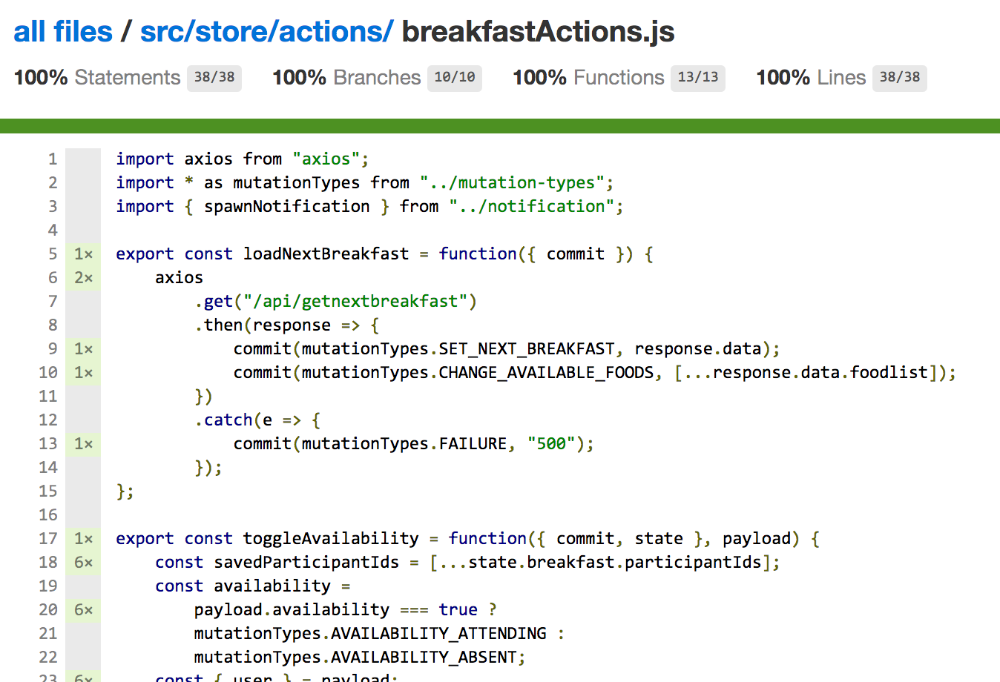

Unit testing your [Vuex](https://vuex.vuejs.org/en/)-powered state management includes verifying [getters](https://vuex.vuejs.org/en/getters.html), [mutations](https://vuex.vuejs.org/en/mutations.html), and [actions](https://vuex.vuejs.org/en/actions.html). Because of the synchronous nature of _getters_ and _mutations_, testing them is straight forward. On the other hand, testing _actions_ can be sometimes tricky since most of the time asynchronous code is involved. Especially testing the key functionality of your _actions_ is not easy &ndash; are your _actions_ dispatching _mutations_ correctly in the right context with the right arguments?

This article is only concerned with testing actions. Because it took me quite some time to figure out how I can establish a testing strategy that allows for [code coverage] of 100%(https://en.wikipedia.org/wiki/Code_coverage), I hope my article offers you some helpful information on this topic.

This article is structured into the following sections:

* [Strategy for Testing Vuex Actions](#section1) &ndash; This constitutes the most important part of this article. Here, I try to provide code examples and explain them in great detail. The goal here is that you get a better understanding of _Vuex_ and how to test things. How to mock _Vuex's commit_ function is in the focus of this section.
* [Overview of Testing Use Cases](#section2) &ndash; This section takes up the learnings from the previous section and provides a quick overview on different testing approaches, especially on how to isolate 3rd-party dependencies, such as remote calls. To get a quick overview on how my testing approach looks like, just jump directly to this section.

# <a name="section1"></a>Strategy for Testing Vuex Actions

First, I explain my testing concept, which libraries I use, as well as the testing skeleton. After that, I go into details on [how to mock Vuex's commit function](#mock-commit) and [how to cope with asynchronous code](#test-async), e.g., REST calls.

## Project Setup

The easiest way to have a _Vue.js_ project setup with _Mocha_ and _Sinon_ in place is to use the [official Vue.js Webpack Template](https://github.com/vuejs-templates/webpack). Start the wizard with the following shell command:

```bash
$ vue init webpack my-project
```

* Select &quot;Set up unit tests&quot;
* Select &quot;Karma and Mocha&quot;

This installs all required _npm modules_ for you.

## <a name="skeleton"></a>Skeleton for Testing Actions and Involved Technologies

The next code snippet represents our skeleton for testing _Vuex_ actions.

```javascript
// actions.spec.js

import sinon, { expect } from "sinon";
import sinonChai from "sinon-chai";
import chai from "chai";
import axios from "axios";
import MockAdapter from "axios-mock-adapter";
let mock = new MockAdapter(axios);

import { testAction } from "./testUtils";

import actions from "@/store/actions";
import * as mutationTypes from "@/store/mutation-types";

chai.use(sinonChai);

describe("actions", () => {
  beforeEach(function() {
    mock.reset();
  });

  it("should process payload and commits mutation for successful GET", done => {
    /* testing code here */
  });
});
```

Let's go through the _import statements_ to see which technologies are involved. [Sinon.js](http://sinonjs.org/) (short _Sinon_) provides standalone test spies, stubs, and mocks that can also be used with [Mocha](https://mochajs.org/). _Mocha_ represents the testing framework. I also utilize [Chai](http://chaijs.com/) that constitutes a BDD assertion library. [Sinon-Chai](https://github.com/domenic/sinon-chai) allows for writing nice _Chai_ assertions together with mocking capabilities provided by _Sinon_. The following line extends _Chai_ with further assertions for _Sinon_.

```javascript
chai.use(sinonChai);
```

Besides _Sinon_, there are alternative ways for mocking dependencies. I also use [Axios Mock Adapter](https://github.com/ctimmerm/axios-mock-adapter) (short _AxiosMock_) to isolate the actual remote calls. In addition, it offers a powerful feature to test actions with different remote call responses. E.g., you can verify that a remote call was successful.

Later, I show you testing examples using _AxiosMock_. In order to ensure that every test is independent from each other, created mocks need to be destroyed after every test. The following _beforeEach_ function does exactly this:

```javascript
beforeEach(function() {
  mock.reset();
});
```

With the help of the following _import statement_, I bring in my helper function to verify that _Vuex_ actions dispatch mutations correctly.

```javascript
import { testAction } from "./testUtils";
```

In the next section, I walk through this helper function in great detail since it is the crucial part of my testing strategy.

## Well, How to Implement Action Tests?

Before I answer this question, let's have a quick recap of a _Vuex_ action.

```javascript
export const loadNextBreakfast = function({ commit }) {
  axios
    .get("/api/getnextbreakfast")
    .then(response => {
      commit(mutationTypes.SET_NEXT_BREAKFAST, response.data);
      commit(mutationTypes.CHANGE_AVAILABLE_FOODS, [...response.data.foodlist]);
    })
    .catch(e => {
      commit(mutationTypes.FAILURE, "500");
    });
};
```

Besides the fact, that virtually every time a remote call is performed (we deal with this fact later), an action will commit one or more _mutations_ based on the context. A context arises, e.g., by a remote call response or by providing particular function arguments, e.g., a _state_ or an _action payload_.

The main purpose of _actions_ is to dispatch or commit _mutations_, respectively. Thus, most of the time I want to verify that _Vuex's commit_ function is invoked correctly with the right arguments. Since I do not want to invoke the actual mutation implementation, I have to mock the _commit_ function. In the next section we deal with this aspect.

## <a name="mock-commit"></a>Mocking Vuex's Commit Function

Based on the [official Vuex documentation](https://vuex.vuejs.org/en/testing.html) for testing actions, I created a file named _testUtils.js_ as testing helper. In principle, _Vuex_'s documentation provides all necessary information. However, I had a hard time to understand the mechanism due to the fact that it is spare on the topic of testing _actions_.

I utilize _testAction_ function in tests in order to verify that the _action_ under test invokes the correct mutations with right arguments and in right order.

Before I go into implementation details of the helper function, I show you how I want to use it later in tests.

```javascript
it("should invoke correct mutations for successful GET", done => {
  const response = {
    foodlist: ["salmon", "peanut butter"]
  };
  mock.onGet("/api/getnextbreakfast").reply(200, response);
  const actionPayload = null;
  const state = null;
  const expectedMutations = [
    {
      type: mutationTypes.SET_NEXT_BREAKFAST,
      payload: response
    },
    {
      type: mutationTypes.CHANGE_AVAILABLE_FOODS,
      payload: response.foodlist
    }
  ];
  testAction(loadNextBreakfast, actionPayload, state, expectedMutations, done);
});
```

The example test above verifies that the _Vuex_ action &quot;loadNextBreakfast&quot; commits the expected mutations, described with the array _expectedMutations_. _type_ and _payload_ represent the arguments of [Vuex's commit function](https://github.com/vuejs/vuex/blob/dev/src/store.js). I also want to verify inside the helper function that the correct mutations were triggered with the correct arguments. _payload_ can be null, if a mutation needs to be committed with a _type_ only. _actionPayload_ and _state_ are optional arguments and, thus, can be null. If the _action_ under test needs to operate on _state_ and / or requires a _payload_ object as input, you have to provide it with these two arguments.

_testAction_ contains the logic to mock the _commit_ function.

```javascript
// testUtils.js
import { expect } from "chai";

export const testAction = (
  action,
  actionPayload,
  state,
  expectedMutations,
  done
) => {
  let count = 0;
  let commit = (type, payload) => {
    let mutation = expectedMutations[count];
    try {
      // check if commit function is invoked with expected args
      expect(mutation.type).to.equal(type);
      if (payload) {
        expect(mutation.payload).to.deep.equal(payload);
      }
      count++;
      // check if all mutations have been dispatched
      if (count >= expectedMutations.length) {
        done();
      }
    } catch (error) {
      done(error);
    }
  };

  if (expectedMutations.length === 0) {
    expect(count).to.equal(0);
    done();
  } else {
    action({ commit, state }, actionPayload);
  }
};
```

I think it might help to break the code into pieces and explain it step by step. Let's start with the function arguments.

```javascript
export const testAction = (
  action,
  actionPayload,
  state,
  expectedMutations,
  done
) => {
  // ...
};
```

* **action** refers to the function name of the _action_ that needs to be called in the context of the test. For the example above, the _action_ is &quot;loadNextBreakfast&quot;.
* **actionPayload** constitutes the _payload_ that is passed as argument to the _action_ under test. We pass _null_ if the _action_ does not process a _payload_.
* **state** represents the _Vuex state object_ that is required by the _action_ under test. The object must just define the properties needed by the _action_. It can also be _null_ if the _action_ does not operate on the _state_ at all.
* **expectedMutations** is an array containing one or more objects, which hold the arguments for invoking the _commit_ function. Here is a recap of what it looks like:

```javascript
const expectedMutations = [
  {
    type: mutationTypes.SET_NEXT_BREAKFAST,
    payload: response
  },
  {
    type: mutationTypes.CHANGE_AVAILABLE_FOODS,
    payload: response.foodlist
  }
];
```

* **done** is a callback that I have to invoke inside the helper function when a test has completed. This is because _Vuex actions_ are asynchronous. You can read more about this concept in the [Mocha documentation on how to test asynchronous code](https://mochajs.org/#asynchronous-code).

Next up, the function body:

```javascript
let count = 0;
let commit = (type, payload) => {
  /* ... */
  count++;
  /* ... */
};
if (expectedMutations.length === 0) {
  expect(count).to.equal(0);
  done();
} else {
  action({ commit, state }, actionPayload);
}
```

_testAction_ declares a _count_ variable initialized to _0_ outside of the mock _commit_ function. _count_ gets increased whenever _commit_ is invoked by the _action_ that gets this mock _commit_ passed as an argument.

The whole process is triggered by calling the actual _action_ inside the _else_ clause. _action_ refers to the _Vuex action_ under test that is passed as argument to _testAction_. Besides our mock _commit_ function, I also pass a mock _state_ and an _actionPayload_ as arguments to _testAction_. The _if_ clause handles the case that an _action_ does not commit any _mutation_. _done()_ is important to signal _Mocha_ that the asynchronous test code is completed.

Finally, I take a closer look at the arrow function that constitutes the mock _commit_ function.

```javascript
let commit = (type, payload) => {
  let mutation = expectedMutations[count];
  try {
    expect(mutation.type).to.equal(type);
    if (payload) {
      expect(mutation.payload).to.deep.equal(payload);
    }
    count++;
    if (count >= expectedMutations.length) {
      done();
    }
  } catch (error) {
    done(error);
  }
};
```

First, I extract the _mutation_ with the current _count_ from the passed _expectedMutations_ array. Remember, such a _mutation_ object looks like this:

```javascript
  {
    type: mutationTypes.SET_NEXT_BREAKFAST,
    payload: response
  }
```

Then, I verify that _type_ and _payload_ do match. Since not every _mutation_ needs a payload, I verify that the _payload_ object is defined. It is important to call _done()_ if all expected _mutations_ have been dispatched, otherwise I get a _Mocha_ error. Additionally, I use a _try-catch block_ for the same reason in order to terminate the unit test in case of an exception.

In summary, the test above verifies that &quot;loadNextBreakfast&quot; _action_ dispatches two _mutations_ with right _type_ and _payload_ in correct order.

## <a name="test-async"></a>Testing Asynchronous Code

In principle, testing _Vuex actions_ also means to isolate asynchronous code in order to make unit tests independent from external code (e.g., 3rd-party dependencies or backend code). In the example above, &quot;loadNextBreakfast&quot; uses [Axios](https://github.com/axios/axios) to perform REST calls.

Thus, the task is to mock _axios.get()_.

```javascript
export const loadNextBreakfast = function({ commit }) {
  axios
    .get("/api/getnextbreakfast")
    .then(response => {
      /* ... */
    })
    .catch(e => {
      /* ... */
    });
};
```

In the next section, I present two approaches to prevent the invocation of the actual implementation of _axios.get()_. First, [testing use case 2](#use-case2) leverages _AxiosMock_ to circumvent the original _axios_ call. [Testing use case 3](#use-case3) demonstrates how _Sinon_ can be used to have external dependencies under control.

# <a name="section2"></a>Overview of Testing Use Cases

## <a name="use-case1"></a>Testing Use Case 1: Verifying that Actions Dispatch Mutations correctly

As described in great detail in the previous section, mocking _commit_ is crucial for testing _Vuex actions_.

```javascript
it("should set participation to value attending", done => {
  const payload = {
    availability: true,
    user: {
      username: "doppelmutzi",
      name: "Sebastian Weber",
      avatar: "url"
    }
  };
  const state = {
    breakfast: {
      participantIds: []
    }
  };
  const expectedMutations = [
    {
      type: mutationTypes.SET_PARTICIPATION,
      payload: {
        user: payload.user,
        availability: mutationTypes.AVAILABILITY_ATTENDING
      }
    }
  ];
  testAction(toggleAvailability, payload, state, expectedMutations, done);
});
```

Such a test sets up _testAction_'s arguments first and then calls it. Then it checks whether the expectations (defined by _expectedMutations_) are fulfilled. For a detailled description on how _testAction_ works, go to the section about [mocking Vuex's commit function](#mock-commit).

## <a name="use-case2"></a>Testing Use Case 2: Using Axios Mock Adapter for Testing Successful and Failing Requests

Remember, I created a _mock_ property in the [testing skeleton](#skeleton):

```javascript
/* ... */
import axios from "axios";
import MockAdapter from "axios-mock-adapter";
let mock = new MockAdapter(axios);
/* ... */

describe("actions", () => {
  beforeEach(function() {
    mock.reset();
  });
  /* ... */
```

I utilize _mock_ to check whether the _action_ under test operates correctly for successful and failing _axios_ calls. In the following snippet, the first test is an example for a remote call responding with status code of _200_. The second test checks that the correct _mutation_ is dispatched in case of a network error.

```javascript
it("should process payload and invoke correct mutation
  for successful GET", done => {
  const response = {
    foodlist: ["salmon", "peanut butter"]
  };
  mock.onGet("/api/getnextbreakfast").reply(200, response);
  const payload = null;
  const state = null;
  const expectedMutations = [
    {
      type: mutationTypes.SET_NEXT_BREAKFAST,
      payload: response
    },
    {
      type: mutationTypes.CHANGE_AVAILABLE_FOODS,
      payload: response.foodlist
    }
  ];
  testAction(loadNextBreakfast, payload, state, expectedMutations, done);
});

it("should invoke failure mutation for network error", done => {
  mock.onGet("/api/allusers").networkError();
  const payload = null;
  const state = null;
  const expectedMutations = [
    {
      type: mutationTypes.FAILURE,
      payload: "500"
    }
  ];
  testAction(loadNextBreakfast, payload, state, expectedMutations, done);
});
```

[Axios Mock Adapter](https://github.com/ctimmerm/axios-mock-adapter) offers a nice API to easily mock server responses, such as status codes or network errors. It is easy to use. Just setup the desired server response before you actually call the _action_ under test. Then, the _axios_ call inside of the _action_ implementation is replaced with the mock version. However, if you just want basic mocking of _axios_, you can also use _Sinon_ as described next.

## <a name="use-case3"></a>Testing Use Case 3: Mocking 3rd-party Libraries with Sinon.js

This technique can also be used to mock any external code, not only _axios_ calls. Take a look at the following _action_ &quot;toggleAvailability&quot; that follows an &quot;optimistic update&quot; approach &ndash; i.e., trigger a _mutation_ immediately without waiting for a remote call to return. Perform a rollback in case of a remote call error with the help of a &quot;compensating commit&quot; (_mutationTypes.FAILED_SET_PARTICIPATION_).

```javascript
export const toggleAvailability = function({ commit, state }, payload) {
  const savedParticipantIds = [...state.breakfast.participantIds];
  const availability =
    payload.availability === true
      ? mutationTypes.AVAILABILITY_ATTENDING
      : mutationTypes.AVAILABILITY_ABSENT;
  const { user } = payload;
  commit(mutationTypes.SET_PARTICIPATION, {
    user,
    availability
  });
  if (!payload.stomp) {
    axios
      .put(`/api/setParticipation/${user.username}/${availability}`)
      .then(response => {})
      .catch(e => {
        commit(mutationTypes.FAILED_SET_PARTICIPATION, savedParticipantIds);
      });
  } else {
    spawnNotification(
      `${user.name} has ${
        availability === mutationTypes.AVAILABILITY_ATTENDING
          ? "signed in"
          : "signed out"
      }.`,
      user.avatar,
      "availability changed"
    );
  }
};
```

This example _action_ has two contexts:

1. The user triggers an event from the UI and the _action_ invokes an _axios_ call. This is indicated by a _stomp_ flag set to _false_.
2. The backend sends a [Stomp](http://jmesnil.net/stomp-websocket/doc/) event to the client and the _action_ needs to dispatch a _mutation_ without performing an _axios_ call. This is indicated by a _stomp_ flag set to _true_. In this context, a browser notification is spawned by invoking the _spawnNotification_ function.

For the purpose of this article, it is not necessary to understand the whole implementation of this example _action_. Futhermore, it is not required to either know the _Stomp protocol_ nor have knowledge how browser notifications work. All implementation details are not relevant for this article and, thus, skipped. The provided _action_ is a good example of how to isolate such external dependencies and instead concentrate on the actual code that is in scope of the _action_.

All in all, the test implementation has to mock external dependencies. Concrete, it has to cope with the _axios_ remote call, the _Vuex commit_ function as well as the _spawnNotification_ function. The following code snippet shows a test implementation that makes use of _Sinon_ to isolate all these dependencies.

```javascript
it("should spawn a notification and should not perform an ajax call
  with stomp flag set to true", () => {
  const notificationStub = sinon.stub(notification, "spawnNotification");
  const axiosStub = sinon.stub(axios, "put");
  const commit = sinon.stub();
  const payload = {
    stomp: true,
    availability: true,
    user: {
      username: "doppelmutzi",
      name: "Sebastian Weber",
      avatar: "url"
    }
  };
  const state = {
    breakfast: {
      participantIds: []
    }
  };
  const expectedNotification = {
    body: payload.user.name + " has signed in",
    icon: payload.user.avatar,
    title: "availability changed"
  };

  toggleAvailability({ commit, state }, payload);

  sinon.assert.calledWith(
    notificationStub,
    expectedNotification.body,
    expectedNotification.icon,
    expectedNotification.title
  );
  expect(axiosStub).to.not.have.been.called;

  notificationStub.restore();
  axiosStub.restore();
});
```

After setting up stubs, _state_, and _payload_, this test verifies that the action named &quot;toggleAvailability&quot; spawns a notification but does not perform a remote call. With this kind of unit test I'm not interested in verifying that correct _mutations_ are dispatched (see [testing use case 1](#use-case1)). Therefore, I also use _Sinon_ to mock _commit_ and just pass it as argument to the _action_ function.

# Jest &ndash; a Mocha Alternative

End of 2017, _Vue.js_'s official [Webpack Template](https://github.com/vuejs-templates/webpack) added support for Facebook's [Jest](https://facebook.github.io/jest/). The installation wizard allows for choosing between _Mocha_ and _Jest_.

<blockquote class="twitter-tweet" data-lang="de"><p lang="en" dir="ltr">Latest vue.js webpack template has moved to Jest, this reduces test run time to a couple of seconds.🎉😂 Was quite easy to upgrade as well, and support for HTTPS in webpack dev server is 💯 <a href="https://twitter.com/hashtag/vuejs?src=hash&amp;ref_src=twsrc%5Etfw">#vuejs</a> <a href="https://t.co/WZ5SY2mWd8">https://t.co/WZ5SY2mWd8</a></p>&mdash; Mark Wolfe (@wolfeidau) <a href="https://twitter.com/wolfeidau/status/932189770125414400?ref_src=twsrc%5Etfw">19. November 2017</a></blockquote>
<script async src="https://platform.twitter.com/widgets.js" charset="utf-8"></script>

I leave undecided which technology is better because I haven't looked into _Jest_ yet. However, I see a lot of articles and tweets about people moving from _Mocha_ to _Jest_.

<blockquote class="twitter-tweet" data-lang="de"><p lang="en" dir="ltr">We are moving from Mocha+chai to Jest. <br><br>The main benefit is test isolation: we have some suboptimal test polluting/depending on the global state and we want to prevent that with Jest.<br><br>Our challenge is to move ~10k tests owned by ~10 different teams 😓</p>&mdash; Sergio Cinos🇪🇸🇦🇺 (@scinos) <a href="https://twitter.com/scinos/status/936233521558913024?ref_src=twsrc%5Etfw">30. November 2017</a></blockquote>
<script async src="https://platform.twitter.com/widgets.js" charset="utf-8"></script>

<blockquote class="twitter-tweet" data-lang="de"><p lang="en" dir="ltr">Sorry <a href="https://twitter.com/hashtag/mocha?src=hash&amp;ref_src=twsrc%5Etfw">#mocha</a> and <a href="https://twitter.com/hashtag/chai?src=hash&amp;ref_src=twsrc%5Etfw">#chai</a>. Time to part our ways. <br>Oh, hello <a href="https://twitter.com/hashtag/jest?src=hash&amp;ref_src=twsrc%5Etfw">#jest</a></p>&mdash; Hakan Dolas (@hakandolas) <a href="https://twitter.com/hakandolas/status/961976424637837312?ref_src=twsrc%5Etfw">9. Februar 2018</a></blockquote>
<script async src="https://platform.twitter.com/widgets.js" charset="utf-8"></script>

_Jest_ is especially popular for its [snapshot testing](https://facebook.github.io/jest/docs/en/snapshot-testing.html). It also comes with [mocking capabilities](https://facebook.github.io/jest/docs/en/mock-functions.html). However, most of the time, I have come across articles about _Jest_ and how to use it for component testing. At least [Lachlan Miller](https://codeburst.io/@lachlanmiller_52885) wrote about using [Jest for testing Vuex actions](https://codeburst.io/a-pattern-for-mocking-and-unit-testing-vuex-actions-8f6672bdb255).

It seems that one of _Jest_'s benefits is its performance. [Edd Yerburg](https://twitter.com/EddYerburgh), one of the authors of [vue-test-utils](https://github.com/vuejs/vue-test-utils), gave a talk about [testing Vue components](http://slides.com/eddyerburgh/testing-vue-components#/) and provided a [comparison of Vue SFC unit tests using different test runners](https://github.com/eddyerburgh/vue-unit-test-perf-comparison).

Up to now, it is not clear for me, if there are any obvious advantages of _Jest_ over _Mocha_ in terms of unit testing _Vuex_ code.

# Conclusion

Leaving the discussion out, which testing technology performs better, it is important to test your _Vuex actions_.
With the testing approaches above (using _Mocha_), it is possible to have a 100% code coverage of _Vuex actions_ as depicted in the next screenshot. I think you can also replace _Mocha_ with _Jest_ very easily and get the same test coverage.

Maybe you have the same attitude like me that _actions_ are one of the most important but also most complex parts of your _Vue.js_ application. That's why testing them entirely is crucial!



Another good thing, if you establish such a testing approach, you also gain a better understanding of _Vuex_ and, thereby, you get a better _Vue_ developer.

It would be nice if you let me know what you think about my testing approach in the comments. How do you test your _Vuex_ code?
