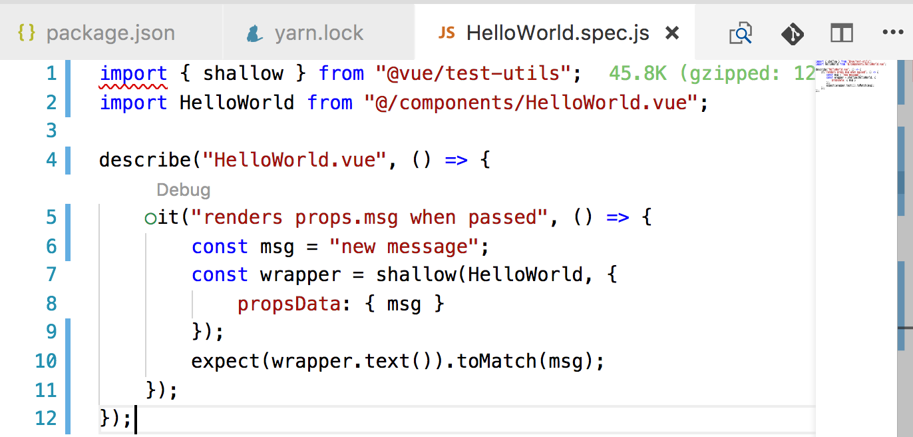
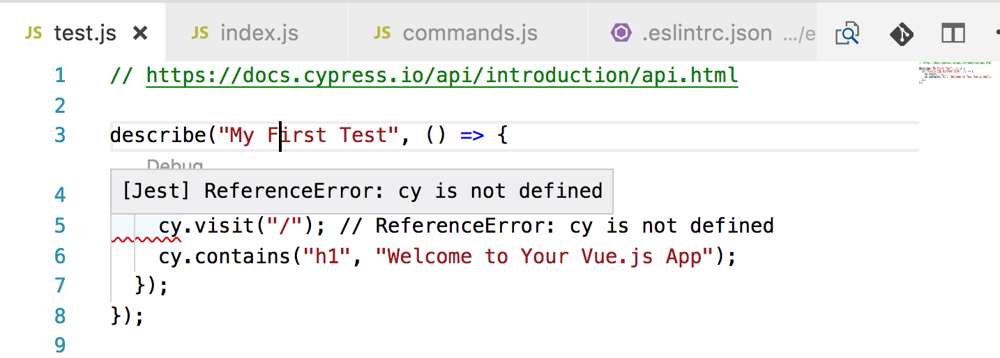

Something special is developing with [Vue CLI 3](https://github.com/vuejs/vue-cli). At the time of this writing _Vue CLI_ is in beta status. It is already pretty awesome! To get a brilliant overview, read [Vue CLI 3: A Game Changer For Frontend Development](https://vuejsdevelopers.com/2018/03/26/vue-cli-3/?jsdojo_id=tw_vc3).

With this article, I want to share my early experience with _Vue CLI_ regarding [ESLint](https://eslint.org/) and [Prettier](https://prettier.io/). _Vue CLI_ has a pretty neat plugin architecture. It is built from ground up to generate _Vue.js_ projects that leveraging _ESLint_ and _Prettier_. _Vue_'s lead developer [Evan You](https://twitter.com/youyuxi) and his team do a great job to integrate best practices from the community and cutting edge technology (e.g., [Cypress](https://www.cypress.io/)). However, the project is in an early state and heavily under development.

# How the ESLint Workflow looks like

I had a hard time to get my desired _ESLint_ and _Prettier_ setup entirely up and running. My goal was to establish the same workflow as I described in [my post from the beginning of the year](https://medium.com/@doppelmutzi/eslint-prettier-vue-workflow-46a3cf54332f):

* _ESLint_ only for static code analysis
* _Prettier_ only for code formatting
* Using an _ESLint_ config like [eslint-config-standard](https://github.com/standard/eslint-config-standard) or [eslint-config-airbnb](https://github.com/airbnb/javascript/tree/master/packages/eslint-config-airbnb)
* Using special _ESLint_ rules for _Vue.js_
* _ESLint_ works within _Vue Single File Components_
* _ESLint_ works with [Jest](https://facebook.github.io/jest/)
* Linting works from the CLI
* Linting works from IDEs (Visual Studio Code and IntelliJ)

In this post, I do not cover the setup of IDEs. Take a look at my previous article on this topic to [configure Visual Studio Code and IntelliJ](https://medium.com/@doppelmutzi/eslint-prettier-vue-workflow-46a3cf54332f#27b4).

# 95% is Working out of the Box with Vue CLI 3

In order to not create a false impression with this article, almost everything is working by just generating your project with _Vue CLI_. However, I had a hard time to get _ESLint_ working with Jest in my IDE as you can see in the next picture. From the command line, everything seems to work &ndash; there were no errors.



# Generating the Project with Some Manual Adjustments

_Vue CLI_ is easy to use. Step one, generate the project without even to have [vue-cli](https://github.com/vuejs/vue-cli) installed globally on your machine.

```bash
$ mkdir vue-project && cd vue-project
$ npx -p @vue/cli vue create.
```

In the following, I just list the relevant options. Feel free to select other options, too.

* Select &quot;manually select features&quot;
* Select &quot;Linter / Formatter&quot; and &quot;Unit Testing&quot;
* Select &quot;ESLint + Prettier&quot;
* Select &quot;Lint and fix on commit&quot;
* Select &quot;Jest&quot;
* I selected &quot;In dedicated config files&quot; (but it doesn't matter what you choose)

You can read more about all the options in [the official documentation](https://github.com/vuejs/vue-cli/blob/dev/docs/README.md#configuration).

Now, we install some additional [Vue CLI ESLint plugins](https://github.com/vuejs/vue-cli/tree/dev/packages/%40vue). In my example I want to use [ESLint Config for JavaScript Standard Style](https://github.com/standard/eslint-config-standard) as this is compatible with my &quot;ESLint for analysis and Prettier for formatting&quot; approach as [described in more detail here](https://medium.com/@doppelmutzi/eslint-prettier-vue-workflow-46a3cf54332f#cdc0).

```bash
$ yarn add —dev @vue/eslint-config-standard
```

Then, linting from the command line worked for me as expected.

```bash
$ vue-cli-service lint
```

Unfortunately, I had problems within my IDE with _Jest_ test files. I had to install the following package to solve the problem.

```bash
$ yarn add --dev babel-preset-env
```

Then, I had to adjust the _.babelrc_ file located in the root folder:

```json
{
  "presets": [
    [
      "env",
      {
        "modules": false
      }
    ]
  ],
  "env": {
    "test": {
      "presets": ["env"]
    }
  }
}
```

In order to get the same _ESLint_ workflow as described in my previous article, I had to replace the content of the _ESLint_ config file located in the root folder (_.eslintrc_).

```json
{
  "root": true,
  "extends": ["prettier", "prettier/standard", "plugin:vue/recommended"],
  "plugins": ["vue", "prettier"],
  "rules": {
    "prettier/prettier": "error"
  }
}
```

With this small adjustments, my desired setup is working.

# Some Lessons Learned

_Vue CLI_ has a great plugin architecture. _ESLint_ config and plugin modules are encapsulated within plugins with a pattern of _@vue/eslint-_. This adds another indirection to the whole setup, however you can easily find out which npm modules get installed.

As an example, [@vue/eslint-config-standard](https://github.com/vuejs/vue-cli/tree/dev/packages/%40vue/eslint-config-standard) installs the following crucial modules as dependencies:

* [eslint-config-standard](https://github.com/standard/eslint-config-standard)
* [eslint-plugin-standard](https://github.com/xjamundx/eslint-plugin-standard)

# Conclusion

_Vue CLI_ rocks! Setting up an advanced _ESLint_ / _Prettier_ / _Vue.js_ Workflow requires only a few steps. Before _Vue CLI_, many manual steps were needed since many npm modules are involved.

However, I had some issues with _ESLint_ and unit testing as well as e2e testing. Currently, I still have issues with _Cypress_ test files.



Nevertheless, I think in the near future, such problems regarding _ESLint_ setup will disappear. _Vue CLI_'s concept is designed for such a workflow.
