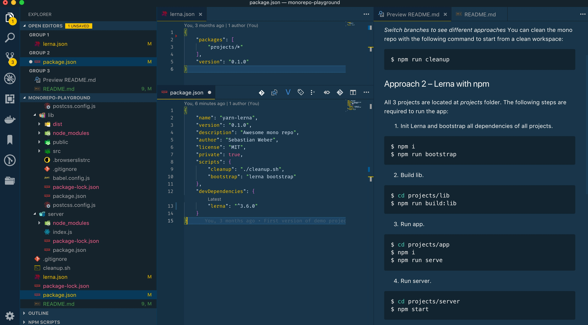
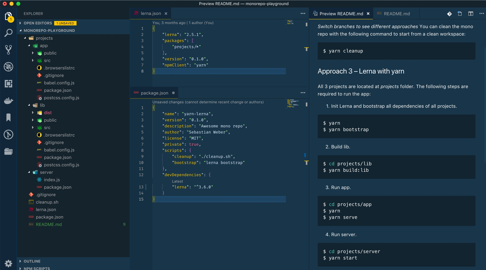
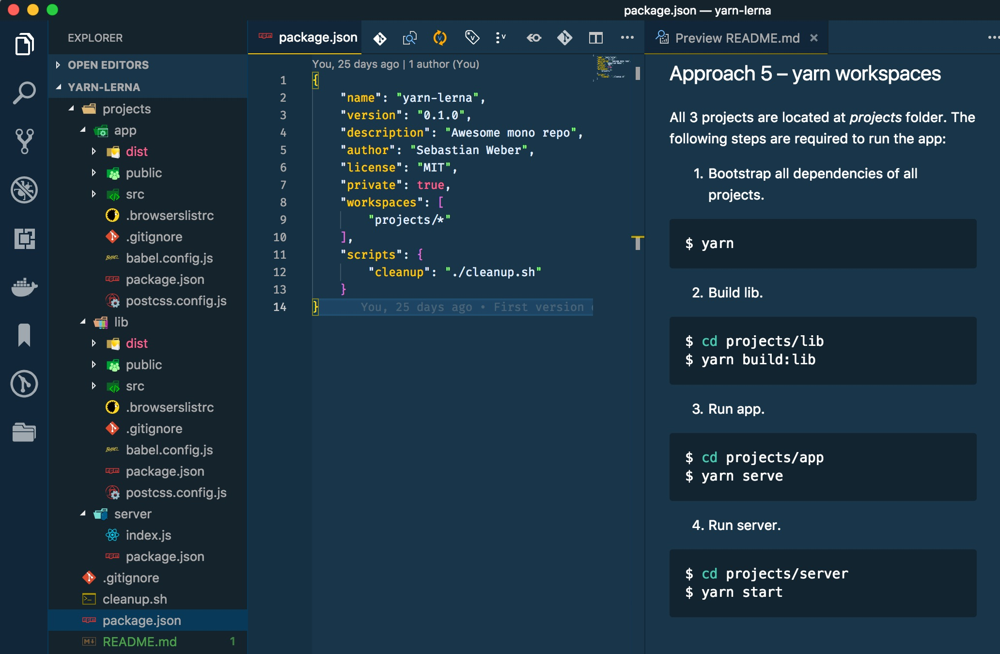
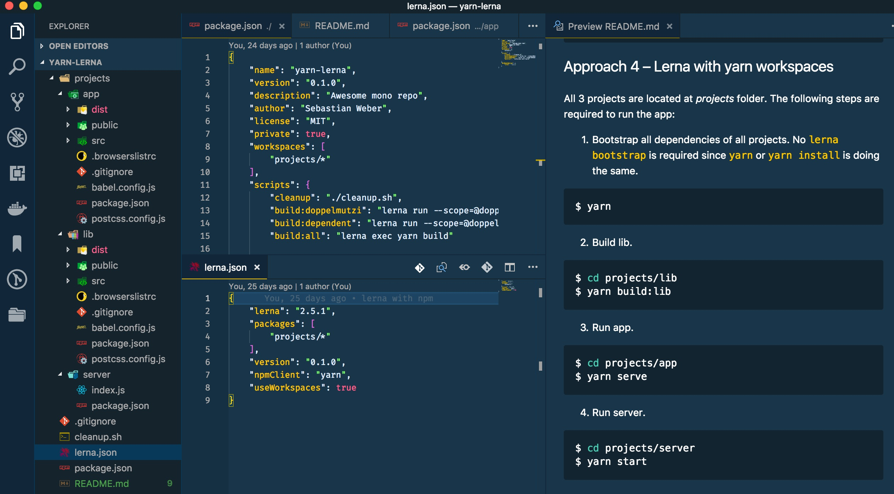
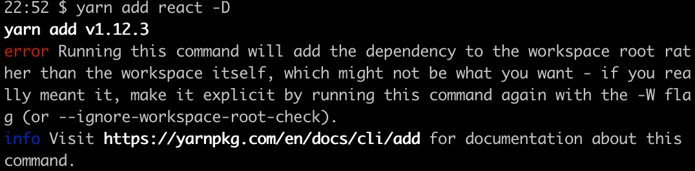

This post is my take on the topic of _Mono-Repo_. After a brief introduction to _Mono-Repos_ and a comparison with _Multi-Repos_, I go into tools to establishing _Mono-Repos_.

I don't want to assess in great detail what repository type is better in which circumstance. However, the goal of this article is all about _Mono-Repos_ and how [lerna](https://lernajs.io/), [npm](https://www.npmjs.com/), and [yarn](https://yarnpkg.com) ([workspaces](https://yarnpkg.com/en/package/workspaces)) can help. It also makes sense to use these tools in combination. Especially _lerna_ and _yarn workspaces_ can peacefully coexist in a project. How? We will find out in a minute.

# What is a Mono-Repo? How does it Compare to Multi-Repo?

Tools like _lerna_ and _yarn workspaces_ have been a decisive factor with the result that managing your codebase in a single repo (a.k.a. _Mono-Repo_) has gained some traction for about one or two years. A lot of articles were written or conference talks were given about this topic.

In short, a so-called _Mono-Repo_ is a (git) repository that houses multiple projects. Such projects are called workspaces or packages. In contrast, using multiple repositories with each repository housing only one project is called a _Multi-Repo_ approach.  Of course, a combination of both approaches is possible. In my current job, we constitute multiple teams where each team has its own repositories. There are teams that pursue a _Multi-Repo_ approach and there are teams believing in a _Multi-Repo_ maxim. Plus there exist teams leveraging both approaches because the technology, which is part of the repository, is also a factor to have in mind for decision-making (e.g., every Java micro-service is part of an own git repo).

To find out about differences along with advantages and disadvantages of _Mono-Repos_ and _Multi-Repos_, I recommend Markus Oberlehner's article about [Monorepos in the Wild](https://medium.com/@maoberlehner/monorepos-in-the-wild-33c6eb246cb9).

# Tool Landscape for Mono-Repos

A _Mono-Repo_ hosts one or more projects or packages. These packages are &quot;Mini-Repos&quot; that can be versioned, built, and published independently. Therefore, every package contains its own _package.json_ file due to the fact that every package is a full-fledged project on its own.
Packages might have dependency relations between each other. Managing these dependencies are implemented by symlinks.

As we see later, _lerna_ and _yarn workspaces_ give us the ability to build libraries and apps in a single repo without forcing us to publish to npm or other registries. The beauty behind these technologies is that they can find package dependencies by analyzing _package.json_ files located at each project's root folder. Thereby, these tools make it obsolete to manually create symlinks or use &quot;low-level&quot; _npm link_ directly.

This results in faster code-test-debug cycles by sharing components locally. _lerna_ and _yarn workspaces_ together improve the developer experience of managing multiple packages in a _Mono-Repo_.

## Correlation between _npm_, _yarn_, _yarn workspaces_, and _lerna_

I want to shed some light on the clutter how _npm_, _yarn_, _yarn workspaces_, and _lerna_ are involved in the topic of _Mono-repos_. Take a look at the following &quot;set diagram&quot;.


It depicts three main players and how they correlate. By the way, do not take the proportions too seriously. The diagram's purpose is just to give an impression how things are connected.

_npm_ (marked by 1) and _yarn_ (2) are both native package managers that have many features in common (3). As an example, both leverage the concept of _package.json_ as container for dependency management, which was introduced by _npm_ back in the days. More shared concepts and features are dependency management, publishing, or using lock files to &quot;freeze&quot; dependency versions. There are even more features originated by _npm_ that are also leveraged by _yarn_, such as publishing to npm registry.

One of the reasons for creating _yarn_ in the first place was performance &ndash; it took too long to install dependencies in large projects with _npm_. Another aspect was missing features, such as a sophisticated concept for freezing versions, offline capabilities, or deterministic behavior in terms of dependency resolution. Though, many of these gaps of _npm_ have vanished over the time and both technologies are more and more feature compliant nowadays.

Things that still belong solely to _npm_ (1) or _yarn_ (2) are _package-lock.json_ files or _yarn.lock_ files, respectively. However, for us, the application developers, the different implementation of lock files does not really matter. Practically, _npm_ and _yarn_ are even on how version management is handled.

One big feature that is exclusive to _yarn_ is _yarn workspaces_ (4) that was added to _yarn_ about a year ago. It expands _yarn_ by native _Mono-Repo_ capabilities. The next section goes more into _Mono-Repo_ features.

## Mono-Repo &ndash; What is native? What is user land?

Consider the next diagram depicting how technologies in the Mono-Repo environment are connected to each other.


Marked in red are technologies that provide Mono-Repo capabilities. All of them are based either on _npm_ or _yarn_. The latter do not provide advanced features for building Mono-Repose besides _npm link_ or _yarn link_, respectively.

[yarn workspaces](https://yarnpkg.com/lang/en/docs/workspaces/) is the only representative that exposes Mono-Repo capabilities natively. [lerna](https://lernajs.io) is around for quite some time and came out even before _yarn workspaces_ has existed. _lerna_ provides Mono-Repo features on the level of user land with the help of _npm_ or _yarn_ as dependency management tools.

_lerna_ leverages semantic links for this purpose. It also allows for using _yarn workspaces_ and, then, leaves the whole Mono-Repo aspect solely to the natively implemented features of _yarn workspaces_. Furthermore, _lerna_ provides sophisticated publishing and version management features to even publish projects independently from each other. Short, _lerna_ offers many features beyond Mono-Repo management. On the other side, _yarn workspaces_ sole purpose is to ease the Mono-Repo workflow. So, you do not have to decide for either side of them. It totally does make sense to use _lerna_ with _yarn workspaces_.

[bolt](https://github.com/boltpkg/bolt) is a relatively new project that bases on _yarn workspaces_. Inspired by _lerna_, its goal is to add more helpful commands on this foundation. However, I do not have any experience with it since I haven't accomplished yet to get _bolt_ up and running in my playground project. In addition, I have realized that there have been relatively few commits lately. So, I do not go any deeper in this article.

# Different Variants of Configuring _Mono-Repos_

This section's goal is to give a quick overview on how to set up the different tools in different variations. You can understand the screenshots as a kind of &quot;cheat sheets&quot;. The focus is on the configuration part of the different approaches and how they differ.

I created a small repository to demonstrate the different variants. Just [clone the demo project repo](https://github.com/doppelmutzi/monorepo-playground) and switch branches for the different variants. The _README.md_ file describes how to bootstrap and use (i.e., build and run the dummy app) the particular variant. Another goal of this section and demo project is to provide an easy playground to see the different variants in action from different perspectives: which configuration steps are required, what steps are needed to build and use the sub projects (i.e., packages), how does dependency management work, or what are the timing implications for bootstrapping.

## 1. Do it yourself

I skip this section but feel free to checkout branch _1-do-it-yourself_. Basically you work with _npm link_ and have to create semantic links and install all sub projects manually. I hope you can imagine how tedious and impractical this scenario is for real-world projects.

## 2. lerna with npm

To get support for automating such manual tasks of approach 1, _lerna_ was introduced. You need a _lerna.json_ file in the root folder. As a convention, _lerna_ uses _npm_ as default.

As you see in the next screenshot, you basically need to edit two files for getting _lerna_ up and running: _lerna.json_ and _package.json_. Within _lerna.json_ you need to specify where _lerna_ has to look for packages.

To bootstrap all sub projects, you need to execute _lerna bootstrap_ by invoking the following npm script:

```bash
$ npm run bootstrap
```

What this command basically does is to go into all packages' root folders and execute _npm install_. Take a look at the three packages and you will see that _lerna_ caused npm to create a _node_modules_ folder for every package.



## 3. lerna with yarn

This is the same setup as approach 2. The only difference is that you have to specify _yarn_ as client with the &quot;npmClient&quot; property in _lerna.json_ file.  Bootstrapping is also performed by _lerna_.

What is the difference in contrast to approach 1? Virtually nothing. Mainly it is a matter of taste because the only difference is whether _lerna_ utilizes _npm_ or _yarn_ as dependency manager. The answer to the question, which one to chose boils down to the following questions:
* which syntax do I prefer? _npm run &lt;command&gt;_ vs _yarn &lt;command&gt;
* Should I stick to the quasi-standard or do I like the effort of Facebook
* Do I really care about bootstrapping time? If so, take a look at the next chapter which provides some performance benchmarks.



## 4. yarn workspaces
For this approach, you do not need _lerna_. _yarn workspaces_ come with built-in _Mono-Repo_ capabilities. To use _yarn workspaces_ you need _yarn_ version 1.0 or higher. As you can see in the following screenshot, you do not need a dedicated configuration file. The _package.json_ file in the root folder needs to be private and has to have a _&quot;workspaces&quot;_ property telling _yarn_ where to find the sub projects (or workspaces in _yarn_ speech).

To bootstrap the project with all its workspaces, you just use _yarn_ since _yarn workspaces_ provides this feature natively:

```bash
$ yarn install
```

or short:

```bash
$ yarn
```

This combines both steps of approach 1 and 2: Installing the dependencies of the root folder and bootstrapping of all packages' dependencies.



One big difference in comparison to approach 1 and 2 is that _yarn workspaces_ creates only one _node_modules_ folder. All dependencies are hoisted to the root folder. Remark: Meanwhile, this behavior is also possible with _lerna_ (without _yarn workspaces_) by using the _--hoist_ flag.

## 5. lerna with yarn workspaces

To configure _lerna_ with _yarn workspaces_ you have to have the same configuration in the root's _package.json_ as described in approach 4. However, you need to provide a _lerna.json_ file in the root folder, too. There, you need to tell _lerna_ to use _yarn workspaces_. Unfortunately, you have to specify the location of the sub projects redundantly in _lerna.json_. To bootstrap the project, no _lerna bootstrap_ is required, you just have to use _yarn install_ as described in approach 4. It [doesn't make much sense](https://github.com/lerna/lerna/issues/1308#issuecomment-370848535) to invoke _lerna bootstrap_ since it just calls _yarn install_ itself.



With this setup, _lerna_ completely dedicates the dependency and bootstrapping workflow to _yarn workspaces_. So, you need to configure more to achieve the same as the previous approach. Why should you then use this way over approach 4? Well, think about this &ndash; using _lerna_ and _yarn workspaces_ at the same time make totally sense. They coexist peacefully together in a _Mono-Repo_ project.

In such a scenario:
* You solely use _yarn workspaces_ for the _Mono-Repo_ workflow.
* You use _lerna_'s utility commands to optimize managing of multiple packages, e.g., selective execution of _npm_ scripts for testing.
* You use _lerna_ for publishing packages since _lerna_ provides sophisticated features with its version and publish commands.

# lerna and yarn workspaces

The last section gives a quick understanding on how to set up _Mono-Repos_ with different configurations. This section's focus is more on the features of _lerna_ and _yarn workspaces_.

## yarn workspaces

Up to date, _yarn workspaces_ constitutes the only technology that comes with native capabilities for _Mono-Repos_. In contrast to _lerna_, you do not have to execute a separate step for bootstrapping dependencies of the packages. _yarn install_ does the trick by installing the dependencies of the root folder and then for every package.

In contrast to _lerna_, _yarn workspaces_ does not come with additional features besides dependency management for multi-project setups. Since it's foundation is _yarn_, you have all of _yarn_'s features on hand.

For using _yarn workspaces_, Facebook has introduced a few additional commands that do only make sense in the context of _Mono-Repos_.

The following command will display the workspace dependency tree of your current project:
```bash
$ yarn workspaces info
```

The following receipt enables you to run the chosen _yarn_ command in the selected workspace (i.e., package):
```bash
$ yarn workspace <package-name> <command>
```

As an example, with the following command _react_ gets added to the package / workspace called &quot;awesome-package&quot; as dev dependency (instead of _--dev_ you can also use _-D_):

```bash
$ yarn workspace awesome-package add react --dev
 ```

Next is an example to remove a dependency from a particular package:
```bash
$ yarn workspace web-project remove some-package --save
```

If you want to add a common dependency to all packages, go into the project's root folder and use the _-W_ (or _--ignore-workspace-root-check_) flag:

```bash
$ yarn add some-package -W
```

Otherwise, you get an error by _yarn_.



With the following command, I add one of my own packages (&quot;awesome-components&quot;) to another package (&quot;awesome-app&quot;) as dependency. I found out that adding local packages should be done by specifying a version number, otherwise _yarn_ tries to find the dependency in the registry.

```bash
$ yarn workspace @doppelmutzi/awesome-app add @doppelmutzi/awesome-components@0.1.0 -D
```

Using the workspaces feature, _yarn_ does not create _node_modules_ directories in either of your packages  &ndash;  only at the root level, i.e., _yarn_ hoists all dependencies to the root level. _yarn_ leverages symlinks to point to the different packages. Thereby, _yarn_ includes the dependencies only once in the project.

You have to utilize _yarn workspaces_' [noHoist](https://yarnpkg.com/blog/2018/02/15/nohoist/) feature to use otherwise incompatible 3rd party dependencies working in the _Mono-Repo_ environment. You have to specify this in the project root _package.json_ as you can see in the following example.

```json
// package.json
{
  ...
  "workspaces": {
    "packages": ["packages/*"],
    "nohoist": [
      "**/react-native"
    ]
  }
  ...
}
```

For more information take a look at the [demo project](https://github.com/connectdotz/yarn-nohoist-examples) of [ConnectDotz](https://github.com/connectdotz).

## Lerna

As with _yarn workspaces_, _lerna_ adds _Mono-Rep_ capabilities to a frontend project. However, as described above, _lerna_ operates on &quot;user land&quot; and cannot add such functionality natively.

If you configure _lerna_ to use _yarn workspaces_ then _lerna_ hands over the whole depenendency management to _yarn workspaces_. If you configure _lerna_ with _npm_ or _yarn_ then _lerna_ provides the _Mono-Repo_ capabilities on its own by utilizing symlinks. In such a context, you have to use _lerna bootstrap_ to initialize dependencies of all packages.

John Tucker wrote a great article about using _lerna_'s [commands to initialize projects and manage dependencies](https://codeburst.io/monorepos-by-example-part-1-3a883b49047e).

To install _react_ as dependency into all packages, you can use the following command:

```bash
$ lerna add react
```

If you want to install _react_ as dependency only to a particular package, execute the following command:

```bash
$ lerna add react --scope my-package
```

If you have installed _react_ for every package but would like to upgrade/downgrade to a particular version only for a specific package then you can do it like this:

```bash
$ lerna add react@16.0.0 --scope my-package
```

_lerna_ comes with a [couple of flags](https://github.com/lerna/lerna/tree/master/core/filter-options). They constitute options for _lerna_ sub-commands that need filtering.

Consider the following npm script called &quot;test&quot;. The two shell commands below show how to execute testing only on particular packages by using the _--scope_ flag along with globs. _lerna_ tries to execute _yarn test_ for every package that matches.

```json
// package.json
{
  ...
  "scripts": {
    "test": "lerna exec yarn test“
  }
  ...
}
```

```bash
$ yarn test --scope @my-company-services/*
```

```bash
$ yarn test --scope @my-company/web-*
```

According to the [documentation](https://github.com/lerna/lerna/blob/master/doc/hoist.md), _lerna_ also provides hoisting shared dependencies up to the root folder just like _yarn workspaces_' default behavior. Therefore, you have to use the _&quot;--hoist&quot;_ flag.

```bash
$ lerna add react -D --hoist
```

A fundamental question is whether to choose _npm_ or _yarn_. Since this topic is worth a separate article, I do not go into detail. If you are interested to find out more about the nitty-gritty details, there are many articles out there (perhaps, I will write a post about it anytime soon).

Anyway, as you can see with the &quot;cheat sheets&quot; in the last section, you can switch easily between the different package managers just as you like.


## Advanced Frontend Workflow Features and Commands

Even if you pick _yarn workspaces_ for dependency management, it is a good idea to use _lerna_ as well. The reason is that _lerna_ provides [utility commands](https://github.com/lerna/lerna/tree/master/commands) to optimize management of multiple packages. For example, with one _lerna_ command you can iterate through all or particular packages, running a series of operations (such as linting, testing, and building) on each package. Thereby, it compliments _yarn workspaces_ that takes over the dependency management process.

Using _lerna_ for testing or linting from the root folder is faster than invoking all operations manually from every package folder. John Tucker's blog post deals with [testing with _lerna_](https://codeburst.io/monorepos-by-example-part-2-4153712cfa31) in great detail.

Versioning and publishing are important development topics where _lerna_ also shines. _lerna_ allows you to use two versioning modes:

* _fixed/locked mode_: The version of each package can be managed at a single point (in _lerna.json_ file). If a package has been updated since the last time a release was made, it will be updated to the new version. As a consequence, a major change in any package will result in all packages having a new major version.

* _independent mode_: Package versions can be incremented independently of each other. Therefore, the &quot;version&quot; key inside of _lerna.json_ needs to be set to &quot;independent&quot;. This approach provides much more flexibility and is especially useful for projects with loosely coupled components.

You can publish packages that have changed since the last release:

```bash
$ lerna publish
```

In independent mode, there exist different options to affect version bumps with the publish command. In addition to use a _semver_ keyword, you can also utilize one of the following version bump flags: [from-git](https://github.com/lerna/lerna/tree/master/commands/publish#bump-from-git) or [from-package](https://github.com/lerna/lerna/tree/master/commands/publish#bump-from-package).

The following command publishes to a npm registry while using the [conventional commits standard](https://www.conventionalcommits.org/en/v1.0.0-beta.2/).

```bash
$ lerna publish --conventional-commits --yes
```

The above command also generates changelog files. According to [lerna's docu](https://github.com/conventional-changelog/conventional-changelog/tree/master/packages/conventional-changelog-angular#angular-convention), there exist different changelog presets, such as _angular_ or _bitbucket_. By the way, the [yes flag](https://github.com/lerna/lerna/tree/master/commands/version#--yes) skips all confirmation prompts.

Within _lerna.json_, you can globally define that conventional commits have to be used without using flags:

```json
// lerna.json
...
"command": {
    "publish": {
       "conventionalCommits": true,
       "yes": true
    }
}
...
```
[@jsilvax](jsilvax) explains [how conventional commits with _lerna_ work](https://medium.com/@jsilvax/a-workflow-guide-for-lerna-with-yarn-workspaces-60f97481149d) and how it can be enforced with _commitlint_.

Since versioning and publishing are complex topics, the section above shows only a small sample of _lerna_'s possibilities. I do not go more into detail because this would go beyond the scope of this article.

# Timing Comparison

One of the main reasons why folks stick to _yarn_ instead of _npm_ is performance in terms of time for installing dependencies. Originally, _yarn_ was developed due to the fact that _npm_ took way too long for installing dependencies (besides the fact that _npm_ had lacked some important features). Meanwhile, _npm_ is available in version 6 and has put a lot of effort to eliminate this gap.

Because you can achieve a _Mono-Repo_ in a variety of ways, lets take a look how these different approaches perform. In the remainder of this section, I present the results of my performance experiment. I cloned [the Babel project](https://github.com/babel/babel) (approximately in October 2018) because it represents a real-life _Mono-Repo_ with many packages (142 to be precise). Interestingly, the original setup of _Babel_ utilizes _lerna_ with a config that specifies _yarn_ as _npmClient_ (no _yarn workspaces_) and deactivates _yarn_'s lock file generation.

For every approach (2 &ndash; 5) I did the following:

* I changed the configuration required for the corresponding approach (i.e., adapt _package.json_ and _lerna.json_ if required).
* I measured the collapsed time for installation of dependencies and for a dedicated bootstrapping step (if required).
* I measured the time for 3 different use cases. For every use case I performed time measurement for 3 times.

The aforementioned use cases (UC) are:

1) I empty npm or yarn cache, I remove all _node_modules_ folders, and I remove all _package-lock.json_ or _yarn.lock_ files.
2) Cache exists, I remove all _node_modules_ folders, and I remove all _package-lock.json_ or _yarn.lock_ files.
3) Cache exists, _package-lock.json_ or _yarn.lock_ files exist, I remove all _node_modules_ folders.

For purging the cache, I executed one of the following commands depending on the used _npm_ client:

```bash
$ npm cache clean --force
```

or

```bash
$ yarn cache clean
```

As a helper for removing lock files and _node_modules_ folders, I added a script to Babel's root folder called _cleanup.sh_:

```bash
find . -type f -name 'yarn.lock' -exec rm {} +
find . -type f -name 'package-lock.json' -exec rm {} +
find . -name "node_modules" -type d -prune -exec rm -rf '{}' +
```

Depending on the use case, I eventually commented out the first 2 lines.

For measuring the execution time of the steps for installing and bootstrapping dependencies, I utilized [gnomon](https://www.npmjs.com/package/gnomon). The following command constitutes an example for approach 2 (_lerna_ with _npm_) and UC 1 (empty cache, no _node_modules_ folders, no lock files as precondition) for how I measured elapsed time:
```bash
$ npm cache clean --force && ./cleanup.sh && npm i | gnomon && npm run bootstrap | gnomon
```

Below, you will find the different measurements. I performed these measurements over time, so I have played around with different _node_, _npm_, _yarn_, and _lerna_ versions to find out if different versions have different performance implications.

To switch _node_ and _npm_ versions, I utilized [nvm](https://github.com/creationix/nvm). The following example first installs and uses _v9_ of _node_ and then installs _v5.7.1_ of _npm_.
```bash
$ nvm install v9
$ nvm use v9
$ npm i -g npm@5.7.1
```

## Approach 2 (lerna with npm) &ndash; Node v10.12.0 / npm v6.4.1 / lerna 2.11.0

<style>

table{
    border:1px solid #fff;
}

th, td{
    border:1px solid #fff;
    padding-left: 3px;
    padding-right: 3px;
}
</style>

| UC | Install  | Bootstrap | Overall   |
|----|:--------:|----------:|----------:|
| 1  | 39.1680s | 64.7168s  | 103.8848s |
| 1  | 40.8052s | 78.0730s  | 118.8782s |
| 1  | 39.8729s | 64.0626s  | 103.9355s |
| 2  | 23.9931s | 34.8695s  | 58.8626s  |
| 2  | 23.8788s | 38.7979s  | 62.6767s  |
| 2  | 25.4764s | 37.5166s  | 62.993s   |
| 3  | 16.7291s | 35.8081s  | 52.5372s  |
| 3  | 29.4270s | 72.3721s  | 101.7991s |
| 3  | 39.4265s | 85.0043s  | 124.4308s |

Remark: To be honest, I do not know why the deviations of the last two entries are so high &ndash; maybe my Macbook's workload were too high?!

## Approach 2 (lerna with npm) &ndash; Node v9.10.0 / npm v5.6.0 / lerna 2.11.0

| UC | Install  | Bootstrap | Overall   |
|----|:--------:|----------:|----------:|
| 1  | 38.1641s | 52.7642s  | 90.9283s  |
| 1  | 33.3413s | 57.4676s  | 90.8089s  |
| 1  | 32.3160s | 52.4869s  | 84.8029s  |
| 2  | 24.3268s | 41.6709s  | 65.9977s  |
| 2  | 26.4843s | 41.6038s  | 68.0881s  |
| 2  | 29.8368s | 43.3759s  | 73.2127s  |
| 3  | 18.2647s | 33.7095s  | 51.9742s  |
| 3  | 15.2864s | 33.4166s  | 48.7030s  |
| 3  | 15.9295s | 34.6834s  | 50.6129s  |


## Approach 3 (lerna with yarn) &ndash; Node v10.12.0 / yarn 1.10.1 / lerna 2.11.0

| UC | Install  | Bootstrap | Overall   |
|----|:--------:|----------:|----------:|
| 1  | 36.5181s | 58.5693s  | 95.0874s  |
| 1  | 29.9026s | 53.8042s  | 83.7068s  |
| 1  | 30.8910s | 60.2566s  | 91.1476s  |
| 2  | 15.6954s | 34.9247s  | 50.6201s  |
| 2  | 24.4038s | 36.8669s  | 61.2707s  |
| 2  | 16.1917s | 36.4996s  | 52.6913s  |
| 3  | 9.2134s  | 29.0799s  | 38.2933s  |
| 3  | 10.1278s | 27.1641s  | 37.2919s  |
| 3  | 10.2387s | 28.1842s  | 38.4229s  |

## Approach 3 (lerna with yarn) &ndash; Node v9.10.0 / yarn 1.10.1 / lerna 2.11.0

| UC | Install  | Bootstrap | Overall   |
|----|:--------:|----------:|----------:|
| 1  | 52.3567s | 69.5431s | 121.8998s  |
| 1  | 45.3363s | 56.1238s | 101.4601s  |
| 1  | 40.0621s | 54.2408s | 94.3029s   |
| 2  | 23.2312s | 40.1567s | 63.3879s   |
| 2  | 22.7905s | 39.2331s | 62.0236s   |
| 2  | 21.3754s | 37.9659s | 59.3413s   |
| 3  | 13.4165s | 28.6476s | 42.0641s   |
| 3  | 13.2283s | 27.9781s | 41.2064s   |
| 3  | 12.6465s | 29.3560s | 42.0025s   |

## Approach 4 (yarn workspaces) &ndash; Node v10.12.0 / yarn 1.10.1

There is no &quot;bootstrap&quot; step required because _yarn install_ does this under the hood.

| UC | Install  | Bootstrap | Overall   |
|----|:--------:|----------:|----------:|
| 1  | 34.9199s |           | 34.9199s  |
| 1  | 31.8336s |           | 31.8336s  |
| 1  | 32.6647s |           | 32.6647s  |
| 2  | 17.9583s |           | 17.9583s  |
| 2  | 17.7032s |           | 17.7032s  |
| 2  | 17.9703s |           | 17.9703s  |
| 3  | 12.6103s |           | 12.6103s  |
| 3  | 13.4137s |           | 13.4137s  |
| 3  | 12.8213s |           | 12.8213s  |

## Approach 4 (yarn workspaces) &ndash; Node v11.2.0 / yarn 1.10.1

| UC | Install  | Bootstrap | Overall   |
|----|:--------:|----------:|----------:|
| 1  | 65.1631s |           | 65.1631s  |
| 1  | 69.0633s |           | 69.0633s  |
| 1  | 63.1915s |           | 63.1915s  |
| 2  | 25.6090s |           | 25.6090s  |
| 2  | 22.4050s |           | 22.4050s  |
| 2  | 24.7715s |           | 24.7715s  |
| 3  | 18.0540s |           | 18.0540s  |
| 3  | 18.8891s |           | 18.8891s  |
| 3  | 17.0438s |           | 17.0438s  |

## Approach 5 (lena with yarn workspaces) &ndash; Node v11.6.0 (npm v6.5.0-next.0) / yarn 1.12.3 / lerna 3.8.0

With this approach, I try to find out if using _yarn workspaces_ as part of a _lerna_ configuration makes any difference regarding approach 4. Because there is no _lerna bootstrap_ required, the corresponding column is empty.

But as I have expected, there is no difference to approach 4 since _lerna_ is not involved in the dependency installation / bootstrapping process.

| UC | Install  | Bootstrap | Overall   |
|----|:--------:|----------:|----------:|
| 1  | 60.4779s |           | 60.4779s  |
| 1  | 63.3936s |           | 63.3936s  |
| 1  | 58.1888s |           | 58.1888s  |
| 2  | 32.7976s |           | 32.7976s  |
| 2  | 30.8835s |           | 30.8835s  |
| 2  | 28.9111s |           | 28.9111s  |
| 3  | 16.4637s |           | 16.4637s  |
| 3  | 17.8068s |           | 17.8068s  |
| 3  | 16.3400s |           | 16.3400s  |

## Approach 6 (lerna + npm ci + Audit) &ndash; Node v10.12.0 / npm v6.4.1 / lerna 3.4.3

In this approach I use _lerna_ with [npm ci](https://blog.npmjs.org/post/171556855892/introducing-npm-ci-for-faster-more-reliable) that constitutes an alternative for _npm install_ in a continuous integration context. Starting with version 3 of _lerna_, _npm ci_ is the default for the installation command. However, you can opt-out.

For this approach, _package-lock.json_ files have to exist. _node_modules_ folders should have been deleted, otherwise you get warnings printed out to the terminal. Thus, UC 3 is not possible.

| UC | Install  | Bootstrap | Overall   |
|----|:--------:|----------:|----------:|
| 1  | 7.9733s | 34.1282s   | 42.1015s  |
| 1  | 9.3572s | 35.0904s   | 44.4476s  |
| 1  | 8.9436s | 36.3684s   | 45.31200s |
| 2  | 10.8888s | 49.3526s  | 60.2414s  |
| 2  | 10.9077s | 44.9243s  | 55.8320s  |
| 2  | 11.5785s | 43.6369s  | 55.2154s  |

## Aproach 6 (lerna + npm ci) &ndash; Node v9 / npm v5.7.1 / lerna 3.4.3

Using this exact _npm_ version the _npm ci_ command is available but without the [auditing feature](https://blog.npmjs.org/post/173719309445/npm-audit-identify-and-fix-insecure). I wanted to test this setup to find out if there are any performance implications without auditing the dependencies. Again, UC 3 is not possible in this scenario.

| UC | Install  | Bootstrap | Overall   |
|----|:--------:|----------:|----------:|
| 1  | 9.0732s  | 29.8326s  | 38.9058s  |
| 1  | 9.3738s  | 30.0418s  | 39.4156s  |
| 1  | 8.8552s  | 29.1426s  | 37.9978s  |
| 2  | 11.7469s | 39.9573s  | 51.7042s  |
| 2  | 13.3401s | 44.6026s  | 57.9427s  |
| 2  | 13.3603s | 39.9416s  | 53.3019s  |


# Conclusion

Based on my measurements, I do not see any notable differences between _npm_ and _yarn (workspaces)_ in terms of performance. From a feature point of view, both do not distinguish either. For me, it's a matter of taste which package manager to utilize. Futhermore, they can be swapped anytime or used in conjunction.

Currently, I prefer to use _yarn workspaces_ as _Mono-Repo_ technology because I like its hoisting capabilities. On the other side, this is also possible with _lerna_ and its _--hoist_ flag. In my opinion, _yarn workspaces_ with _lerna_ is a good match: Configure _lerna_ to leave dependency management to _yarn workspaces_ and use its utility commands instead.
