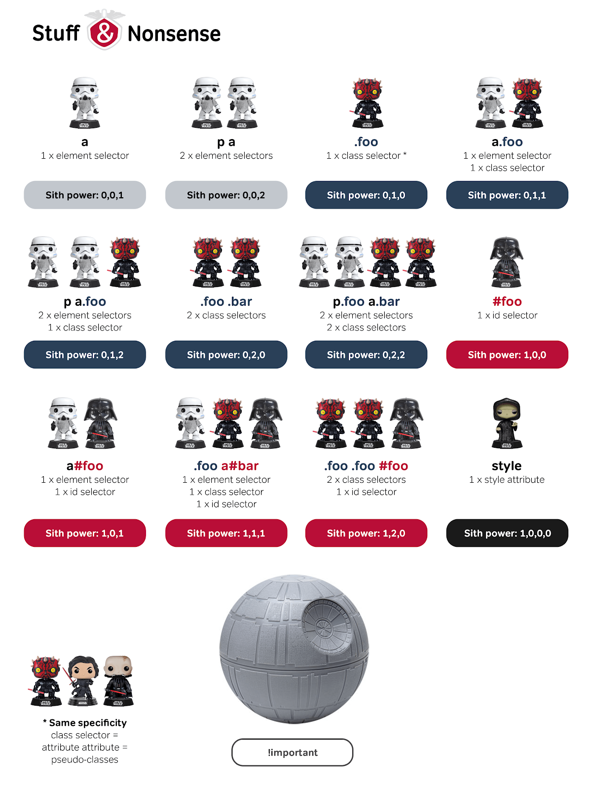
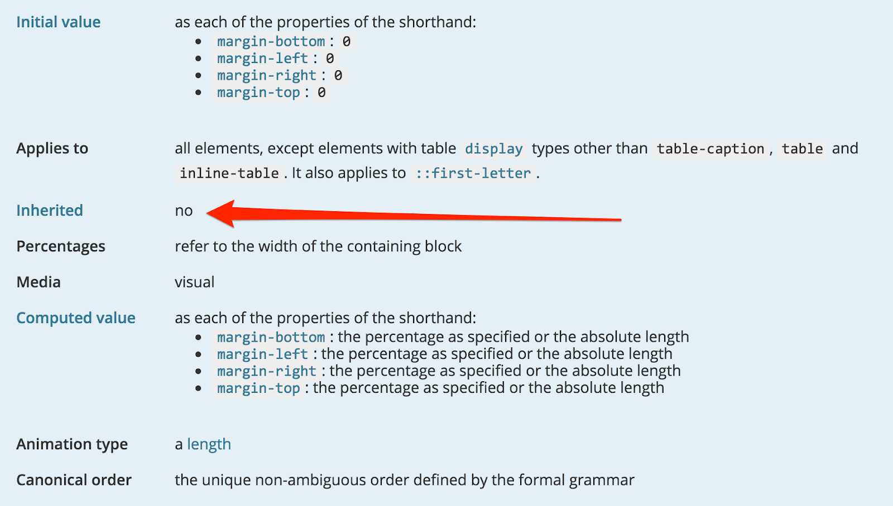

Normally, beginning your journey with CSS entails a steep learning curve. However, mastering CSS is hard since it is such a broad topic in itself. The field of applications is diverse, thus understanding the basics helps you to become a more productive developer.

Sure, having a good understanding is most of the time sufficient. Applying the trial and error method until your selectors do what you want does most of the time the job. However, in big projects you will sooner or later struggle with side effects or other weird bugs without understanding precedence in CSS.


# Precedence

As a reminder, take a look at the structure of a CSS rule.


If several CSS rules target the same HTML element and these rules constitute definitions with one or more mutual CSS properties, which styles are applied by the browser in the end? This is where CSS precedence comes into play.

Examples help to make complex situations more understandable. Take a look at the following code snippets (or play around with the [Codepen](https://codepen.io/doppelmutzi/pen/yWLbbL)).

```html
<!-- HTML template code -->

<h2 class="subline">subline</h2>
<aside>
  <h2>sidebar title</h2>
</aside>
```

```css
/* some styles to target h2 elements */

.subline {
  font-family: serif;
}
h2 {
  font-family: sans-serif;
}
aside {
  color: red;
}
```

In the end, the sidebar title element has a sans-serif and red font applied. The subline element has a black serif font.

Several interesting things happened here. There is no selector that explicitly target a `h2` element to assign a font color. However, the red color of the sidebar title was inherited by its parent element (`aside`). The second CSS `font-family` declaration (`h2` selector) was not applied by the subline element because the `.subline` selector was considered as more specific by the browser.

All these aspects are considered to determine which CSS declarations for every DOM element have to be applied. If multiple CSS declarations (e.g., `font-family: serif;` and `font-family: sans-serif;`) with the same CSS property (`color`) are found to target a particular DOM element (e.g., the sidebar title), the Browser creates a precedence order. Thereby, the property value with the highest precedence gets applied.

As you can see from this simple example, many aspects play a role in the Browser process of determining the actual CSS styles. To be more specific, the following concepts are part of the precedence algorithm:
- specificity
- inheritance
- the cascade

# Specificity

https://codepen.io/doppelmutzi/pen/WZavOm
Take a look at the following CSS snippet. It shows a bunch of selectors to style `li` elements.

```css

.challenge li::before {
  content: '😃';
  margin-right: .25em;
  vertical-align: middle;
}

.challenge > ul li::before {
  content: '😴';
}

ul[data-smiley='crying'] > li::before {
  content: '😭';
}
```
The corresponding HTML elements are shown next.
```html
<main class="challenge">
  <ul class="list">
    <li>1.1</li>
      <ul class="list">
        <li>2.1</li>
        <li>2.2</li>
        <ul class="list" data-smiley="crying">
          <li>3.1</li>
          <li>3.2</li>
          <li>3.3</li>
        </ul>
        <li>2.3</li>
      </ul>
    <li>1.2</li>
    <li>1.3</li>
  </ul>
</main>

```
If you specify multiple selectors to target the same HTML element, the Browser picks the selector with the highest [specificity](https://www.w3.org/TR/selectors-3/#specificity) value.

What is selector specificity all about? The [Specificity Calculator](https://specificity.keegan.st/) is a nice online tool constituting a visual way to understand this concept.


The first selector has a higher specificity because classes are more specific than elements.

You can think of selector specificity as a row vector of 4 elements as depicted by the [illustration of CSS Tricks](https://css-tricks.com/wp-content/csstricks-uploads/specificity-calculationbase.png).


Consider the following examples:
- selector 1 (0,1,0,0) wins over selector 2 (0,0,0,41)
- selector 1 (0,2,0,1) wins over selector 2 (0,1,2,15)

Over 10 years ago, Andy Clarke published an awesome [article explaining selector specificity through Star Wars](https://stuffandnonsense.co.uk/archives/css_specificity_wars.html).



It is a fun way to learn the concept of specificity. I also recommend Emma Wedekind's [explanation of CSS specificity](https://dev.to/emmawedekind/css-specificity-1kca).

# Inheritance

Inheritance controls what happens if no value for a CSS property has been defined for an element. To be more precise, the inheritance mechanism propagates CSS property values from a parent element to its child elements. However, not every property value gets inherited. MDN's CSS property reference can be used to find out if the values of a particular property gets inherited or not. As you can see from in the following screenshot, `margin` does not get inherited by default.



A [comprehensive list of all CSS properties](https://www.w3.org/TR/CSS21/propidx.html) with information about inheritance provides W3C.


Consider the following example.
```html
<article>
  <h2>Title</h2>
  <p>Lorem Ipsum</p>
</article>
```

```css
article {
  margin: 10px;
}

p {
  margin: inherit;
}
```
By using the `inherit` keyword, the `margin` property value of the `article` element gets propagated to the `p` element. In contrast, the `h2` element does not inherit the `margin` value of its parent since `margin` does not get inherited by default.

The following [Codepen](https://codepen.io/doppelmutzi/pen/NaOGER?editors=1100) constitutes a more comprehensive example of CSS inheritance.


# The Cascade

CSS stands for _Cascading Style Sheets_, so it is not surprising that the cascade plays an important role. The cascade algorithm calculates the above explained precedence for all CSS declarations. Thereby, it also considers specificity and inheritance to determine which styles are applied to HTML elements.

The slightly simplified algorithm looks like this (for complete details refer [W3C specification](https://www.w3.org/TR/CSS2/cascade.html#cascade)):