Inspired by an article why [flex-grow is weird](https://css-tricks.com/flex-grow-is-weird/), I've developed a [small tool (Codesandbox)](https://qqq3mv5rvw.codesandbox.io/) to explore how different properties of flex items work separately or in combination. You can reproduce all examples of this article with my tool. I hope you find it useful.

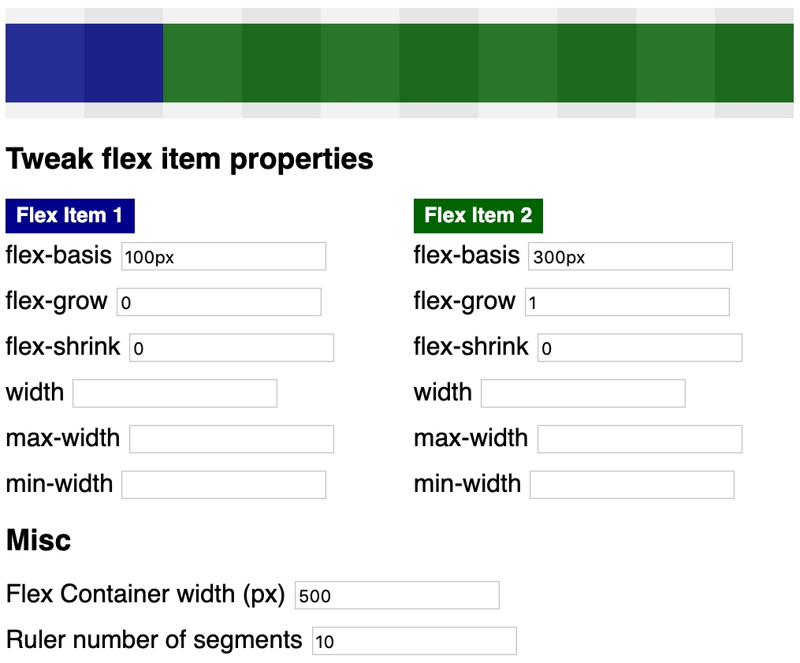

[](https://codesandbox.io/s/qqq3mv5rvw?fontsize=14)

In case this tool is not intuitive for you, this article breaks down different combination of [flex-basis](https://www.w3.org/TR/css-flexbox-1/#flex-basis-property), [flex-grow](https://www.w3.org/TR/css-flexbox-1/#flex-grow-property), and [flex-shrink](https://www.w3.org/TR/css-flexbox-1/#flex-shrink-property) to show how these flexibility properties can be leveraged for responsive flexbox layouts.

## flex-basis

Take a look at the next screenshot.
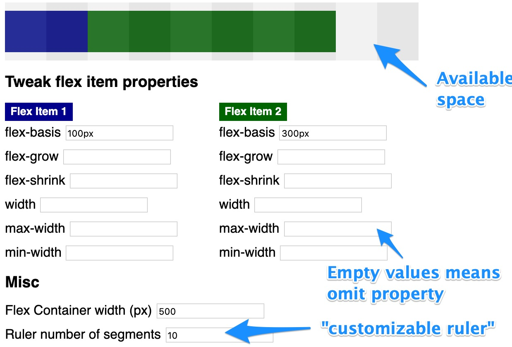

First of all, the blue annotations explain how the tool works. In this example, the 2 flex items (blue = flex item 1 and green = flex item 2) do not consume the whole available space of the flex container (width of `500px`).  `100px` free space is represented by 2 grey-scaled squares (500px / 10 segments). The grey-scaled ruler is meant as utility to visualize how many &quot;portions&quot; of the flex container are free for distribution.

The next example shows both `width` and `flex-basis`.

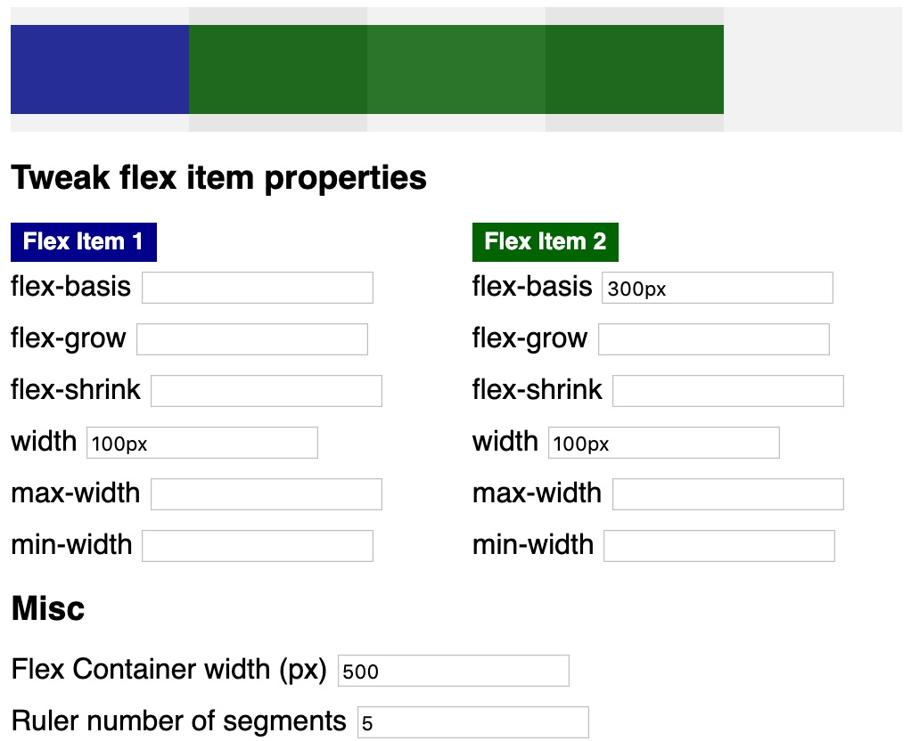

So what is the difference between `width` and `flex-basis` In case you specify both properties (green flex item), `width` is ignored. The blue flex item does not specify `flex-basis` so the item automatically gets the default property (`flex-basis: auto`). In such a case, `width` is used for scaling.

Dave Geddes compiled an in-depth explanation on [the difference between width and flex-basis](https://gedd.ski/post/the-difference-between-width-and-flex-basis/).

## flex-shrink

As you can see in the next example, `flex-basis` can cause an overflow of the flex container.
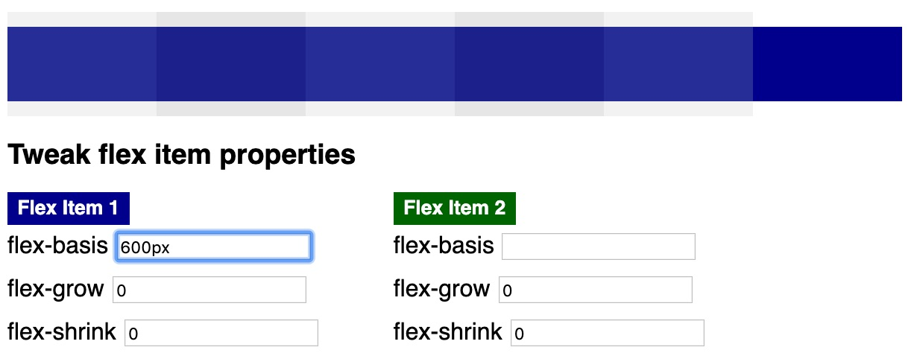

However, specifying a `flex-shrink` value fixes the problem by allowing the blue flex item to shrink.

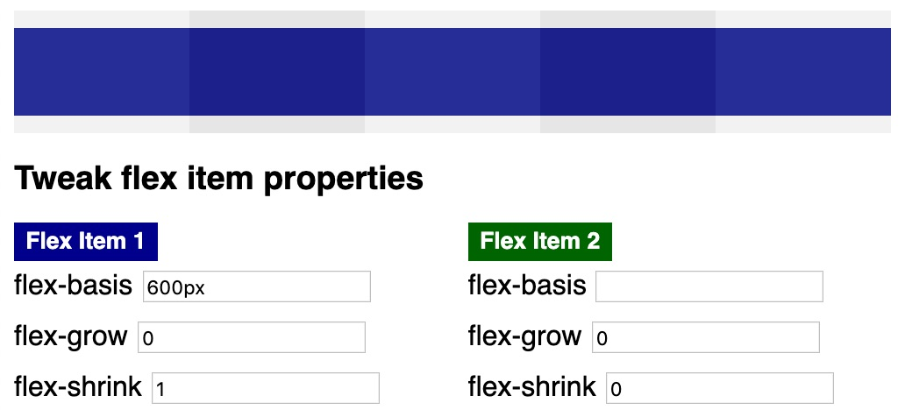

You can specify `flex-shrink` for every flex item. In the next example, flex item 1 shrinks 4 times more than flex item 2.

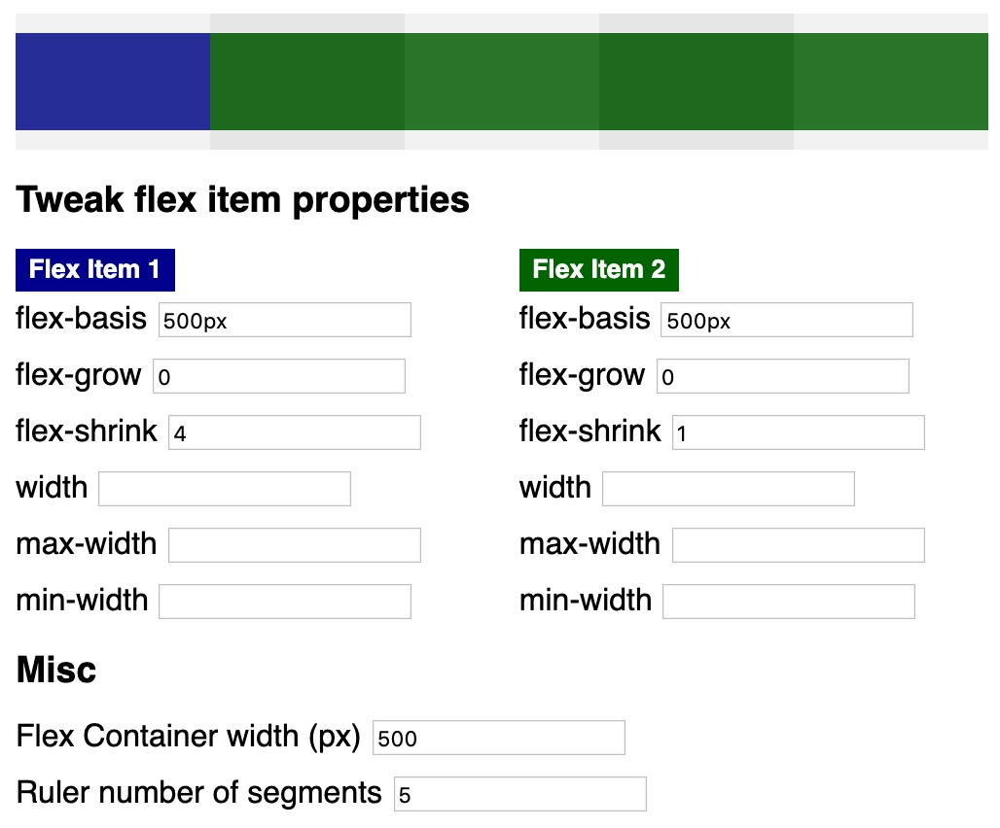

As you can see, the blue flex item consumes 1 spot (`100px`) and the green flex item consumes 4 spots (`400px`). How come?

The following code snippet shows the calculation for the available space for the aforementioned example.

```javascript
// pseudo algorithm for flex-shrink

const flexItem1Width = 500
const flexItem2Width = 500
const flexContainerWidth = 500
// 500 - 500 + 500 = | -500 | = 500px
const spaceToDistribute =
  Math.abs(flexContainerWidth - flexItem1Width + flexItem2Width)
const flexItem1ShrinkFactor = 4
const flexItem2ShrinkFactor = 1
// 5
const totalShrinkValues = flexItem1ShrinkFactor + flexItem2ShrinkFactor
// 100px
const distributionSpot = spaceToDistribute / totalShrinkValues
// 500px - (4 * 100px) = 100px
const flexItem1ComputedWidth =
  flexItem1Width - (flexItem1ShrinkFactor * distributionSpot)
// 500px - (1 * 100px) = 400px
const flexItem2ComputedWidth =
  flexItem2Width - (flexItem2ShrinkFactor * distributionSpot)
```

Downsizing only happens if required. In the following example, the `flex-basis` values are respected.

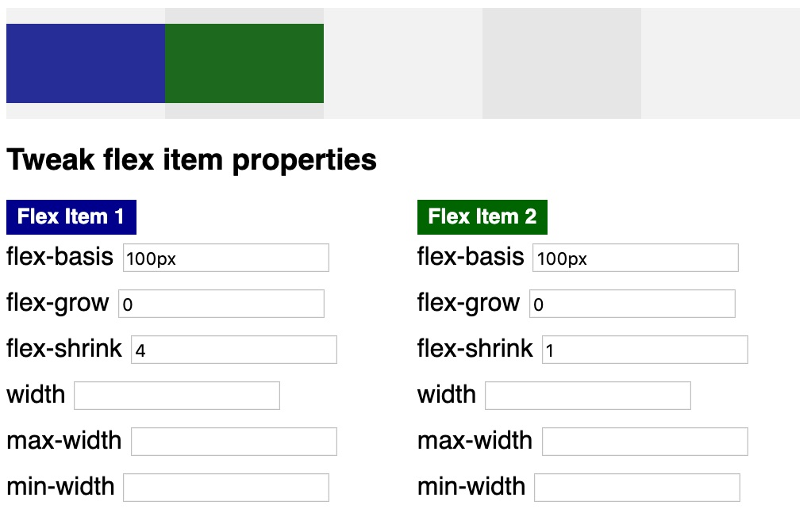

## flex-grow

Of course, you can specify multiple flex item properties. The next screenshot shows that providing `flex-shrink` and `flex-grow` values is totally legit.

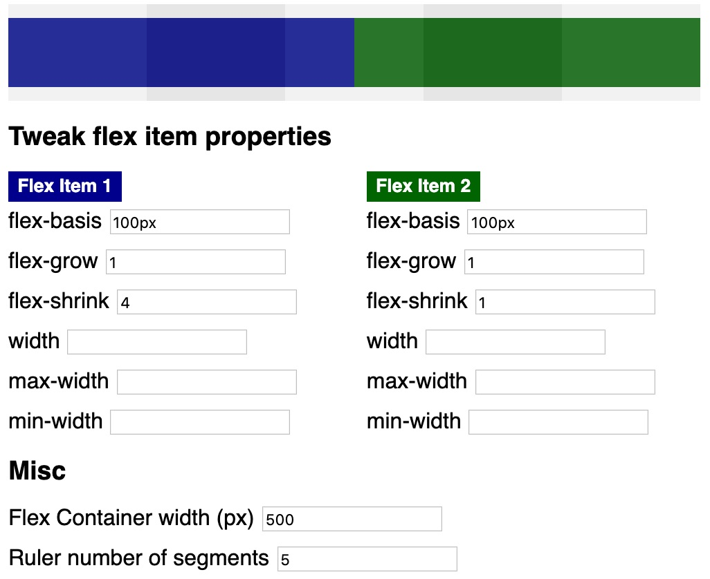

In this case, only `flex-grow` values take effect causing both flex items to grow equally (because of same factor `1`). Obviously, you can also specify different `flex-grow` values for your flex items and the behavior is exactly as you expect it (same as with `flex-shrink` but growing instead of shrinking).

Finally, let's take a look at the following example to examine the calculation formula for `flex-grow`, too.

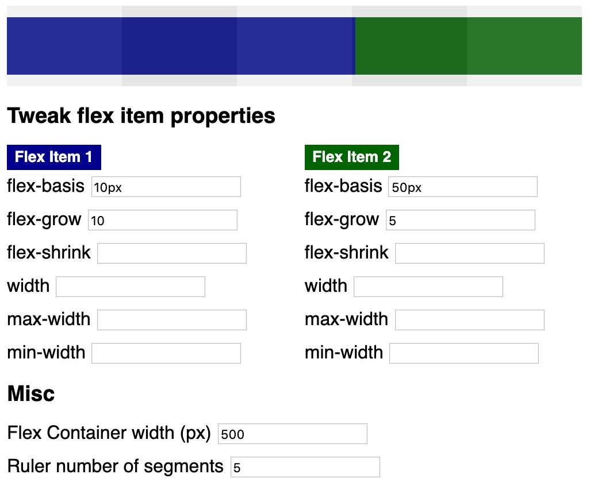

The algorithm is nearly the same as for `flex-shrink`.

```javascript
// pseudo code for flex-grow algorithm

const flexItem1Width = 10
const flexItem2Width = 50
// 10px + 50px - 500px = | -440px | = 440px
const spaceToDistribute = 440
const flexItem1GrowFactor = 10
const flexItem2GrowFactor = 15
// 15
const totalGrowValues = flexItem1GrowFactor + flexItem2GrowFactor
// 440px / 15 = 29,3333
const distributionSpot = spaceToDistribute / totalGrowValues
// 10px + (10 * 29,3333px) = 303,33333px
const flexItem1ComputedWidth =
  flexItem1Width + (flexItem1GrowFactor * distributionSpot)
// 50px + (5 * 29,3333px) = 196,6666px
const flexItem2ComputedWidth =
  flexItem2Width + (flexItem2GrowFactor * distributionSpot)
```

## min-width and max-width

Let's take the last example and specify `max-width` values for both flex items, too.

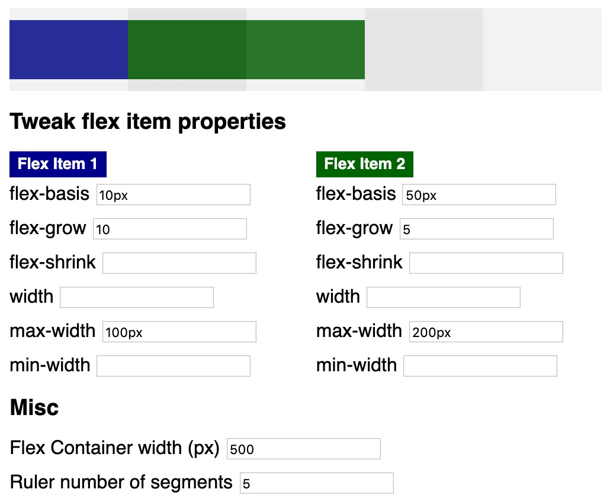

As you can see, `max-width` values are respected. That's why flex item 1 does not grow beyond `100px` (it does not scale to `303,333px`). In addition, flex item 2 does not scale beyond `200px` (it does not scale to `196,6666px`).

Finally, let's see how different flex item properties behave.

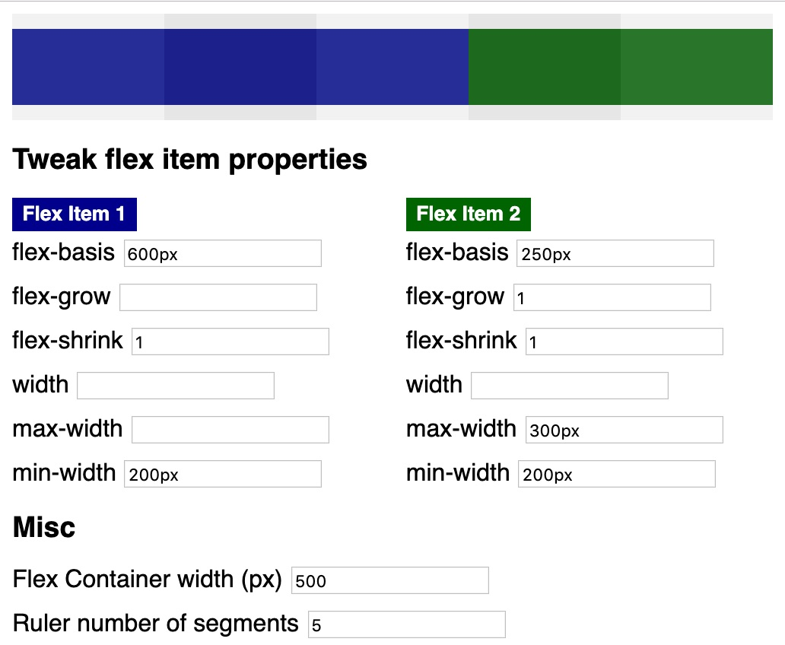

In this example, flex item 1 cannot consume its [hypothetical main size](https://gedd.ski/post/the-difference-between-width-and-flex-basis/) of `600px`. Due to the fact that a `flex-shrink` value other than `0` or `auto` is specified, the blue flex item is allowed to shrink. However, it does not shrink beyond its `min-width` value (`200px`). In the end, its width is `300px` and that's because of the properties of flex item 2. The green flex item cannot take its `flex-basis` width (`250px`). Due to `flex-grow` and `flex-shrink` values the item is allowed to shrink and grow. Growing is not possible because there is no available free space within the flex container. So, the `max-width` value is irrelevant. However, `min-width` is respected and the green flex item takes up `200px` space.

## flex Shorthand

Manuel Matuzovic [explains in detail](https://css-tricks.com/flex-grow-is-weird/) why `flex-grow: 1` is not the same as `flex: 1`.

This is because `flex` is the shorthand for `flex-grow`, `flex-shrink`, and `flex-basis`. It is tricky because you can [use it with one, two, and three values](https://developer.mozilla.org/en-US/docs/Web/CSS/flex#Syntax). E.g., if you use only one value, the other values are implicitly set (e.g., by default values).

## Summary and Lessons Learned

It helped me a lot to understand scaling of flex items by developing this tiny tool. I can encourage others to do the same for learning purposes and sharing knowledge.

For me, a good understanding of `flex-grow`, `flex-shrink`, and `flex-basis` in combination with known `width`, `min-width`, and `max-width` properties allows for developing better (in terms of responsive and robust) flexbox layouts.