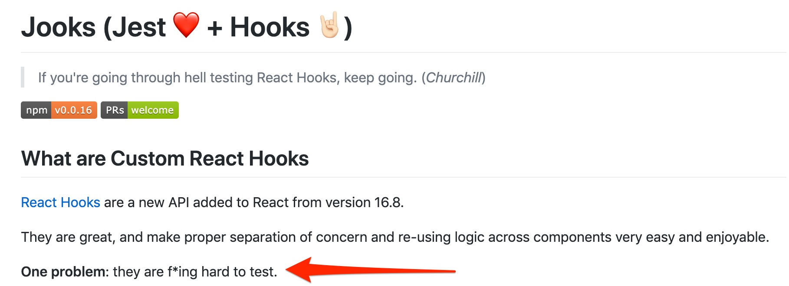
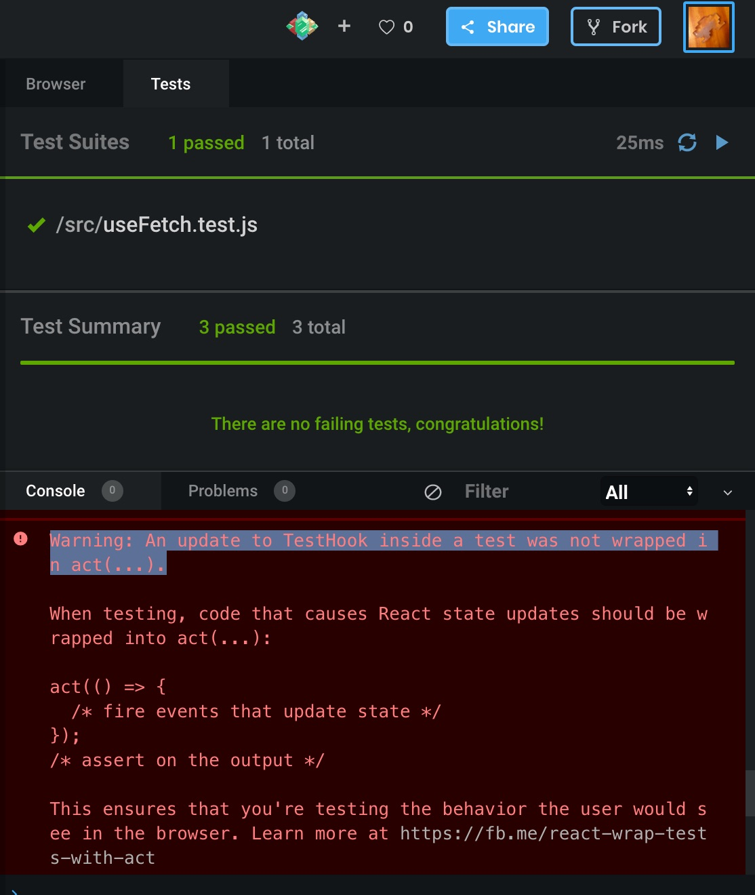

React Hooks is a new concept of React. It requires some rethinking of existing knowledge. Furthermore, developing React components with React Hooks requires a mind shift (e.g., [don't think in lifecycle methods](https://overreacted.io/a-complete-guide-to-useeffect/)). It needs some time to get comfortable, but with some practice hooks can be incorporated into real-life projects without problems. Custom hooks are very useful to encapsulate logic into isolated modules that can be easily reused.

However, testing hooks is (currently) no easy task. It took me quite some time to write working tests for my custom hooks. This post describes the crucial aspects for testing custom hooks.



You can find the code for the custom hook as well as the test code in my [Code Sandbox](https://codesandbox.io/s/testing-custom-hook-demo-7uqwv).

# The Custom Hook

This article expects you to know how to write custom React Hooks. If you are new to this topic, check out [React's documentation](https://reactjs.org/docs/hooks-custom.html).

The following code snippet constitutes a simple custom React Hook to perform a GET request with Axios. 

```Javascript
// useFetch.js
import { useState, useEffect } from "react";
import axios from "axios";

// custom hook for performing GET request
const useFetch = (url, initialValue) => {
  const [data, setData] = useState(initialValue);
  const [loading, setLoading] = useState(true);
  useEffect(() => {
    const fetchData = async function() {
      try {
        setLoading(true);
        const response = await axios.get(url);
        if (response.status === 200) {
          setData(response.data);
        }
      } catch (error) {
        throw error;
      } finally {
        setLoading(false);
      }
    };
    fetchData();
  }, [url]);
  return { loading, data };
};

export default useFetch;
```

The following code shows how this custom hook can be used.
```JavaScript
import React from "react";
import ReactDOM from "react-dom";
import "./styles.css";

import useFetch from "./useFetch";

function App() {
  const { loading, data } = useFetch(
    "https://jsonplaceholder.typicode.com/posts/"
  );

  return (
    <div className="App">
      {loading && <div className="loader" />}
      {data &&
        data.length > 0 &&
        data.map(blog => <p key={blog.id}>{blog.title}</p>)}
    </div>
  );
}

const rootElement = document.getElementById("root");
ReactDOM.render(<App />, rootElement);
```

# Testing the Custom Hook

At time of this writing, testing hooks is no straight forward task. React's official documentation provides only a [tiny section on this topic](https://reactjs.org/docs/hooks-faq.html#how-to-test-components-that-use-hooks). I had a hard time to test hooks because of violations against the [rules of hooks](https://reactjs.org/docs/hooks-rules.html).

However, I've discovered [react-hooks-testing-library](https://react-hooks-testing-library.com/) that handles running hooks within the body of a function component, as well as providing various useful utility functions.

Before you write your tests, you need to install the library along with its peer dependencies as [described in the documentation](https://react-hooks-testing-library.com/setup):
```bash
$ npm install --save-dev @testing-library/react-hooks
$ npm install react@^16.8.0
$ npm install --save-dev react-test-renderer@^16.8.0
```

The custom hook utilizes [axios](https://www.npmjs.com/package/axios) for fetching data. We need a way to mock the actual networking. There a many ways to do this. I like [axios-mock-adapter](https://github.com/ctimmerm/axios-mock-adapter) making it easy to write tests for succeeding and failing requests.

First, take a look at the following [Jest](https://jestjs.io/) test, before we discuss the crucial parts.

```Javascript
// useFetch.test.js
import { renderHook } from "@testing-library/react-hooks";
import axios from "axios";
import MockAdapter from "axios-mock-adapter";

import useFetch from "./useFetch";

test("useFetch performs GET request", async () => {
  const initialValue = [];
  const mock = new MockAdapter(axios);

  const mockData = "response";
  const url = "http://mock";
  mock.onGet(url).reply(200, mockData);

  const { result, waitForNextUpdate } = renderHook(() =>
    useFetch(url, initialValue)
  );

  expect(result.current.data).toEqual([]);
  expect(result.current.loading).toBeTruthy();

  await waitForNextUpdate();

  expect(result.current.data).toEqual("response");
  expect(result.current.loading).toBeFalsy();
});
```

The implementation of _useFetch_ performs a network request with axios. Therefore, we mock the _GET_ request before we call _useFetch_.

```Javascript
// ...
const mock = new MockAdapter(axios);
// ...
/* 
  Mock network call. Instruct axios-mock-adapter 
  to return with expected data and status code of 200.
*/
mock.onGet(url).reply(200, mockData);
// invoke our custom hook
const { result, waitForNextUpdate } = renderHook(() =>
  useFetch(url, initialValue)
);
```

As you can see, _useFetch_ is wrapped in a [renderHook](https://react-hooks-testing-library.com/usage/basic-hooks#rendering) function invocation. What this actually does is to provide the correct context to execute the custom hook without violating the rules of hooks (in this case that [hooks can only be called inside the body of a function component](https://react-hooks-testing-library.com/#the-problem)). 

The _renderHook_ call returns a [RenderHookResult](https://react-hooks-testing-library.com/reference/api#renderhook). In our example, we destructure _result_ and _waitForNextUpdate_ from the result object. Let's discuss _result_ first.

```Javascript
// ...
const { result, waitForNextUpdate } = renderHook(() =>
  useFetch(url, initialValue)
);

expect(result.current.data).toEqual([]);
expect(result.current.loading).toBeTruthy();
// ...
```

_result_ constitutes the [renderHook result](https://react-hooks-testing-library.com/reference/api#renderhook-result). As you can see in the _expect_ statement, we can access the actual return value of our custom hook from _result.current_.  So _result.current.data_ and _result.current.loading_.  These two assertions evaluates to true. The _data_ state holds the passed initial value and the _loading_ state is true because the actual network call has not been performed. 

So far, so good, but how do we do this? Therefore, we need _waitForNextUpdate_.

```Javascript
// ...
const { result, waitForNextUpdate } = renderHook(() =>
  useFetch(url, initialValue)
);

expect(result.current.data).toEqual([]);
expect(result.current.loading).toBeTruthy();

await waitForNextUpdate();

expect(result.current.data).toEqual("response");
expect(result.current.loading).toBeFalsy();
```

_[_waitForNextUpdate_ allows us to wait for the asynchronous function to return in order to check the response of the network call.

The following extract is from the [documentation](https://react-hooks-testing-library.com/usage/advanced-hooks#async):
> returns a Promise that resolves the next time the hook renders, commonly when state is updated as the result of an asynchronous action`.

After `await waitForNextUpdate()` returns we can assert _result.current.data_ to hold data coming from the (mock) network request. In addition, a state change through calling `setLoading(false)` was performed and, thus, _result.current.loading_ is false. 

# Testing More Use Cases

The following code snippet shows two additional tests. The first one tests if our hook implementation can handle multiple invocations. The second one checks the network error case with the help of _axios-mock-adapter_.

```Javascript
test("useFetch performs multiple GET requests for different URLs", async () => {
  // fetch 1
  const initialValue = "initial value";
  const mock = new MockAdapter(axios);

  const mockData = 1;
  const url = "http://mock";
  mock.onGet(url).reply(200, mockData);

  const { result, waitForNextUpdate } = renderHook(() =>
    useFetch(url, initialValue)
  );

  expect(result.current.data).toEqual("initial value");
  expect(result.current.loading).toBeTruthy();

  await waitForNextUpdate();

  expect(result.current.data).toEqual(1);
  expect(result.current.loading).toBeFalsy();

  // fetch 2
  const url2 = "http://mock2";
  const mockData2 = 2;
  mock.onGet(url2).reply(200, mockData2);

  const initialValue2 = "initial value 2";
  const { result: result2, waitForNextUpdate: waitForNextUpdate2 } = renderHook(
    () => useFetch(url2, initialValue2)
  );

  expect(result2.current.data).toEqual("initial value 2");
  expect(result2.current.loading).toBeTruthy();

  await waitForNextUpdate2();

  expect(result2.current.data).toEqual(2);
  expect(result2.current.loading).toBeFalsy();
});

test("useFetch sets loading to false and returns inital value on network error", async () => {
  const mock = new MockAdapter(axios);

  const initialValue = [];
  const url = "http://mock";

  mock.onGet(url).networkError();

  const { result, waitForNextUpdate } = renderHook(() =>
    useFetch(url, initialValue)
  );

  expect(result.current.data).toEqual([]);
  expect(result.current.loading).toBeTruthy();

  await waitForNextUpdate();

  expect(result.current.loading).toBeFalsy();
  expect(result.current.data).toEqual([]);
});
```

# Conclusion

I really like the API of _react-hooks-testing-library_. But what I like most is that the library enables me to test custom hooks in first place. IMHO testing with this lib is straightforward. 

However, if you try out [my Code Sandbox](https://codesandbox.io/s/testing-custom-hook-demo-7uqwv), you will see annoying warnings in the console.


The [problem is known](https://github.com/testing-library/react-hooks-testing-library/issues/14) and the community is working to solve it. Even [Dan Abramov confirms that testing hooks is not 100% ready](https://github.com/facebook/react/issues/14769#issuecomment-474656273), yet.

However, I can live with it.
