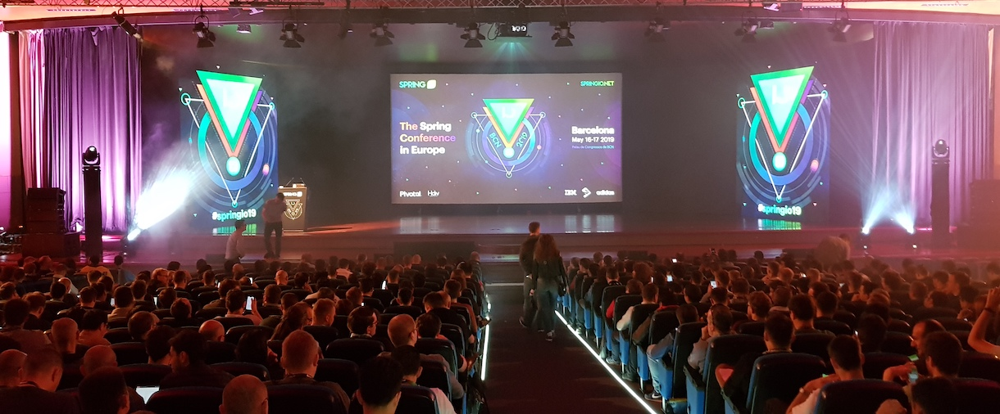

Gastbeitrag von Jérôme Waibel ([diva-e](https://www.diva-e.com/de/)) und Jörg Alberto Hoffmann ([diva-e](https://www.diva-e.com/de/))

Wie schon im letzten Jahr waren auch dieses Jahr einige diva-e-Entwickler auf der Spring IO 2019 im schönen Barcelona zu Gast, um sich über die Neuerungen rund um das auch bei diva-e-Projekten so beliebten Frameworks zu informieren. Von den hoch-interessanten Entwicklungen rund um das Spring-Ökosystem, auf die wir uns in den nächsten Releases von Spring-Core 5.2 und Spring-Boot 2.2 freuen können, möchten wir hier kurz berichten.

# Reaktive Webanwendungen
Reaktive Anwendungen waren bereits im letzten Jahr auf der Spring IO 2018 ein ganz heißes Thema. Allerdings gab es da noch einige große Fragezeichen, beispielsweise rund um das Tooling, Anbindung von klassischen Datenbanken oder auch einfach nur, ob sich der Aufwand zum Umstieg auf Reaktive Webanwendungen überhaupt lohnt, oder das bisherige Paradigma nicht einfach “gut genug” ist.

Bereits in der Keynote zur Eröffnung wurde klar, dass auch bei Spring diese Bedenken erkannt wurden und an Lösungen gearbeitet wird. So gibt es nun Tools zur Unterstützung bei der Fehlersuche, wie bspw. [BlockHound](https://github.com/reactor/BlockHound/blob/master/docs/quick_start.md), welcher über blockierende Stellen in den Anwendungen alarmiert, oder Erweiterungen um bessere Stacktraces zu erzeugen. Zu den ganz großen Highlights gehören aber zwei komplett neue Frameworks: R2DBC als Spezifikation für den reaktiven Zugriff auf klassische, relationale Datenbanken, sowie RSocket als reaktives Anwendungsprotokoll.

# R2DBC
Anwendungen mit Spring WebFlux zu erstellen, ohne dass der gesamte Technologiestack ein reaktives Programmiermodell unterstützt, ist nur begrenzt sinnvoll. Spätestens beim Zugreifen auf die Datenbank mittels JDBC oder JPA wird wieder blockierender Code ausgeführt. Während die Anwendung an sich mit weniger Threads und geringerem Memory Overhead auskommt, wird beim Datenbankzugriff wieder auf einen Connection Pool zugegriffen, der ausschließlich über Threads skaliert.

[R2DBC](https://r2dbc.io/) (Reactive Relational Database Connectivity) ermöglicht es nun auch relationale Datenbanken, welche erfahrungsgemäß immer noch einen Großteil aller DB Systeme ausmachen, asynchron und nicht-blockierend anzusprechen. Dabei setzt die R2DBC Spezifikation direkt auf Reactive Streams. Eine wichtige Designentscheidung lautete, auf eine möglichst einfache und kleine SPI zu setzen, auf denen in Zukunft wiederum Entwickler-freundliche APIs aufbauen können. Anders als JPA bringt R2DBC somit keine weiterführenden Features wie Caching, Lazy Loading oder ORM Funktionen mit und setzt voll auf native, optimierbare SQL Queries und Prepared Statements.

R2DBC liegt derweil in Version 0.8 vor und wird (noch) nicht für den produktiven Einsatz empfohlen, unterstützt allerdings schon MySQL, MSSQL, PostgreSQL und H2 als In-Memory DB. Auch Unterstützung für Transaktionen und BLOB/CLOB Support sind bereits größtenteils vorhanden.

Des weiteren hat Ben Hale interessante neue Funktionen wie den [r2dbc-proxy](https://github.com/r2dbc/r2dbc-proxy) erläutert, welcher es erlaubt, (Slow) Query Logging oder Methoden Tracing für Datenbankzugriffe programmatisch zu implementieren.

# RSocket
Gerade in Zeiten ausufernder Microservice-Landschaften binden viele Spring-basierte Anwendungen aber nicht nur Datenbanken an, sondern kommunizieren auch intensiv mit anderen Diensten und Third Party APIs. Und nicht immer ist HTTP (1.1 oder auch 2) dafür die beste Wahl. Mit RSocket hat Ben Hale von Pivotal nun eine Alternative zu HTTP vorgestellt, die den reaktiven Grundgedanken (z.B. Backpressure) auf Interprozess-Kommunikation ausweitet. [RSocket](http://rsocket.io/) ist ein binäres Anwendungsprotokoll, ursprünglich von Netflix entwickelt, welches drei neue Kommunikations-Semantiken für IPC zwischen Microservices einführt mit dem Ziel Kommunikationsoverhead zu vermeiden und reaktive (in diesem Kontext: bidirektionale, gemultiplexte und asynchrone) Kommunikation zwischen Server und Client zu ermöglichen.

Neben dem von HTTP bekannten Request-Response Mechanismus wurden in dem spannenden Vortrag auch vorgestellt:
* Fire-and-Forget: Wie der Name schon deutlich macht, wird ein Request geschickt, ohne auf eine Antwort zu warten.
* Request-Stream: kontinuierlicher, endlicher Stream an Daten. Interessant um z.B. historische Event Daten ressourcenschonend zu konsumieren.
* Channel: Bidirektionale Streams an kontinuierlichen Response/Request Streams, gemultiplext auf einen Stream
Die RSocket-Protokollspezifikation wird als Standard von einer breiten Community weiterentwickelt.

Zusammenfassend kann man sagen, dass das Thema “Reaktive Webanwendung” in Verbindung mit Spring WebFlux mit Sicherheit das Standard-Paradigma für die Entwicklung von Microservices in der Zukunft sein wird. Die Frage lautet nicht mehr “Warum sollte ich das machen?”, sondern muss vielmehr lauten “Warum sollte ich das nicht machen?”.

# JSON Web Token
Eine weitere sehr erfreuliche Neuerung ist die zukünftig wesentlich leichtere Handhabung von Client-Authentifizierung mittels JWT und OAuth2. Wer schon einmal OAuth mit Spring benutzt hat weiß, dass dies bisher nicht immer ein ganz einfaches Unterfangen war. Ab Spring 5.2 jedoch ist das Benutzen von JWT-Tokens und OAuth, sowohl als Webseite mit Frontend, als auch als Ressourcen-liefernder Microservice, als auch als Client hin zu anderen Diensten ein Kinderspiel, was mit wenigen Zeilen Konfiguration erledigt ist. Speziell hervorheben möchten wir an dieser Stelle die Talks von Thomas Darimont zum Authentifizierungsserver Keycloak, der einmal mehr zeigte, dass es wirklich absolut keinen Grund gibt diese Lösung nicht einzusetzen, sowie den, aus gutem Grund wirklich [sehr gut besuchten](https://twitter.com/MichaelHagerAIT/status/1129376508559155201?s=20), Talk von Joe Grandja, der ein hervorragendes Beispielprojekt erstellt hat, welches Blueprints zu allen üblichen Authentifizierungsmustern im Microservices-Umfeld liefert.

# Weitere lobende Erwähnungen
Ebenfalls kurz lobend erwähnt werden müssen

* ein Vortrag von Ray Tsang und Josh Long, der zeigt, wie einfach GCP-Produkte in Spring einbindbar sind. Sehr beeindruckend war ein Zweizeiler(!), welcher ein Bild aus einem Google-Storage gelesen und mittels Bilderkennung als Katze erkannt hat,
* ein Vortrag von Tom Hombergs zum Thema “Hexagonale Architektur”, der dies nicht nur theoretisch, sondern auch praxisnah an einem Spring-basierten Demoprojekt erklärt hat,
* ein Vortrag von Andreas Evers zu Spinnaker, welcher die Mächtigkeit des Werkzeugs am Beispiel eines vollautomatisch durchgeführten Blue-Green-Deployments demonstrierte,
* dass - nachdem Netflix große Teile seiner Cloud Projekte in den Maintenance Status verschoben hat - Pivotal nun nachgezogen ist und Spring Cloud Netflix ebenfalls in den Maintenance Modus gesetzt hat. Dafür haben Olga Maciaszek-Sharma und Marcin Grzejszczak mit Spring Cloud Gateway eine (nicht rückwärts-kompatible) Wachablösung für Netflix' Zuul Gateway vorgestellt. Auch andere Netflix Projekte werden mit alternativen Spring Cloud Projekten aus dem Hause Pivotal ersetzt,
* und Oleg Šelajev eine kurze Einführung in GraalVM und dessen potentiellen Vorteile (Polyglot, Performance) gegeben hat, als auch über den aktuellen Stand der Produktionsreife (eher noch nicht soweit) informiert hat.

# Zusammenfassung
Die Spring IO ist definitiv eine Konferenz, an der man als Entwickler im Umfeld Spring / Microservices / Java / Kotlin / Cloud / Kubernetes teilnehmen sollte. Die Vorträge sind sehr praxisnah und -relevant, das kommerzielle Sponsoring angenehm zurückhaltend und die Organisation extrem professionell. Selbst die kleinen Kritikpunkte vom letzten Jahr (zu wenig Verpflegung, zu viel Plastikgeschirr) wurden als Feedback verarbeitet und in diesem Jahr vorbildlich behoben. Und zu guter Letzt ist natürlich auch die Messe Barcelona und natürlich die Stadt selbst eine Reise wert. Wir freuen uns jedenfalls schon darauf, im nächsten Jahr wieder dabei sein zu dürfen.
