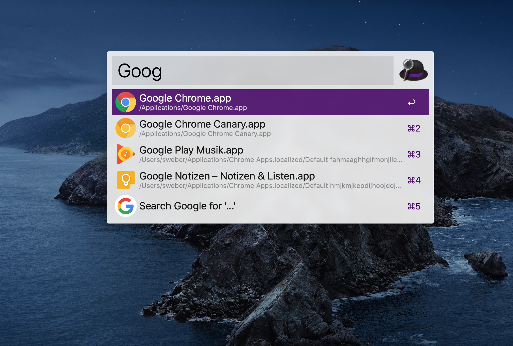
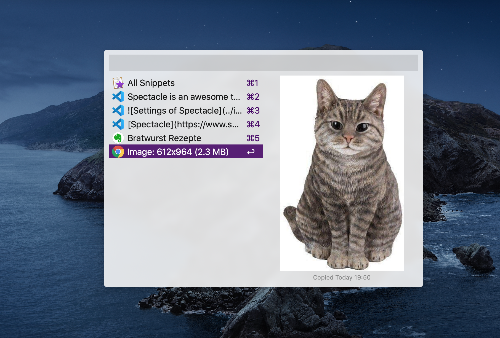

Using a mouse or trackpad is a major distraction and flow-breaker for many development tasks, especially programming. I strive for using keyboard shortcuts as much as possible to be more productive while programming.

Out of the box, macOS does not provide many keyboard shortcuts when it comes to window management. As an example, there is no way to move a focused window to another space by keyboard.

In this article I want to present my curated list of useful tools to manage windows, displays, and spaces (of [Mission Control](https://en.wikipedia.org/wiki/Mission_Control_(macOS))) without a mouse. I hope you retire your mouse after reading this post. 😉

# Alfred &ndash; Application Launcher on Steroids
[Alfred](https://www.alfredapp.com/) is an elite application launcher and utility to search and find files on your machine or on the Web. I use Alfred instead of [Spotlight](https://support.apple.com/en-us/HT204014). The hotkey to open up the launcher panel has been burned into my brain for a long time. Of course, you can define a custom key combo in Alfred's settings.

Alfred is very versatile, you just have to fire up the panel with your defined hotkey and you can start typing. Most of the time I type the starting characters of an app I want to launch. However, you can do more from this input field, e.g., start a google search as you can see from the next screenshot (marked by **⌘5**).

To open a file or folder on your machine, start typing **open** and Alfred assists you with recommended actions shown in the result list.

Alfred has many more awesome features like snippets or workflows, which I will not cover here. Take a look at Alfred's [power pack](https://www.alfredapp.com/powerpack/). I want to point out one awesome feature and that is **Clipboard History**. You can define a shortcut in the **Features** section of Alfred's settings.

If you press the defined hotkey, a clipboard history panel appears and allows you to paste more than the last copied item.

# Spectacle &ndash; The Missing Window Resizer

[Spectacle](https://www.spectacleapp.com/) is an awesome tiny tool that allows for changing the size or position of a particular window. It upgrades macOS in a way that you can use keyboard shortcuts to resize or move focused windows of any app. Sophisticated window management by shortcuts is one aspect I have missed from Microsoft Windows when I was working on a project with PCs as development machines.

In my current project, I have an environment with two external displays in addition to the built-in display of my MacBook. Spectacle provides
customizable shortcuts even for throwing a focused window to another display. Therefore, you can specify shortcuts in Spectacle's settings dialog for **Next Display** and **Previous Display**.

Besides moving windows from one visible display to another, I highly use shortcuts to resize windows like **Make Larger**, **Make Smaller**, or **Left Half**.

I appreciate Spectacle's simplicity. You have a nice glasses icon in the menu bar to see all window actions along with keyboard shortcuts at a glance.

The following recording gives an impression how Spectacle works. I used the shortcuts as you can see in the screenshot above.

<iframe width="560" height="315" src="https://www.youtube.com/embed/CZNxXPJ2k44" frameborder="0" allow="accelerometer; autoplay; encrypted-media; gyroscope; picture-in-picture" allowfullscreen></iframe>

Spectacle is brilliant, however, it lacks one feature I really need. I need to move windows also to invisible spaces. Spectacle only allows to move windows between visible spaces (i.e., displays) by defining shortcuts for **Next Display** and **Previous Display**. Luckily, the next tool can help out.

# Amethyst &ndash; A Handy Tiling Window Manager

[Amethyst](https://ianyh.com/amethyst/) constitutes a tiling window manager for macOS. It has some features in common with Spectacle, e.g., increasing and decreasing window sizes by shortcuts. However, as you can see from the screenshot about Amethyst's settings, the tool provides many more useful shortcuts.

My personal killer feature is the ability to throw focused windows to a particular space. I very often move a window to the left or right space (**Throw focused window to space left** or **Throw focused window to space right**).

Another very handy feature does not require using shortcuts at all. Amethyst rearranges windows on a display automatically (i.e., visible space in focus). As an example, if you have a single browser window on your active display and you open another browser window by **⌘ N**, both windows are positioned next to each other with the exact same width and height. If you put another window of any software on this display, all three windows are rearranged again in a way that there is no overlapping. Wicked!

<iframe width="560" height="315" src="https://www.youtube.com/embed/8DPpZ0LodeU" frameborder="0" allow="accelerometer; autoplay; encrypted-media; gyroscope; picture-in-picture" allowfullscreen></iframe>

# Contexts &ndash; An Improved Command-Tab Switcher

I use [Contexts](https://contexts.co/) primarily for an improved &quot;Command-Tab switcher&quot;.

Contexts adds the ability to select individual windows by using the learned key combos **⌘ ⇥** and **⇧ ⌘ ⇥** (to move up the list). In the settings you can also define other shortcuts for these actions. Additionally, you can also use multiple shortcuts for invoking the window switcher with individual settings, which is not possible with macOS default switcher.

As you can see from the previous screenshot, you can define any number of shortcuts to activate the window switcher and to move the list up and down. What I really like is that you can restrict the list for every shortcut, e.g., show only visible spaces.

Another major time saver is Contexts' search capability. Actually, it acts more like a filter for the window list. When you have activated the switcher panel, you can just start typing (with pressed hotkey) and, thereby, filter the list to save the time for moving up and down the list.

You can even optimize this workflow by defining a modifier key to activate and use the fast search feature. To switch to a window, press this modifier key and type a few characters from the app name or window title. As you can see from a previous screenshot, on the left-hand side of the switcher panel characters are shown that show you suitable strings for fast search.

What I also like is that I can remove particular apps from the switcher panel's list, e.g., macOS Finder, because I'm not convinced of this tool and use instead an alternative.

# macOS Build-in Shortcuts

There are some shortcuts to use [Mission Control](https://support.apple.com/en-us/HT204100) without a mouse. For me, the most important one is to switch between spaces by pressing **⌃ ←** or **⌃ →**. To open Mission Control or show its spaces bar press **⌃ ↑**. To show all windows of an application side by side press **⌃ ↓**.

Of course, the following shortcuts should become second nature if you want to be productive on a Mac. **⌘ Q** quits applications along with all its windows. To close a focused window press **⌘ W**. To copy and paste things use **⌘ C** and **⌘ V**.

Another useful shortcut during my office hours is locking the screen by pressing **⌃ ⌘ Q**. In addition, a useful shortcut to kill none-responding applications is **⌥ ⌘ ESC**.

# KeyCue &ndash; Shortcus Always at a Glance

If you cannot remember these system shortcuts, you can take a look at the application menu. If a command provides a shortcut, you can find it on the right side of the menu entry. An even faster approach is to use [KeyCue](https://www.ergonis.com/products/keycue/). It's a useful tool to show all shortcuts of the current application which is currently in focus along with system shortcuts. The goal of KeyCue is to find, remember, and learn keyboard shortcuts.

You can show the list of shortcuts for a focused app from the keyboard. As an example, I configured KeyCue to show the list by pressing the **⌘** key for 1.5 seconds.

# Summary

I want to point out that the presented tools provide way more features. However, these are the most important capabilities for me to reduce mouse usage.

Resizing and moving windows between visible and none-visible spaces with just a few keystrokes has significantly improved my productivity during a course of a day. I hope I could provide you some inspiration to improve your development workflow.
