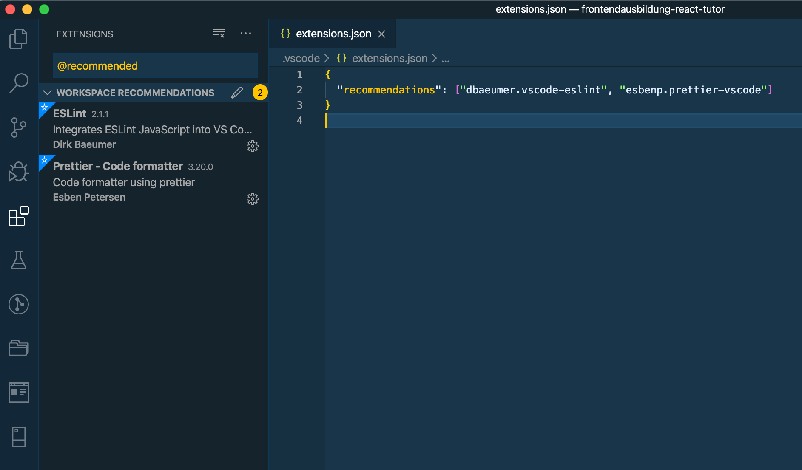

Two years ago, I wrote an article on how to setup a development workflow utilizing [ESLint](https://eslint.org/) for static code analysis and [Prettier](https://prettier.io/) for beautifying code. It was in the context of [Vue.js](https://vuejs.org/) but 99% of the concepts and related technologies are independent of the actual frontend development framework. Meanwhile, I use [React](https://reactjs.org/) on a daily basis on my job project.

As you most likely know, things are steadily changing in &quot;frontend world&quot;. That's why I come up with a 2020 remake of [my original article (which targeted Vue.js &ndash; but it doesn't matter)](https://medium.com/@doppelmutzi/eslint-prettier-vue-workflow-46a3cf54332f). However, I do not want to rehash the old article by duplicating chapters. Instead, I focus only on the technical details:
- related npm dependencies
- general ESLint / Prettier config
- React related config
- VSCode integration

If you are interested in the underlying concepts, please feel free to check out [my former article](https://medium.com/@doppelmutzi/eslint-prettier-vue-workflow-46a3cf54332f):
- What is ESLint, what is Prettier, how they differ
- How to integrate ESLint with Prettier
- What are possible workflows (terminal, git hooks, IDE, etc.)
- IntelliJ integration

# React Project Setup

The easiest thing to launch a running React project is to use [create-react-app](https://github.com/facebook/create-react-app).

```bash
$ npx create-react-app react-project
```

Go to the `package.json` file, remove the `eslint-config` object.
```json
"eslintConfig": {
  "extends": "react-app"
}
```
Add the following `devDependencies`. 

```json
"devDependencies": {
  "babel-eslint": "^10.0.3",
  "eslint": "^6.8.0",
  "eslint-config-babel": "^9.0.0",
  "eslint-config-prettier": "^6.10.0",
  "eslint-plugin-import": "^2.20.0",
  "eslint-plugin-prettier": "^3.1.2",
  "eslint-plugin-react": "^7.18.0",
  "eslint-plugin-standard": "^4.0.1",
  "prettier": "^1.19.1"
}
```

You can learn more about this dependencies by [reading my old article](https://medium.com/@doppelmutzi/eslint-prettier-vue-workflow-46a3cf54332f#b33f).

**TLTR;**
With this setup you can integrate ESLint with Prettier in a way that code formatting is turned off for ESLint ([eslint-config-prettier](https://github.com/prettier/eslint-config-prettier)) and runs Prettier as an ESLint rule ([eslint-plugin-prettier](https://github.com/prettier/eslint-plugin-prettier). [eslint-plugin-standard](https://github.com/standard/eslint-plugin-standard) and [eslint-plugin-react](https://github.com/yannickcr/eslint-plugin-react) are two of the supported plugins.

Of course you have to install the dependencies:
```bash
$ npm i
```

The final step is to add a `.eslintrc.json` file to the root folder with the following content:
```json
{
  "extends": [
    "prettier",
    "prettier/standard",
    "prettier/react",
    "plugin:react/recommended"
  ],
  "plugins": ["prettier"],
  "rules": {
    "prettier/prettier": "error"
  },
  "parser": "babel-eslint",
  "env": {
    "browser": true
  },
  "settings": {
    "react": {
      "pragma": "React",
      "version": "detect"
    }
  }
}
```

# Required Visual Studio Extensions

You need to install two VSCode extensions to get a pretty awesome developer UX. First, you have to install the [Prettier plugin](https://marketplace.visualstudio.com/items?itemName=esbenp.prettier-vscode). In addition, you need the [ESLint plugin](https://marketplace.visualstudio.com/items?itemName=dbaeumer.vscode-eslint) as well. Just search in the extension section for the keywords _&quot;eslint&quot;_ and _&quot;prettier&quot;_ and make sure to install the correct ones, from Dirk Baeumer and Esben Petersen, respectively.

A nice feature of VSCode is to [add recommended extensions to your project](https://code.visualstudio.com/docs/editor/extension-gallery#_workspace-recommended-extensions). It can be useful to get new developers productive fast. All you need to to is to add `.vscode` folder to the root of your project and add a `extensions.json` file with the following content:
```json
{
  "recommendations": [
    "dbaeumer.vscode-eslint", 
    "esbenp.prettier-vscode"
  ]
}
```

For your colleagues it then looks like this.



# Setup Format on Save

The final part of setting up VSCode is to provide the auto save configuration in the workspace settings. Fire up the [command palette](https://code.visualstudio.com/docs/getstarted/userinterface#_command-palette) with ⇧⌘P and type &quot;open workspace settings&quot;. Switch to the json editor. Put the following code inside the json file:
```json
{
  "editor.codeActionsOnSave": {
    "source.fixAll.eslint": true
  },
  "editor.formatOnSave": true,
  "[javascript]": {
    "editor.formatOnSave": false
  },
  "[javascriptreact]": {
    "editor.formatOnSave": false
  }
}
```

The last two properties are necessary for me to turn of other formatting mechanism that have nothing to do with ESLint or Prettier.

By now I think it is a good idea to have these settings under version control. This workspace settings are located in `.vscode/settings.json` of your project. It can help to eliminate different VSCode setups among your colleagues. At least it saves time for recurring work.

At the latest after a restart of VSCode format on save should work as expected for JSX and javascript code as well as json and css files.

# Demo Project

You can check out my demo project to see all this in action. Just perform the following steps:
- [clone](https://github.com/doppelmutzi/eslint-prettier-vscode-react.git) the project
- install the dependencies
```bash
$ npm install
```
- Optional: Install the VSCode extensions for ESLint and Prettier. Go to the Extension section, enter _@recommended_ into the _Search Extensions in Marketplace_ search field, and install both extensions.

Go to javascript, json or css files, change them and press save. The file should be reformatted.

# Conclusion

The setup became even easier than 2 years ago. However, many vectors change, so that it is always a bit complicated to find the interaction between all technologies. In addition, you can find outdated information on the net, which does not make life any easier. To fix the problem for February 2020, this article was created 😀.