These days, you have to use a modern [module bundler](https://lihautan.com/what-is-module-bundler-and-how-does-it-work/) such as [webpack](https://webpack.js.org/) to benefit from a development workflow that utilizes state-of-the-art performance optimization concepts. Module bundlers are built by brilliant people just to help you with these difficult tasks.

In addition, I recommend using a [starter kit](https://webpack.js.org/starter-kits/) or starting with a modern boilerplate project to have webpack configuration best practices in place. Building on this, you can make project-specific adjustments. I like [this React + webpack 4 boilerplate project](https://github.com/esausilva/react-starter-boilerplate-hmr), which is also the basis of this blog’s [accompanying demo project](https://github.com/doppelmutzi/react-performance-strategies).

_Originally published at [blog.logrocket.com](https://blog.logrocket.com/guide-performance-optimization-webpack/)_

webpack 4 comes with appropriate presets. However, you have to understand a fair number of concepts to reap their performance benefits. Furthermore, the possibilities to tweak webpack’s configuration are endless, and you need extensive knowhow to do it the right way for your project.

You can follow along the examples with [my demo project](https://github.com/doppelmutzi/react-performance-strategies). Just switch to the mentioned branch so that you can see for yourself the effects of the adjustments. The `master` branch represents the demo app, along with its initial webpack configuration. Just execute `npm run dev` to take a look at the project (the app opens on http://localhost:3000).

```json
// package.json
"scripts": {
    "dev": "webpack-dev-server --env.env=dev",
    "build": "webpack --env.env=prod"
}
```

## Use production mode for built-in optimization

webpack 4 has introduced `development` and `production` [modes](https://webpack.js.org/configuration/mode/). You should always ship a `production` build to your users. I want to emphasize this because you get many built-in optimizations automatically, such as [tree shaking](https://webpack.js.org/guides/tree-shaking/), [performance hints](https://webpack.js.org/configuration/performance/#performancehints), or minification with the [TerserWebpackPlugin](https://webpack.js.org/plugins/terser-webpack-plugin/) in production mode.

webpack 4 has adopted the software engineering paradigm [convention over configuration](https://en.wikipedia.org/wiki/Convention_over_configuration), which basically means that you get a meaningful configuration by just setting the mode to `production`. However, you can tweak the configuration by overriding the default values. Throughout this article, we explain some of the performance-related configuration options that you can define as you wish for your project.

If you run `npm run build` (on the `master` branch), then you get the following output:

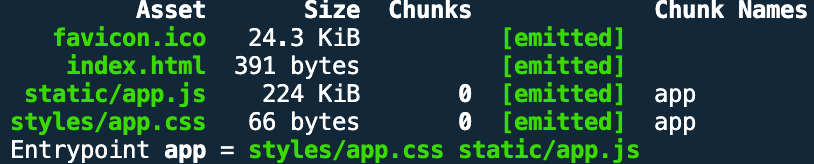


Open `dist/static/app.js` and you can see for yourself that webpack has uglified our bundle.

If you check out the branch `use-production-mode`, you can see how the `app` bundle size increases when you set the mode to `development` because some optimizations are not performed.

```javascript
    // webpack.prod.js
    const config = {
+       mode: "development",
-       mode: "production",
        // ...
    }
```

The result looks like this:

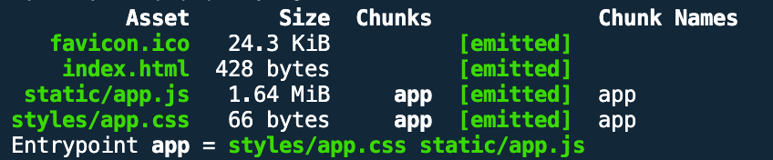

## Use bundle analyzer regularly

You should use the awesome [webpack-bundle-analyzer](https://github.com/webpack-contrib/webpack-bundle-analyzer) plugin regularly to understand what your bundles consist of. In so doing, you realize what components really reside inside your bundles and find out which components and dependencies make up the bulk of their size — and you may discover modules that got there by mistake.

The following two npm scripts run a webpack build (`development` or `production`) and open up bundle analyzer:

```json
// package.json
"scripts": {
    "dev:analyze": "npm run dev -- --env.addons=bundleanalyzer",
    "build:analyze": "npm run build -- --env.addons=bundleanalyzer"
}
```

When you invoke `npm run build:analyze` then an interactive view opens on `http://localhost:8888`.

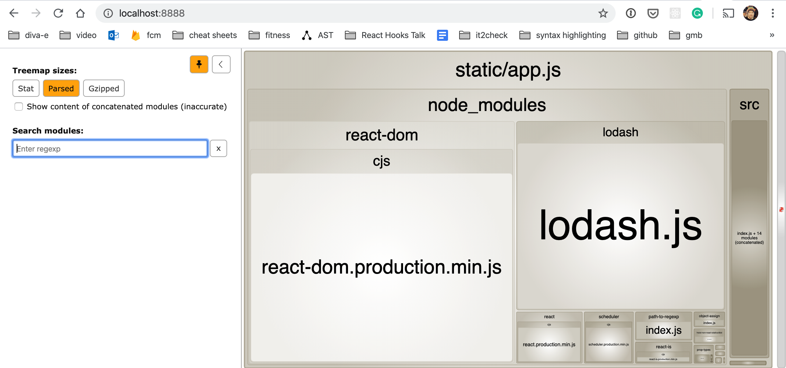


Our initial version of the demo project consists of only one bundle named `app.js` because we only defined one single entry point.

```javascript
// webpack.prod.js
const config = {
    mode: "production",
    entry: {
        app: [`${commonPaths.appEntry}/index.js`]
    },
    output: {
        filename: "static/[name].js",
    },
    // ...
}
```    

## React production build

You should send the [minified React production build](https://reactjs.org/docs/optimizing-performance.html#use-the-production-build) to your users. The bundled React code is much smaller because it lacks a number of things like warnings, which are really only useful during development time.

If you are using webpack in `production` mode, you come up with a React production build, as you can see in the last screenshot (`react-dom.production.min.js`). 

The following screenshot shows a little bit more about the bundled React code.

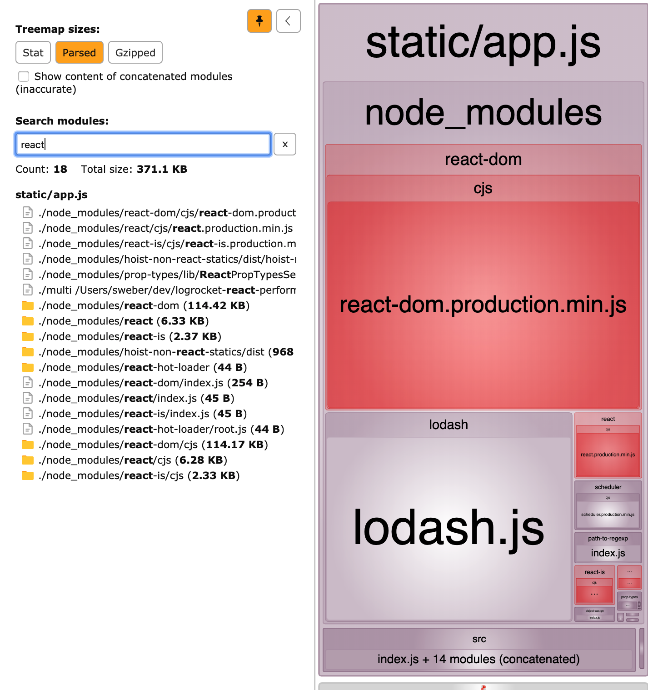


If you take a closer look, you will see that there is still some code that does not belong in a production build (e.g., react-hot-loader). This is a good example of why frequent analysis of our generated bundles is an important part of finding opportunities for further optimization. In this case, the webpack/React setup [needs improvement to exclude react-hot-loader](https://github.com/gaearon/react-hot-loader/issues/602#issuecomment-575741927).

If you have an “insufficient production config” and set  `mode:` `"``development``"`, then you come up with a much larger React chunk (switch to branch `use-production-mode` and execute `npm run build:analyze`).


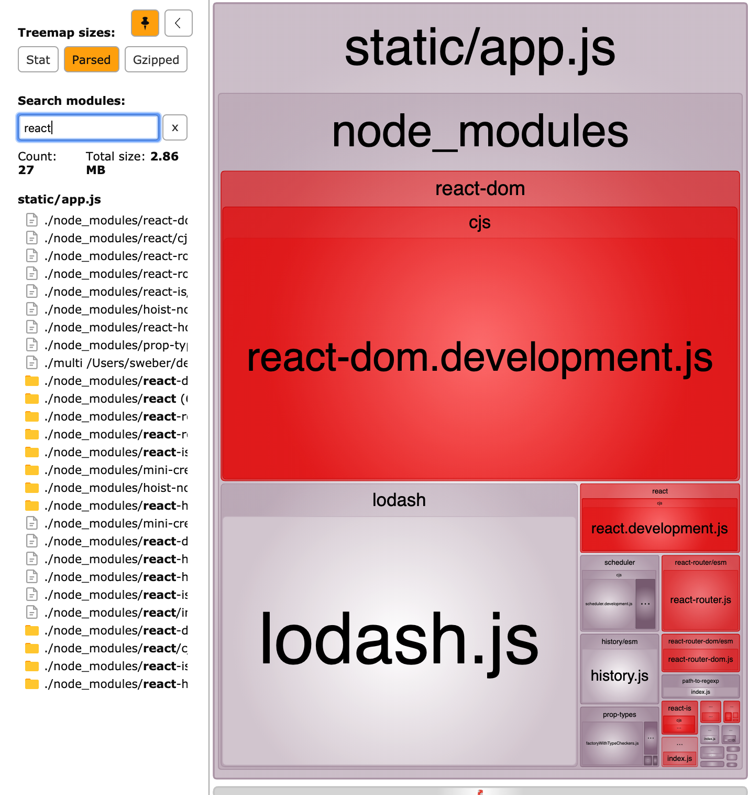

## Add multiple entry points for bundle splitting

Instead of sending all our code in one large bundle to our users, our goal as frontend developers should be to serve as little code as possible. This is where code splitting comes into play.

Imagine that our user navigates directly to the profile page via the route `/profile`. We should serve only the code for this profile component. Next, we add another [entry point](https://webpack.js.org/concepts/entry-points/) that leads to a new bundle (check out out branch `entry-point-splitting`).

```javascript
    // webpack.prod.js
    const config = {
        mode: "production",
        entry: {
            app: [`${commonPaths.appEntry}/index.js`],
+           profile: [`${commonPaths.appEntry}/profile/Profile.js`],
        },
        // ...
    }
```

The consequence is, of course, that you have to make sure the bundles are included in one or more HTML pages depending on the project, whether a [single-page application (SPA)](https://asperbrothers.com/blog/spa-vs-mpa/) or [multi-page application (MPA)](https://asperbrothers.com/blog/spa-vs-mpa/). This demo project constitutes an SPA.

The good thing is that you can automate this composing step with the help of [HtmlWebpackPlugin](https://github.com/jantimon/html-webpack-plugin).

```javascript
// webpack.prod.js
plugins: [
    // ...
    new HtmlWebpackPlugin({
        template: `public/index.html`,
        favicon: `public/favicon.ico`,
    }),
],
```    

Run the build, and the generated `index.html` consists of the correct link and script tags in the right order.

```html
<!-- dist/index.html -->
<!DOCTYPE html>
<html lang="en">
    <head>
        <meta charset="UTF-8" />
        <meta name="viewport" content="width=device-width,initial-scale=1" />
        <meta http-equiv="X-UA-Compatible" content="ie=edge" />
        <title>react performance demo</title>
        <link rel="shortcut icon" href="favicon.ico" />
        <link href="styles/app.css" rel="stylesheet" />
        <link href="styles/profile.css" rel="stylesheet" />
    </head>
    <body>
        <div id="root"></div>
        <script src="static/app.js"></script>
        <script src="static/profile.js"></script>
    </body>
</html>
```    

To demonstrate how to generate multiple html files (for an MPA use case), check out the branch `entry-point-splitting-multiple-html`. The following setup generates an `index.html` and a `profile.html`.

```javascript
    // webpack.prod.js
    plugins: [
-       new HtmlWebpackPlugin({
-           template: `public/index.html`,
-           favicon: `public/favicon.ico`,
-       }),
+       new HtmlWebpackPlugin({
+           template: `public/index.html`,
+           favicon: `public/favicon.ico`,
+           chunks: ["profile"],
+           filename: `${commonPaths.outputPath}/profile.html`,
+       }),
+       new HtmlWebpackPlugin({
+           template: `public/index.html`,
+           favicon: `public/favicon.ico`,
+           chunks: ["app"],
+       }),
    ], 
```

There are even more [configuration options](https://github.com/jantimon/html-webpack-plugin#options) — for example, you can provide a custom chunk-sorting function with `chunksSortMode`, as demonstrated [here](https://medium.com/@jaketripp/cool-things-with-webpack-9a8019bdbd4a).

webpack only includes the script for the profile bundle in the generated `dist/profile.html` file, along with a link to the corresponding `profile.css`. `index.html` looks similar and only includes the app bundle and `app.css`.

```html
<!-- dist/profile.html -->
<!DOCTYPE html>
<html lang="en">
    <head>
        <meta charset="UTF-8" />
        <meta name="viewport" content="width=device-width,initial-scale=1" />
        <meta http-equiv="X-UA-Compatible" content="ie=edge" />
        <title>react performance demo</title>
        <link rel="shortcut icon" href="favicon.ico" />
        <link href="styles/profile.css" rel="stylesheet" />
    </head>
    <body>
        <div id="root"></div>
        <script src="static/profile.js"></script>
    </body>
</html>
```     

## Separate application code and third-party libs (vendor code splitting)

Check out branch `vendor-splitting`. Let’s analyze the current state of our production build.

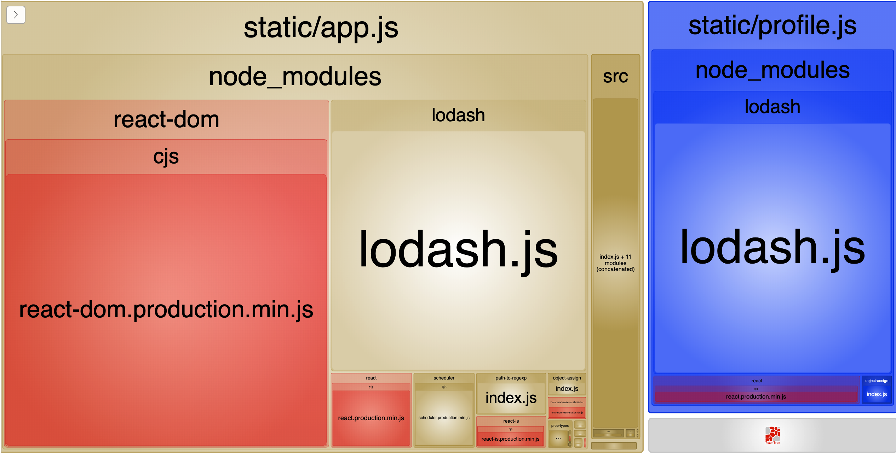


`react.production.min.js` and `lodash.js` are found redundantly in both bundles.

Is this a problem? Yes, because you should separate (for any kind of app) the vendor chunks from your application chunks due to caching purposes. The reason is that your application code changes more often than the vendor code because you adjust versions of your dependencies less frequently.

Vendor bundles can thus be cached for a longer time so that returning users benefit from it. Vendor splitting means to create separate bundles for your application code and third-party libraries.

You can do this — and other code splitting techniques, as we will see in a minute — with the [SplitChunksPlugin](https://webpack.js.org/plugins/split-chunks-plugin/). Before we add vendor splitting, let’s take a look at  the current production build output first.


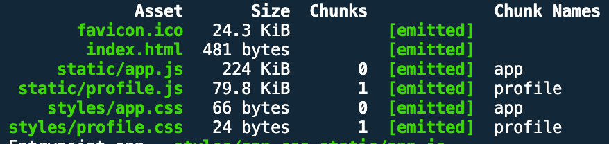


In order to use the aforementioned `SplitChunksPlugin`, we add [optimization.splitChunks](https://webpack.js.org/plugins/split-chunks-plugin/#optimizationsplitchunks) to our config.

```javascript
    // webpack.prod.js
    const config = {
        // ...
+       optimization: {
+           splitChunks: {
+               chunks: "all",
+           },
+       },
    }
```

This time, we run the build with the bundle analyzer option (`npm run build:analyze`). The result of the build looks like this:

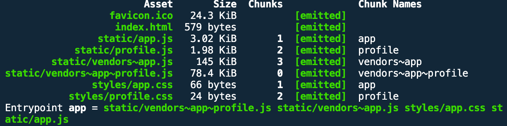


`app.js` and `profile.js` are much smaller now. But wait — two new bundles,  `vendors~app.js` and `vendors~app~profile.js`, have come up. As you can see, with bundle analyzer, we successfully extracted dependencies from `node_modules` (i.e., React, Lodash) into separate bundles. The tiny greenish boxes in the lower right are our `app` and `profile` bundles.

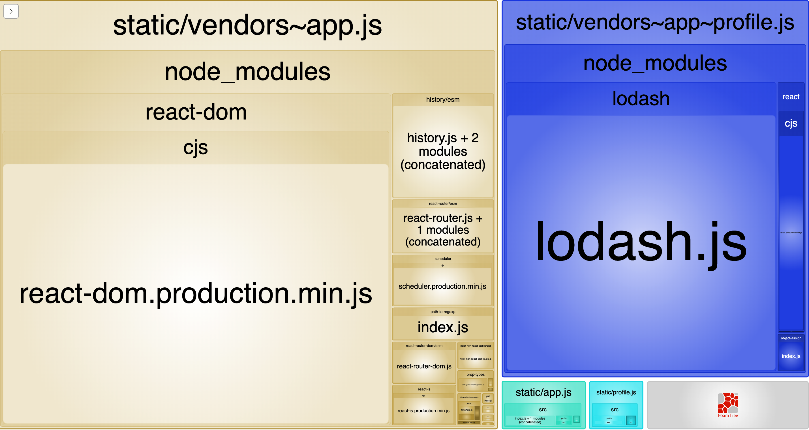


The names of the vendor bundles indicate from which application chunk the dependencies were pulled. Since React DOM is only used in the `index.js` file of the `app.js`  bundle, it makes sense that the dependency is only inside of `vendors~app.js`. But why is Lodash in the `vendors~app~profile.js` bundle if it’s only used by the `profile.js` bundle?

Once again, this is webpack magic — [conventions/default values](https://webpack.js.org/plugins/split-chunks-plugin/#optimizationsplitchunks), plus some clever things under the hood. I really recommend reading [this article](https://medium.com/webpack/webpack-4-code-splitting-chunk-graph-and-the-splitchunks-optimization-be739a861366) by webpack core member Tobias Koppers on the topic. The important takeaways are:


- Code splitting is based on heuristics that find candidates for splitting based on module duplication count and module category
- The default behavior is that only dependencies of ≥30KB are picked as candidates for the vendor bundle
- Sometimes webpack intentionally duplicates code in bundles to minimize requests for additional bundles

But the default behavior can be changed by the [splitChunks](https://webpack.js.org/plugins/split-chunks-plugin/#optimizationsplitchunks) options. We can set the [minSize option](https://webpack.js.org/plugins/split-chunks-plugin/#splitchunksminsize) to a value of 600KB and thereby tell webpack to first create a new vendor bundle if the dependencies it pulled out exceed this value (check out out the branch `vendor-splitting-tweaking`).

```javascript
    // webpack.prod.js
    const config = {
        // ...
        optimization: {
            splitChunks: {
                chunks: "all",
+               minSize: 1000 * 600
            },
        },
    }
```

Now, webpack came up with only one vendor bundle named `vendors~app.js`.

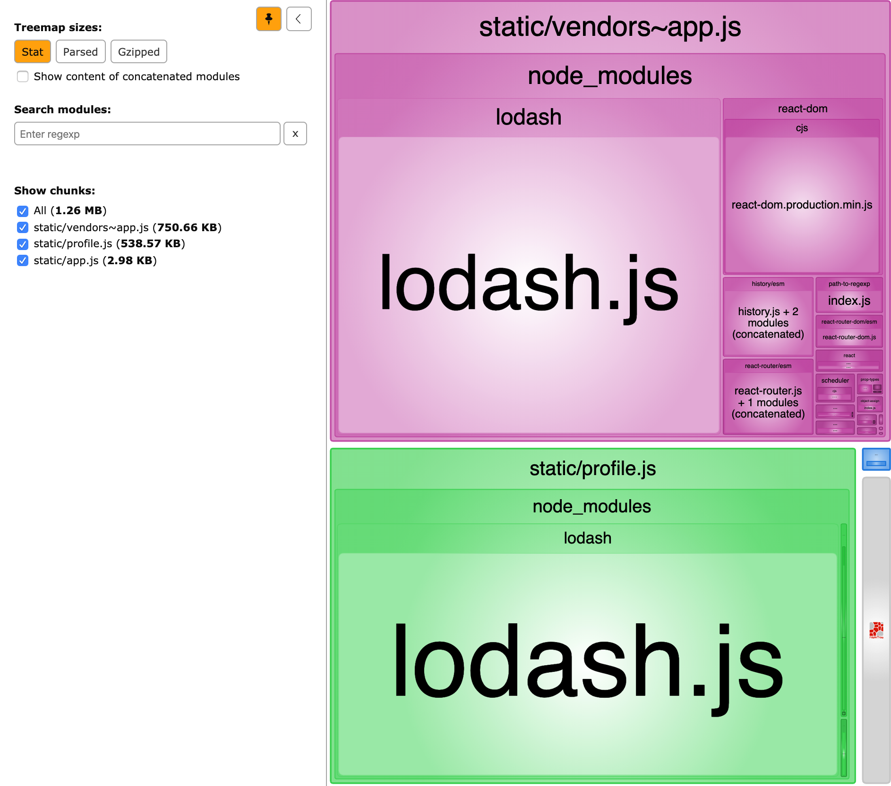


Why? If you check the `Stat size`, the new vendor bundle is larger than the minium size of 600KB, sitting at 750KB. webpack couldn’t create another chunk candidate for another vendor bundle because of our new configuration.

As you can see, Lodash is duplicated in the `profile.js` bundle, too (remember, webpack intentionally duplicates code). If you adjust the value of `minSize` to, e.g., 800KB, webpack cannot come up with a single vendor bundle for our demo project. I leave it up to you to try this out.
 
Of course, you could have more control if you wanted. Let’s assign a custom name, `node_vendors`. We define a [cacheGroup](https://webpack.js.org/plugins/split-chunks-plugin/#splitchunkscachegroups)s property for our vendors, which we pull out of the `node_modules` folder with the `test` property (check out the `vendor-splitting-cache-groups` branch). In the previous example, the default values of `splitChunks` contains `cacheGroups` out of the box.

```javascript
    // webpack.prod.js
    const config = {
        // ...
-       optimization: {
-           splitChunks: {
-               chunks: "all",
-               minSize: 1000 * 600
-           },
-       },
+       optimization: {
+           splitChunks: {
+               cacheGroups: {
+                   vendor: {
+                       name: "node_vendors", // part of the bundle name and
+                       // can be used in chunks array of HtmlWebpackPlugin
+                       test: /[\\/]node_modules[\\/]/,
+                       chunks: "all",
+                   },
+               },
+           },
+       },
        // ...
    }
```   

This time, webpack presents us one vendor bundle with our custom name and combined all dependencies from `node_modules` in it.

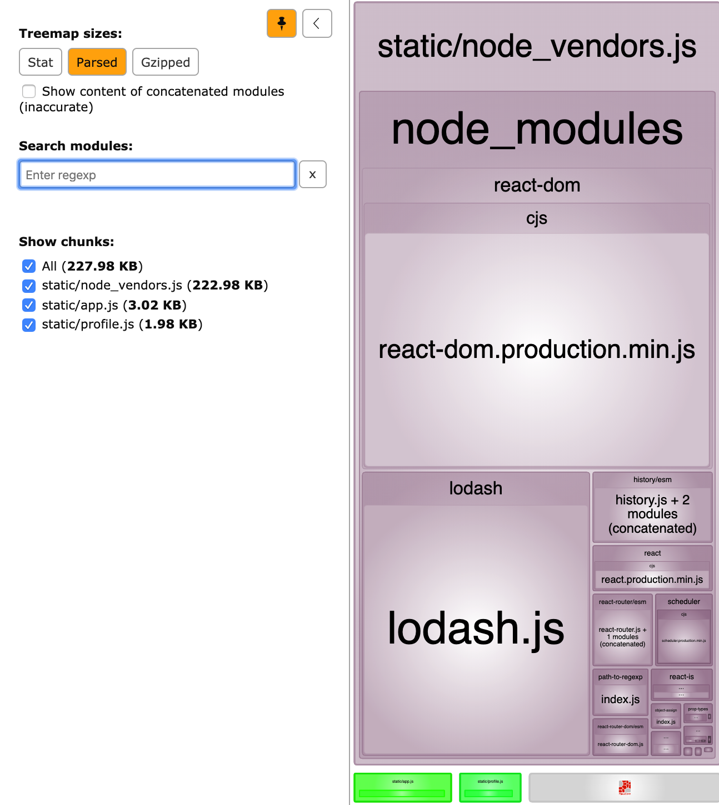


In the `splitChunks` property above, we added a property [chunks](https://webpack.js.org/plugins/split-chunks-plugin/#splitchunkschunks) with a value of `all`. Most of the time, this value should be alright for your project. However, if you want to extract only lazy/async loaded bundles, you can use the value `async`. When we look at common code splitting in the next section, we’ll come back to this aspect again. 

## Consolidate shared code into common bundles (common code splitting)

Common code splitting aims for combining shared code into separate bundles. The reason behind this is smaller bundle sizes and caching. It is similar to vendor code splitting; the only difference is that you target shared components and libraries of your own codebase. 

In our example, we combine vendor code splitting with common code splitting (check out branch `common-splitting`). We import and use the `add` function of `util.js` in the `Blog` and `Profile` components, which are part of two different entry points.

We add a new object with the key `common` to the `cacheGroups` object with a regex to target only modules in our `components` folder. Since the components of this demo project are very tiny, we need to override webpack’s default value of `minSize` — we set it to 0KB just in case.

```javascript
    // webpack.prod.js
    const config = {
        // ...
        optimization: {
            splitChunks: {
                cacheGroups: {
                    vendor: {
                        name: "node_vendors", // part of the bundle name and
                        // can be used in chunks array of HtmlWebpackPlugin
                        test: /[\\/]node_modules[\\/]/,
                        chunks: "all",
                    },
+                   common: {
+                       test: /[\\/]src[\\/]components[\\/]/,
+                       chunks: "all",
+                       minSize: 0,
+                   },
                },
            },
        },
        // ...
```

When you run webpack, a new bundle, `common~app~profile.js`, is generated in addition to our vendor bundle and the two entry point bundles. 

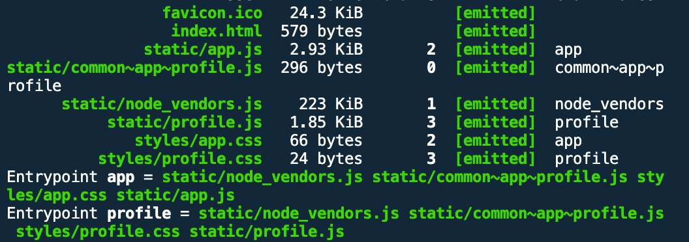


Search for `console.log(``"``add")` within `dist/static/common~app~profile.js` and you will find what you are looking for.

## Lazy loading on route level

We have already seen how we can use [react-router](https://reacttraining.com/react-router/web) in combination with entry code splitting in the `entry-point-splitting` branch. We can push code splitting one step further by enabling our users to load different components on demand while they are navigating through our application. This use case is possible with [dynamic imports supported by webpack](https://webpack.js.org/guides/code-splitting/#dynamic-imports) and code splitting by route.

In the context of our demo project, this is evidenced by the fact that the `profile.js` bundle is only loaded when the user navigates to the corresponding route (switch to branch `code-splitting-route`). We utilize the [@loadable/components](https://github.com/gregberge/loadable-components) library, which does the hard work of code splitting and dynamic loading behind the scenes.

```json
// package.json
{
    // ...
    "dependencies": {
        "@loadable/component": "^5.12.0",
        // ...
    }
    // ...
}
```

In order to use the [ES6 dynamic import syntax](https://github.com/tc39/proposal-dynamic-import), we have to use a [babel plugin](https://babeljs.io/docs/en/babel-plugin-syntax-dynamic-import).

```json
// .babelrc
{
    // ...
    "plugins": [
        "@babel/plugin-syntax-dynamic-import",
        // ...
    ]
}
```    

The implementation is pretty straightforward. First, we need a tiny wrapper around our `Profile` component that we want to lazy-load. 

```javascript
// ProfileLazy.js
import loadable from "@loadable/component";
export default loadable(() => import(/* webpackChunkName: "profile" */ "./Profile"));
```    

We use the dynamic import inside the `loadable` callback and add a comment (to give our code-split chunk a custom name) that is understood by webpack.

In our `Blog` component, we just have to adjust the import for our `Router` component.

```javascript
    // Blog.js
    import React from "react";
    import { BrowserRouter as Router, Switch, Route, Link } from "react-router-dom";

-   import Profile from "../profile/Profile";
+   import Profile from "../profile/ProfileLazy";

    import "./Blog.css";
    import Headline from "../components/Headline";

    export default function Blog() {
        return (
            <Router>
                <div>
                <ul>
                    <li>
                        <Link to="/">Blog</Link>
                    </li>
                    <li>
                        <Link to="/profile">Profile</Link>
                    </li>
                </ul>
                <hr />
                <Switch>
                    <Route exact path="/">
                        <Articles />
                    </Route>
                    <Route path="/profile">
                        <Profile />
                    </Route>
                </Switch>
                </div>
            </Router>);
    }
    // ...  
```

The last step is to delete the `profile` entry point that we used for entry point code splitting from both the `production` and `development` webpack config.

```javascript
    // webpack.prod.js and webpack.dev.js
    const config = {
        // ...
        entry: {
            app: [`${commonPaths.appEntry}/index.js`],
-           profile: [`${commonPaths.appEntry}/profile/Profile.js`],
        },
        // ...
    }
```

Run a production build and you’ll see in the output that webpack created a `profile.js` bundle because of the dynamic import.

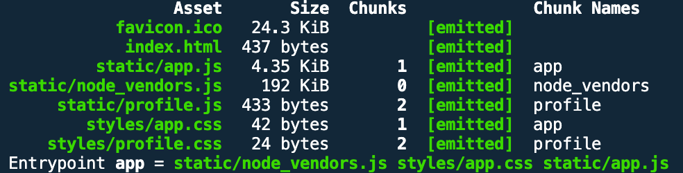


The generated HTML document does not contain a script pointing to the `profile.js` bundle.

```html
<!-- dist/index.html -->
<!DOCTYPE html>
<html lang="en">
    <head>
        <meta charset="UTF-8" />
        <meta name="viewport" content="width=device-width,initial-scale=1" />
        <meta http-equiv="X-UA-Compatible" content="ie=edge" />
        <title>react performance demo</title>
        <link rel="shortcut icon" href="favicon.ico" />
        <link href="styles/app.css" rel="stylesheet" />
    </head>
    <body>
        <div id="root"></div>
        <script src="static/node_vendors.js"></script>
        <script src="static/app.js"></script>
    </body>
</html>
```    

Wonderful — `HtmlWebpackPlugin` did the right job.

It’s easier to test this with the development build (`npm run dev`).

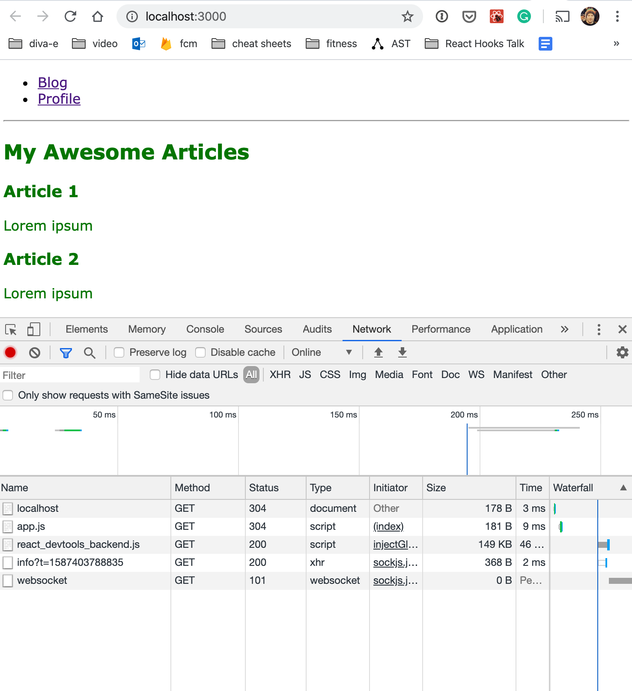


DevTools shows that the `profile.js` bundle is not loaded initially. When you navigate to the `/profile` route, though, the bundle gets loaded lazily.


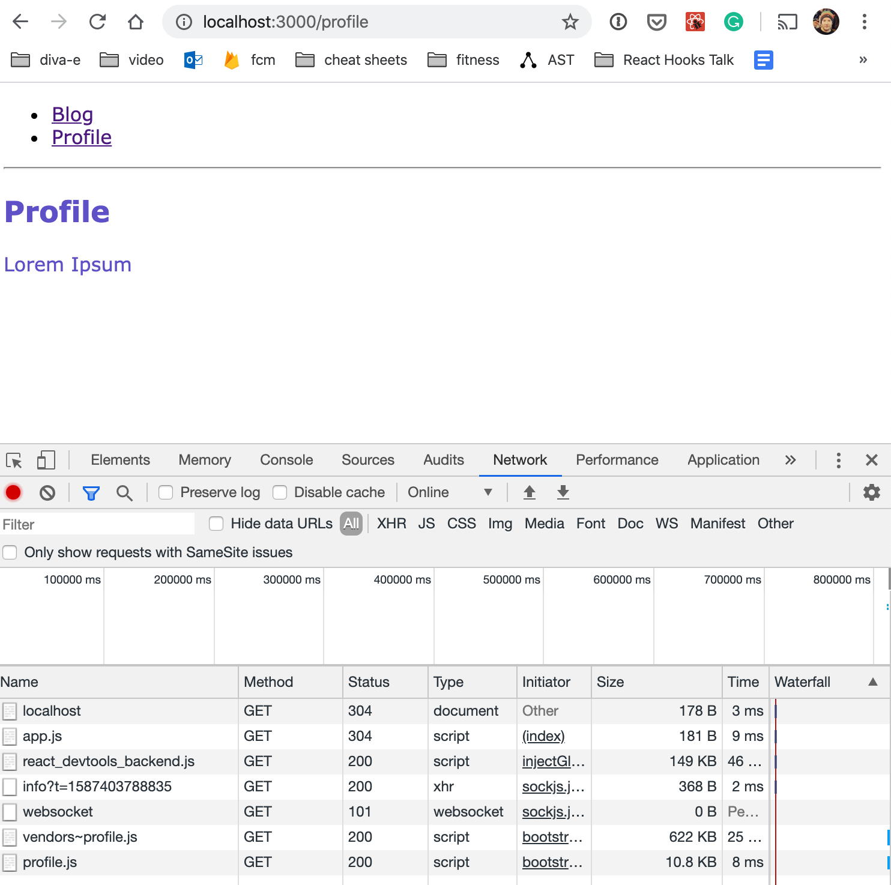

## Lazy loading on the component level

Code splitting is also possible on a fine-grained level. Check out branch `code-splitting-component-level` and you’ll see that the technique of route-based lazy loading can be used to load smaller components based on events.

In the demo project, we just add a button on the profile page to load and render a simple React component (`Paragraph`) on click.

```javascript
    // Profile.js
-   import React from "react";
+   import React, { useState } from "react";
    // some more boring imports
+   import LazyParagraph from "./LazyParagraph";
    
    const Profile = () => {
+       const [showOnDemand, setShowOnDemand] = useState(false);
        const array = [1, 2, 3];
        _.fill(array, "a");
        console.log(array);
        console.log("add", add(2, 2));
        return (
            <div className="profile">
                <Headline>Profile</Headline>
                <p>Lorem Ipsum</p>
+               {showOnDemand && <LazyParagraph />}
+               <button onClick={() => setShowOnDemand(true)}>click me</button>
            </div>
        );
    };

    export default Profile;
```    

`ProfileLazy.js` looks familiar. We want to call the new bundle `paragraph.js`.

```javascript
// LazyParagraph.js
import loadable from "@loadable/component";
export default loadable(() => import(/* webpackChunkName: "paragraph" */ "./Paragraph"));
```

I skip `Paragraph` because it is just a simple React component to render something on the screen.

The output of a production build looks like this.

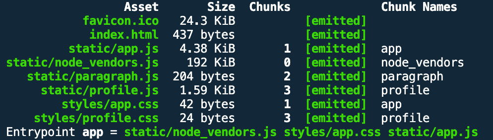


The `development` build shows that loading and rendering the dummy component bundled into `paragraph.js` happens only on clicking the button.

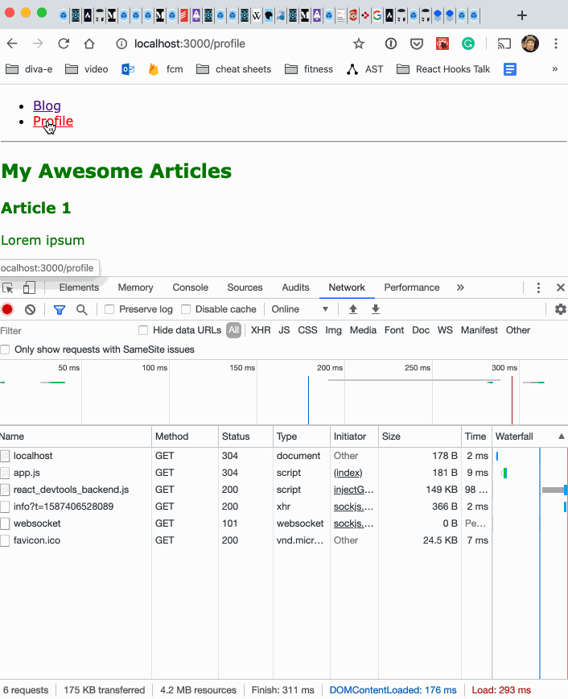

## Extracting webpack’s manifest into a separate bundle

What does this even mean? Every application or site built with webpack includes a [runtime and manifest](https://webpack.js.org/concepts/manifest/). It’s the boilerplate code that does the magic. The manifest wires together our code and the vendor code. It is not big in size, but it is duplicated for every entry point unless you do something about it.

Once again, if you want to optimize browser caching, then it might be useful to extract the manifest out in a separate bundle. This saves the users from unnecessarily re-downloading files. However, I’m not sure how often the manifest changes after webpack version updates?!

Anyway, check out branch `manifest-splitting`. The basis is our production configuration with two entry points and, now, vendor/common code splitting in place. In order to extract the manifest, we have to add the [runtimeChunk](https://webpack.js.org/guides/caching/#extracting-boilerplate) property.

```javascript
    // webpack.prod.js
    const config = {
        mode: "production",
        entry: {
            app: [`${commonPaths.appEntry}/index.js`],
            profile: [`${commonPaths.appEntry}/profile/Profile.js`],
        },
        output: {
            filename: "static/[name].js",
        },
+       optimization: {
+           runtimeChunk: {
+               name: "manifest",
+           },    
+       },
        // ...
    }
```

A production build shows a new `manifest.js` bundle. The two entry point bundles are a little bit smaller.

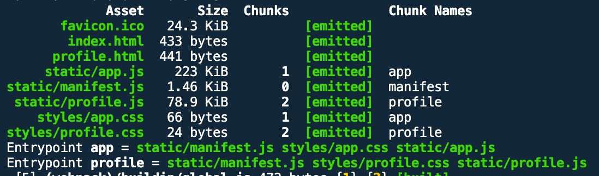


In contrast, here you can see the bundle sizes without the `runtimeChunk` optimization.

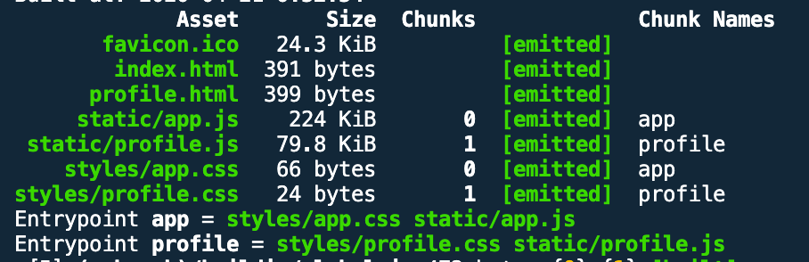


The two HTML documents were generated with an extra script tag for the manifest. As an example, here you can see the `profile.html` file (I skip `index.html`).

```html
<!-- dist/profile.html -->
<!DOCTYPE html>
<html lang="en">
  <head>
    <meta charset="UTF-8" />
    <meta name="viewport" content="width=device-width,initial-scale=1" />
    <meta http-equiv="X-UA-Compatible" content="ie=edge" />
    <title>react performance demo</title>
    <link rel="shortcut icon" href="favicon.ico" />
    <link href="styles/profile.css" rel="stylesheet" />
  </head>
  <body>
    <div id="root"></div>
    <script src="static/manifest.js"></script>
    <script src="static/profile.js"></script>
  </body>
</html>
```    

## Exclude dependencies from bundles

With webpack’s [externals config option](https://webpack.js.org/configuration/externals/), it is possible to exclude dependencies from bundling. This is useful if the environment provides the dependencies elsewhere.

As an example, if you work with different teams on a React-based MPA, you can provide React in a dedicated bundle that is included in the markup in front of each team’s bundles. This allows all teams to keep this dependency out of their bundles.

This is the starting point (check out out branch `manifest-splitting`). We have two entry point bundles, both with React and one with the even bigger React DOM as dependencies.

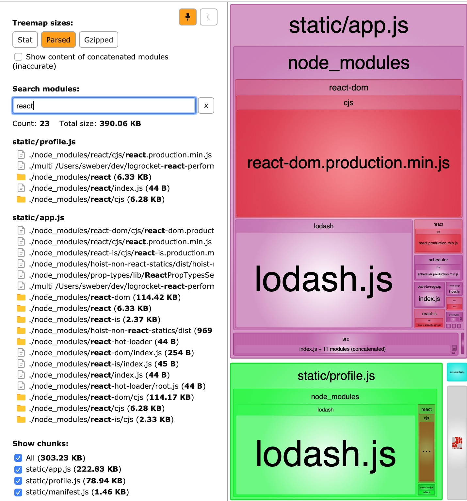

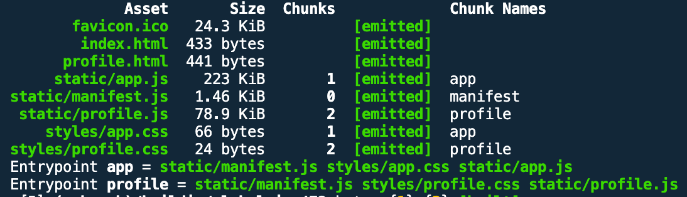


If we want to exclude React and React DOM from the production bundles, we have to add the following `externals` object to our production configuration (check out branch `externals`).

```javascript
    // webpack.prod.js
    const config = {
        // ...  
+   externals: {
+       react: "React",
+       "react-dom": "ReactDOM",
+   },
        // ...
    }
```

When you now create a production bundle, the file size is much smaller. 

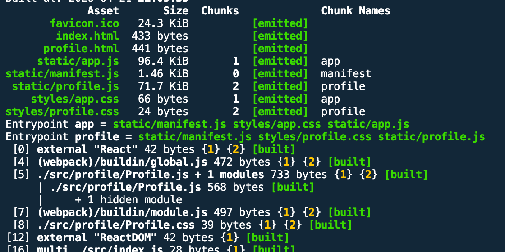


The size of `app.js` has shrunk from 223KB to 96.4KB because React DOM was left out. The file size of `profile.js` has decreased from 78.9KB to 71.7KB.

Now, we have to provide React and React DOM in the context. In our example, we provide [React over CDN](https://reactjs.org/docs/cdn-links.html) by adding script tags to our HTML template files.

```html
<!-- public/index.html -->
<body>
    <div id="root"></div>
    <script crossorigin 
        src="https://unpkg.com/react@16/umd/react.production.min.js"></script>
    <script crossorigin 
        src="https://unpkg.com/react-dom@16/umd/react-dom.production.min.js"></script>
</body>
```
This is how the generated `index.html` looks (I’ll skip the `profile.html` file):

```html
<!-- dist/index.html -->
<!DOCTYPE html>
<html lang="en">
    <head>
        <meta charset="UTF-8" />
        <meta name="viewport" content="width=device-width,initial-scale=1" />
        <meta http-equiv="X-UA-Compatible" content="ie=edge" />
        <title>react performance demo</title>
        <link rel="shortcut icon" href="favicon.ico" />
        <link href="styles/app.css" rel="stylesheet" />
    </head>
    <body>
        <div id="root"></div>
        <script
            crossorigin
            src="https://unpkg.com/react@16/umd/react.production.min.js"
        ></script>
        <script
            crossorigin
            src="https://unpkg.com/react-dom@16/umd/react-dom.production.min.js"
        ></script>
        <script src="static/manifest.js"></script>
        <script src="static/app.js"></script>
    </body>
</html>
```   
    
## Remove dead code from bundles (aka tree shaking)

[Tree Shaking](https://webpack.js.org/guides/tree-shaking/) is a term originally coined by [Rollup](https://rollupjs.org/guide/en/) and represents a dead code elimination technique. Imagine a component with default and/or named exports, but it isn’t used anywhere in your application. It is a total waste to deliver the code in the JavaScript bundle to your users. Tree shaking finds and strips unused code from your bundles.

The good thing with webpack 4 is that you most likely don’t have to do anything to perform tree shaking. Unless you are working on a legacy project with the CommonJS module system, you get it automatically in webpack when you use `production` mode — you have to use ES6 module syntax, though. Since you can use webpack without specifying a mode or set it to `development`, you have to meet a set of additional requirements, which is explained in great detail [here](https://webpack.js.org/guides/tree-shaking/#conclusion). 

As also described in webpack’s tree shaking documentation, you have to make sure no compiler transforms the ES6 module syntax into the CommonJS version. Since we use [@babel/preset-env](https://babeljs.io/docs/en/babel-preset-env#modules) in our demo project, we better set `modules: false` to be on the safe side to disable transformation of ES6 module syntax to another module type.

```json
// .babelrc
{
    "presets": [
        ["@babel/preset-env", { "modules": false }],
        "@babel/preset-react"
    ],
    "plugins": [
        // ...
    ]
}
```
The reason for this is that ES6 modules can be statically analyzed by webpack, whereas it is not possible with other variants, such as `require` by CommonJS. It is possible to dynamically change exports and do all kinds of [monkey patching](https://stackoverflow.com/a/42883538). You can also see an example in this project where `require` statements are created dynamically within a loop:

```javascript
// webpack.config.js
// ...
const addons = (/* string | string[] */ addonsArg) => {
    // ...
    return addons.map((addonName) => require(`./build-utils/addons/webpack.${addonName}.js`));
};
// ...
```
If you want to see how it looks without tree shaking, you can disable the [UglifyjsWebpackPlugin](https://webpack.js.org/plugins/uglifyjs-webpack-plugin/), which is used by default in `production` mode.

Before we disable tree shaking, I first want to demonstrate the production build indeed removes unused code. Switch to the `master` branch and take a look at the following file:

```javascript
// util.js
export function add(a, b) { // imported and used in Profile.js
    console.log("add");
    return a + b;
}
export function subtract(a, b) { // nowhere used
    console.log("subtract");
    return a - b;
}
```
Only the first function is used within `Profile.js`.  Execute `npm run build` again and open up `dist/static/app.js`. You can search and find two occurrences of the string `console.log("add` but no occurrence of `console.log("subtract`. This is the proof that it works.

Now switch to branch `disable-uglify`, where `minimize: false` is added to the configuration. 

```javascript
    // webpack.prod.js
    const config = {
        mode: "production",  
+       optimization: {
+           minimize: false, // disable uglify + tree shaking
+       },
        entry: {
            app: [`${commonPaths.appEntry}/index.js`],
        },
        // ...
    }
```

If you execute another production build, you get a warning that your bundle size exceeds the standard threshold.

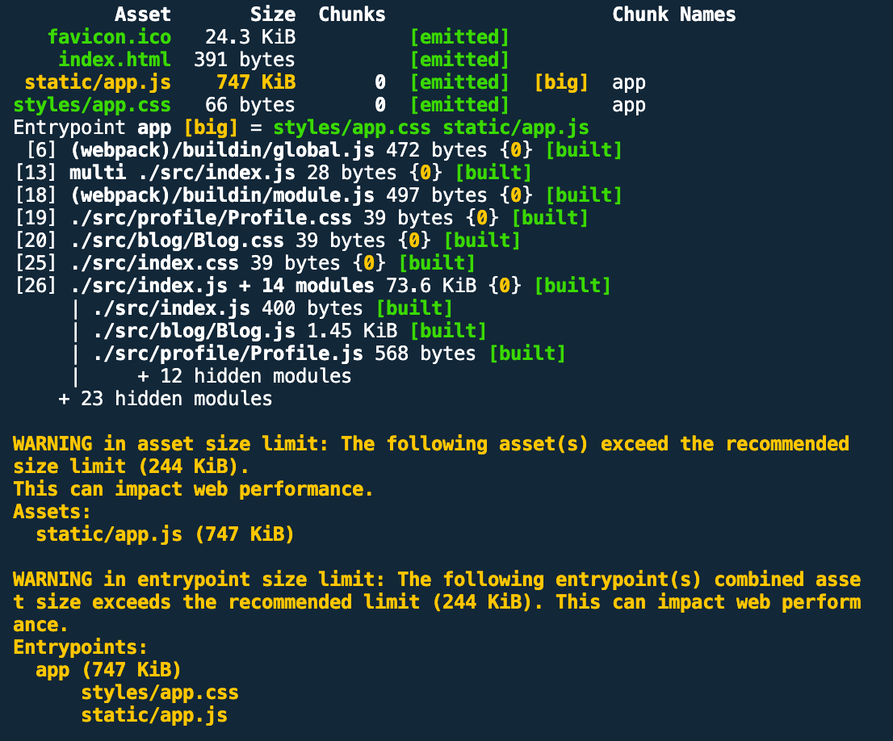


In the not-defaced `dist/static/app.js` file, you also find two occurrences of `console.log("subtract`.

But why is the uglify plugin even involved? The reason for this is that the term tree shaking is a little bit [misleading](https://medium.com/@Rich_Harris/tree-shaking-versus-dead-code-elimination-d3765df85c80): in this step, the dead leaves (e.g., unused functions) of the dependency graph are not removed. Instead, the uglify plugin actually does this in the second step. In the first step, a [live code inclusion](http://rollupjs.org/guide/en/#what-is-tree-shaking) takes place to mark the source code in a way that the uglify plugin is able to “shake the syntax tree.”

## Define a performance budget

It’s crucial to monitor the bundle sizes of your project. Over time, the application grows, and that’s why it’s important to understand when bundles grow too large and mess up the UX.

As you can see in the last screenshot, webpack has [built-in support for performance measurement](https://webpack.js.org/configuration/performance/) of assets. In the example above, we have colossally blown up the maximum threshold, 244KB, with 747KB. In `production` mode, the default behavior is to warn you about threshold violations.

We can define our own [performance budget](https://addyosmani.com/blog/performance-budgets/) for output assets. We don’t care for `development`, but we want to keep an eye on it for `production` (check out branch `performance-budget`).

```javascript
    // webpack.prod.js
    const config = {
        mode: "production",
        entry: {
            app: [`${commonPaths.appEntry}/index.js`],
        },
        output: {
            filename: "static/[name].js",
        },
+       performance: {
+           hints: "error",
+           maxAssetSize: 100 * 1024, // 100 KiB 
+           maxEntrypointSize: 100 * 1024, // 100 KiB
+       },
        // ...
    }
```

We defined 100 KB as a threshold for assets (like CSS files) as well as entry points (i.e., generated JS bundles). In contrast to the previous screenshot (`warning`), we define `error` as type `hint`. 

As we see in our output, this means that the build will fail. With `warning`, the build will still succeed.

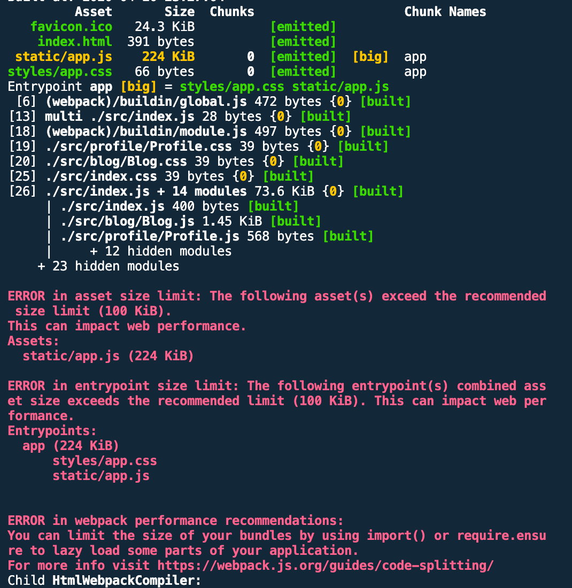


webpack offers advice on how to deal with the problem. 

I like to set `hints` to `error` the build. This causes your CI pipeline to fail if you push it to VCS anyway. In my opinion, this promotes a culture of caring about bundle/asset sizes early on and, in the end, user experience. 

## Use tree-shakeable third-party libraries

Let’s inspect our bundle to see how much size our popular Lodash dependency consumes in contrast to the other components. Check out out branch `master` and run `npm run build:analyze`.

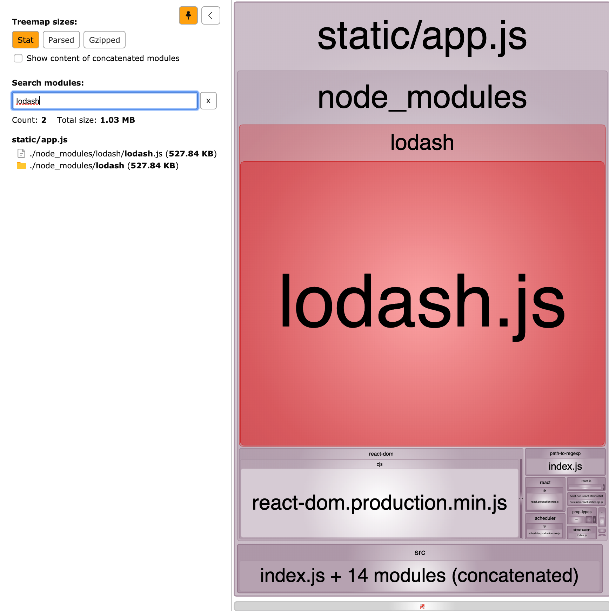


That’s a pretty big chunk not only in absolute terms, but also in relation to the other components. This is how we use it.

```javascript
// Profile.js
import _ from "lodash";
// ...
const Profile = () => {
    const array = [1, 2, 3];
    _.fill(array, "a");
    console.log(array);
    // ...
}  
```

The problem is that we pull in the whole library even we just use the `fill` function. However, Lodash has a modular architecture and also supports tree shaking. 

We just need to change the import to pull in only the array functions (check out branch `lodash-modular`).

```javascript
    // Profile.js
-   import _ from "lodash";
+   import _ from "lodash/array";
    // ...
```

The build output looks much better now.

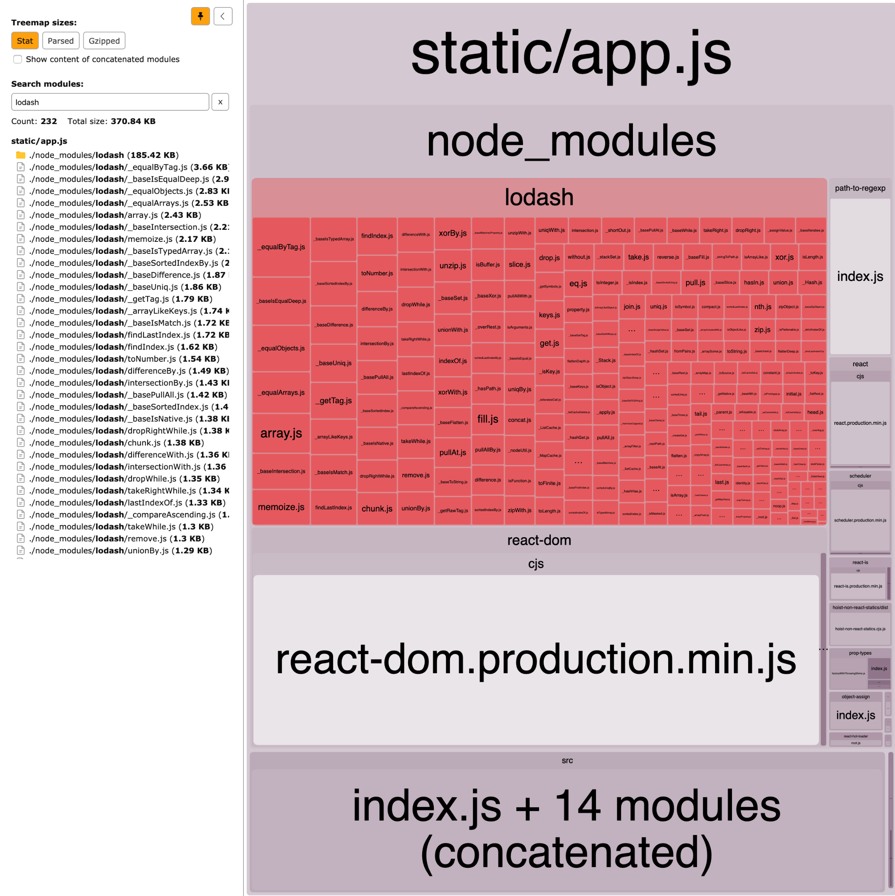


The bottom line is that you should regularly inspect your bundles with an eye on your libraries. If you use only a small portion of the total library scope, then something is wrong. Check the library’s documentation to see whether you can import individual functionalities. Otherwise, you have to look for modularized alternatives or roll your own solution.

In the previous section, we learned what requirements must be met to have tree shaking in place. Well, there is one requirement left: external libraries need to tell webpack that they don’t have side effects.

From webpack’s perspective, all libraries have side effects unless they tell it otherwise. Library owners have to [mark their project or parts of it as side-effect-free](https://webpack.js.org/guides/tree-shaking/#mark-the-file-as-side-effect-free). Lodash also does this with the `sideEffects: false` property within its [package.json](https://github.com/lodash/lodash/blob/master/package.json). 

## Ship the correct variant of source maps to production

It is up to you and your team to decide if you want to ship source maps to production, e.g., [for debugging reasons or to enable others to learn from you](https://css-tricks.com/should-i-use-source-maps-in-production/).

If you don’t want source maps at all for production bundles, you need to make sure no [devtool configuration option](https://webpack.js.org/configuration/devtool/) is set for `production` mode.

If you do want to have source maps for production, take care that you use the right `devtool` variant because it has an effect on webpack’s build speed and, most importantly, on the size of the bundles as well. 

For production, `devtool: "source-map"` is a good choice because only a comment is generated into the JS bundle. If your users do not open the browser’s devtools, they do not load the corresponding source map file generated by webpack. 

For adding source maps, we just have to add one property to the production configuration (check out branch `sourcemaps`).

```javascript
    // webpack.prod.js
    const config = {
        mode: "production",
+       devtool: "source-map",
        // ...
    }
```

The following screenshot shows how the result would look for the production build.

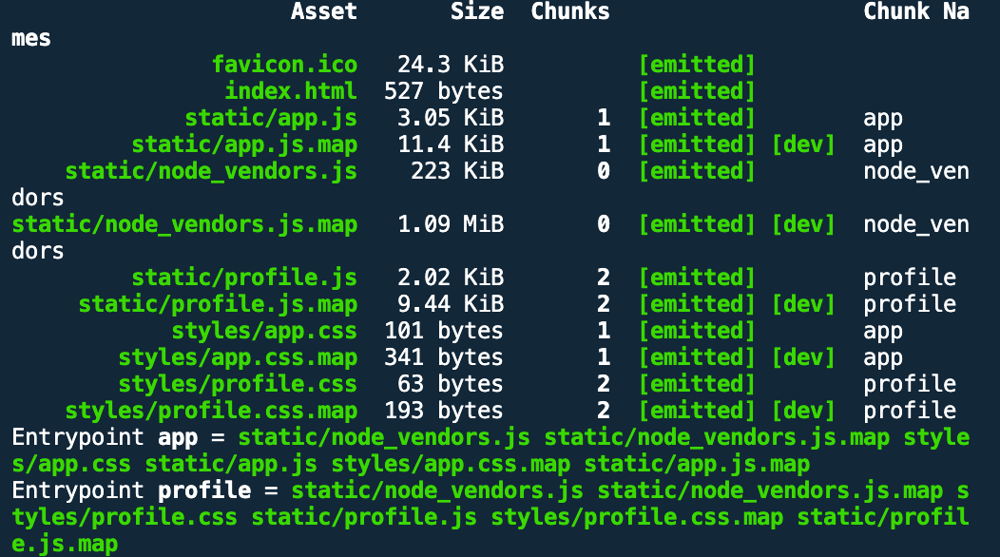


webpack only added one line of comment in every asset.

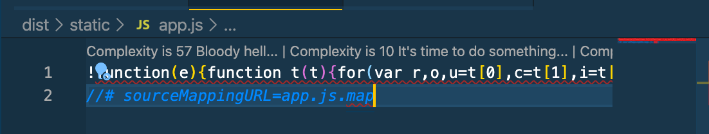


In contrast, when you run the development build with `devtool:` `"``inline-source-map``"`, you can clearly see that it is not a good idea to use this configuration for production.

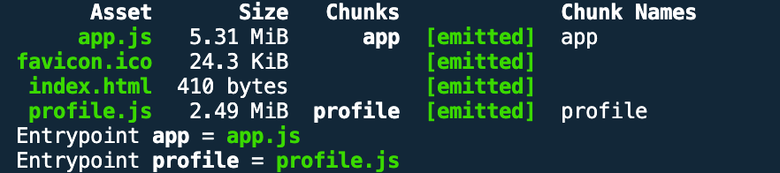

## Preparing for long-term caching

Check out the branch `caching-no-optimization` and run a production build to see the starting point.

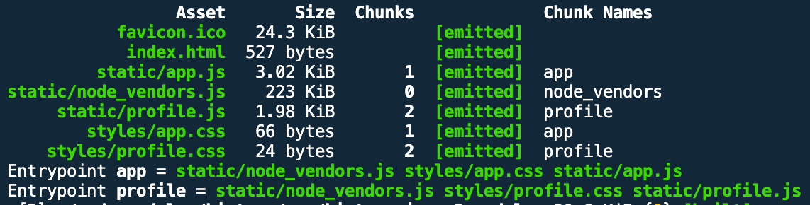


Why is this result problematic? From a caching standpoint, the asset names can be considered suboptimal. We should configure our web server to respond with `[Cache-Control](https://developer.mozilla.org/en-US/docs/Web/HTTP/Headers/Cache-Control)` [headers](https://developer.mozilla.org/en-US/docs/Web/HTTP/Headers/Cache-Control) that set `max-age` values with a long time period to support long-term browser caching.

With these filenames, however, we cannot invalidate browser-cached assets after webpack has generated new versions, whether due to a bug-fix, a new feature, etc. As a result, our users may end up using stale and buggy JavaScript bundles even though we already provided updated versions.

We can do better. We can use placeholder strings in different places of our webpack configuration — in the `filename` value, for example. We use `[hash]` to create a unique filename for an asset whenever we have made a change to the corresponding source files (check out branch `caching-hash`). We shouldn’t forget our CSS assets, either.

```javascript
    // webpack.prod.js
    const config = {
        // ...
        output: {
-           filename: "static/[name].js",
+           filename: "static/[name].[hash].js",
        },
        // ...
        plugins: [
            new MiniCssExtractPlugin({
-               filename: "styles/[name].css",
+               filename: "styles/[name].[hash].css",
            }),
            // ...
        ],
    }
```

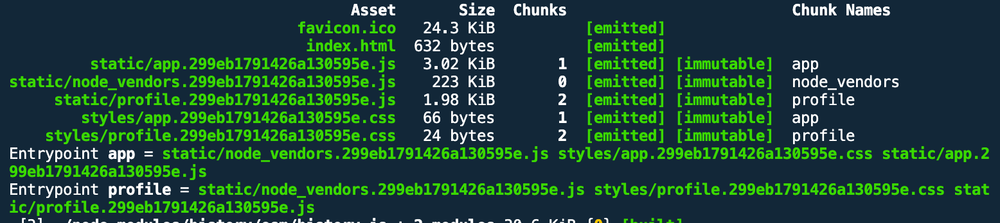


Cool, we have fancy hash values as part of the filenames. But not so fast — we aren’t done yet. The result shows that all assets have the same hash value inside their names. This doesn’t help at all because whenever we change one file, all other assets would get the same hash value, too.

Let’s change `Profile.js` by adding a `console.log` statement and run the build again.

```javascript
    // Profile.js
    const Profile = () => {
+       console.log("hello world");
        // ...
    };
    export default Profile;
```    

As expected, all assets get the same new hash value.

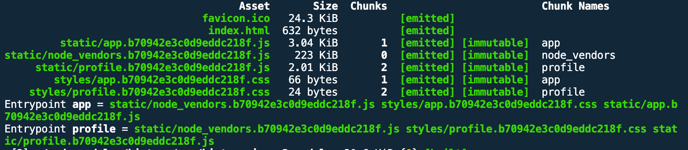


That’s because we have to use a different filename [substitution placeholder](https://webpack.js.org/guides/caching/#output-filenames). In addition to `[name]`, we have three placeholder strings when it comes to caching:


- `[hash]` – if at least one chunk changes, a new hash value for the whole build is generated
- `[chunkhash]` – for every changing chunk, a new hash value is generated
- `[contenthash]` – for every changed asset, a new hash based on the asset’s content is generated

It's not quite clear what the difference is between `chunkhash` and `contenthash`, though. Let’s try out `[chunkhash]` (check out branch `caching-chunkhash`).

```javascript
    // webpack.prod.js
    const config = {
        // ...
        output: {
-           filename: "static/[name].[hash].js",
+           filename: "static/[name].[chunkhash].js",
        },
        // ...
        plugins: [
            new MiniCssExtractPlugin({
-               filename: "styles/[name].[hash].css",
+               filename: "styles/[name].[chunkhash].css",
            }),
            // ...
        ],
    }
```

Give it a shot and run the production build again!

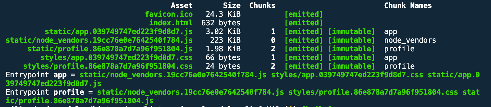


This looks a little better, but the hashes of a CSS asset match with its corresponding JS asset. Let’s change `Profile.js` and hope that the corresponding CSS filename won’t be updated.

```javascript
    // Profile.js
    const Profile = () => {
+       console.log("hello world again");
        // ...
    };
```
As we can see, it’s even worse. Not only does the profile CSS filename include the same new hash value of the profile JS, file but also the “app CSS/JS pair” was updated with another new hash value.


Maybe `[contenthash]` helps? Let’s find out (check out branch `caching-contenthash`).

```javascript
    // webpack.prod.js
    const config = {
        // ...
        output: {
-           filename: "static/[name].[chunkhash].js",
+           filename: "static/[name].[contenthash].js",
        },
        // ...
        plugins: [
            new MiniCssExtractPlugin({
-               filename: "styles/[name].[chunkhash].css",
+               filename: "styles/[name].[contenthash].css",
            }),
            // ...
        ],
    }
```
Each asset has been given a new but individual hash value.

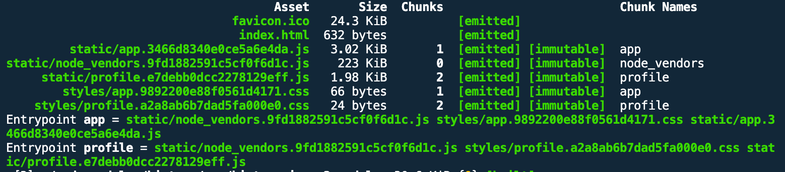


Did we make it? Let’s change something in `Profile.js` again and find out.

```javascript
    // Profile.js
    const Profile = () => {
+       console.log("Let's go");
        // ...
    };
```

CSS asset names have not changed, so we have decoupled them from the associated JS assets.

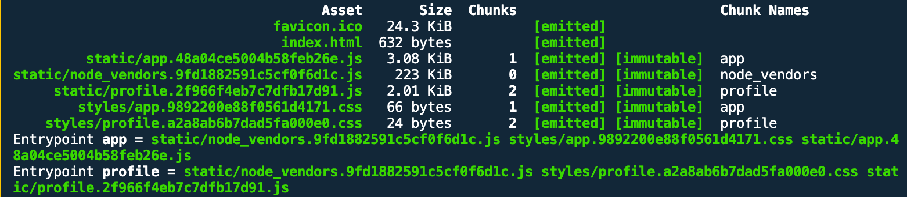


The vendor bundle still has the same name. Since the `Profile` React component is imported into the `Blog` React component, it’s OK that both filenames for both JS bundles have changed. 

A change in `Blog.js`, though, should only lead to a change of the `app` bundle name and not of the `profile` bundle name because the latter imports nothing from the former. 

```javascript
    // Blog.js
    export default function Blog() {
+       console.log("What's up?");
        // ...
    }
```
This time, the profile bundle name is unchanged — great!

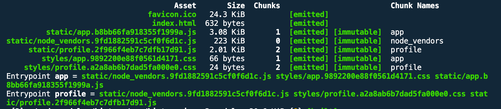


In addition, the [official webpack docs](https://webpack.js.org/guides/caching/) recommend you also do the following:


- Extract the manifest in a separate bundle
- Use [moduleIds](https://webpack.js.org/configuration/optimization/#optimizationmoduleids)

Check out branch `caching-moduleids` for the final version of our configuration.

```javascript
    // webpack.prod.js
    const config = {
        // ...
        optimization: {
+           moduleIds: "hashed",
+           runtimeChunk: {
+               name: "manifest",
+           },
            splitChunks: {
                // ...
            }
        }
        // ...
    }
```

Now all the JS bundles have changed because the manifest was extracted out of them into a separate bundle. As a result, their sizes have shrunk a tiny bit.

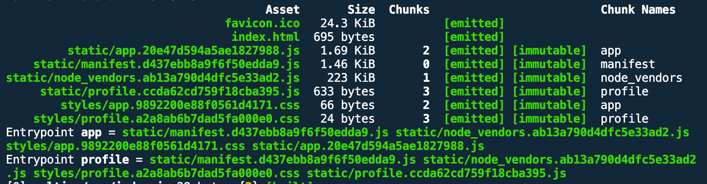


I’m not sure when the manifest changes — maybe after a webpack version update?! But we can verify the last step. If we update one of the vendor dependencies, the `node_vendors` bundle should get a new hash name, but the rest of the assets should remain unchanged. Let’s change a random dependency in `package.json` and run `npm i && npm run build`.

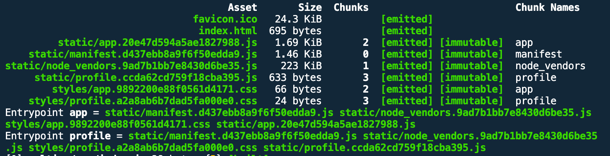


It was hard work, but it was worth it. Now, we are better prepared for cache busting.

## Conclusion

Performance optimization is a complicated matter. webpack makes the complicated a little less complicated.

The key to integrate performance optimization into your project is to understand some basic concepts, such as tree shaking, code splitting, or cache busting. Sure, webpack is an opinionated module bundler, but with a good understanding of the underlying principles, it is easier to work with the webpack documentation and achieve the desired performance goals.

This guide focus mainly on performance optimization techniques regarding JavaScript. Some HTML was also included with the `HtmlWebpackPlugin`. There are more areas that could be covered, such as optimizing styles (e.g., CSS-in-JS, critical CSS) or assets (e.g., brotli compression), but that would be the subject of another article.

