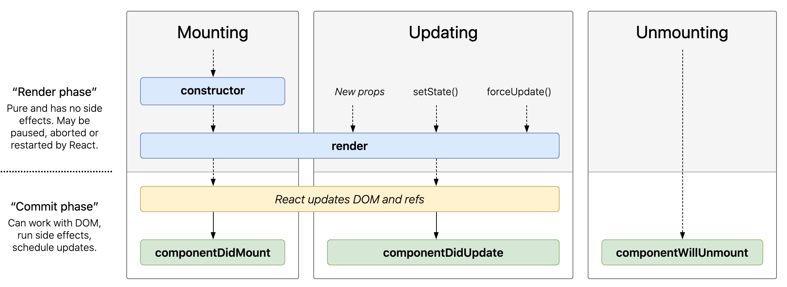
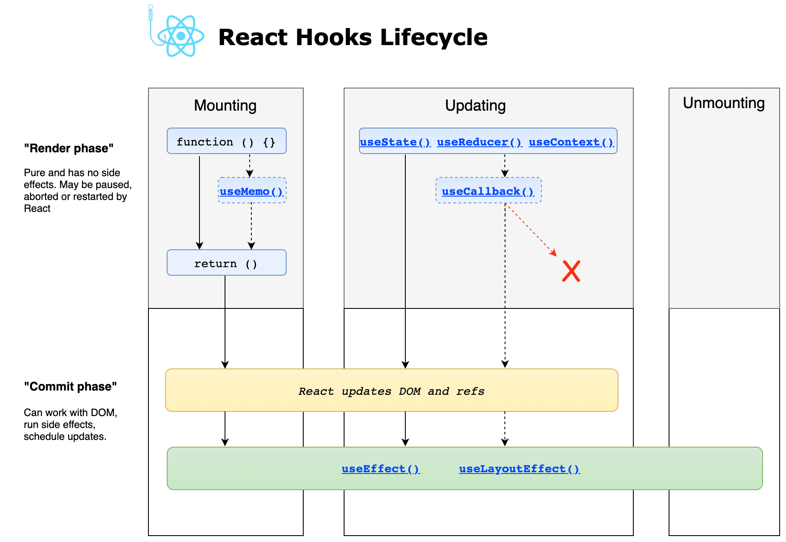
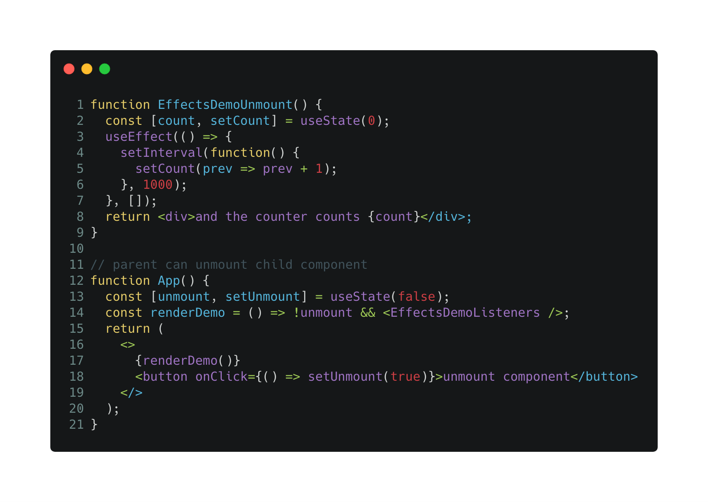
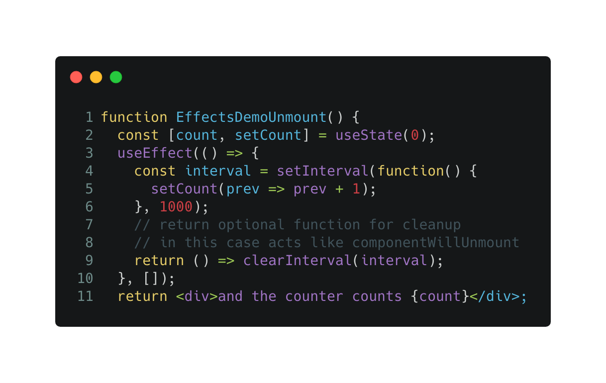
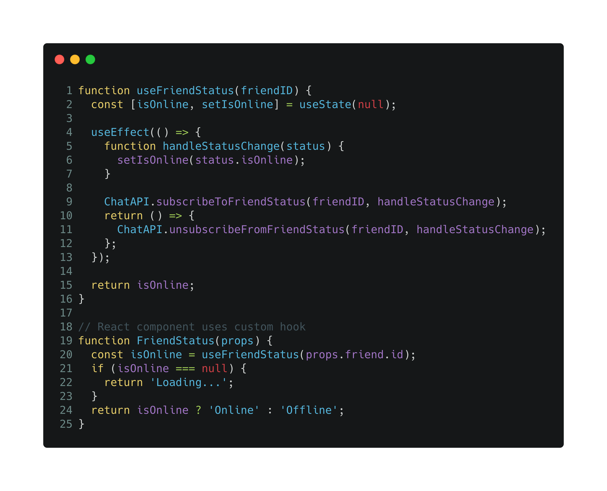

<!-- _Originally published at [blog.logrocket.com](https://blog.logrocket.com/guide-performance-optimization-webpack/)_ -->

<!--
- Beispiel mit animated gifs (console.logs zeigen bzgl. render, useEffect calls)
- mit verschiedenen Kontexten wie z.B. state/props/context ändern sich
- Diagramme zeichnen allgemein
- Diagramm (instance diagram) zeichnen
- Diagramme mit tool von Dan / von React Kurs
-->

Understanding how _useEffect_ works is one of the most important skills for mastering React. Especially, if you have been working with React for several years, it is key to understand how working with _useEffect_ differs from working with lifecycle methods of class-based components.

## Invoke side effects   

With _useEffect_ you invoke side effects, which is an important concept to understand in the React hooks era.

Examples for side effects are:
- fetch data
- read from local storage
- register and deregister event listeners

With _useEffect_ there are similar things possible as with lifecycle methods of class-based components. This [interactive diagram](https://projects.wojtekmaj.pl/react-lifecycle-methods-diagram/) shows in which React phases which lifecycle methods are executed.

But side effects part of functional components are not equivalent to lifecycle methods belonging to class-based components. I will go into the various differences in more detail later.

In contrast, the next [diagram](https://wavez.github.io/react-hooks-lifecycle/) shows how things work with functional components. In this article, we focus on _useEffect_ only.

<!-- dieser Hinweis hier schon? -->
If you are new to React, I would recommend to ignore class-based components and lifecycle methods and instead learn how to develop functional components and how to decipher the powerful possibilities of effects.

The whole process may be hard to understand at first, but we'll look at the different parts bit by bit, so you'll have a complete understanding in the end.

<!-- Hinweis auf Dans Artikel -->

## tldr; _useEffect_ lifecycle at glance

This section describes the control flow of effects very briefly. The following steps are carried out for a functional React component if at least one effect is defined.

1. Based on a state, prop, or context change, the component will be rerendered.
2. If one or more _useEffect_ declarations exist for the React component, for each _useEffect_ it is checked whether the conditions are fulfilled to execute the implementation (the body of the callback function provided as first argument). In this case conditions mean that one or more dependencies have changed since the last render cycle. Dependencies are array items provided as the optional second argument of the _useEffect_ call. Array values need to be from the component scope (i.e., props or state). 
3. After execution of every effect, scheduling of new effects occurs based on every effect's depenencies. If an effect does not specify a dependency array at all, it means that this effect is executed after every render cycle.
4. This is an optional step for every effect if the body of the _useEffect_ callback function (first argument) returns a so-called cleanup callback function. In this case, the cleanup function gets invoked before the execution of the effect beginning with the second scheduling cycle. This also means, if there is no second execution of an effect scheduled, the cleanup function is invoked before the React component gets destroyed.

I am quite sure that this life cycle will not be completely clear to you if you have little experience with _useEffect_. That's why I explain every single aspect in great detail throughout this article.

## blub

This may sound strange at first, but effects defined with _useEffect_ hooks are invoked after _render_. 

## Rules of hooks

This is not exclusive to the _useEffect_ hook but it's important to understand at which places in your code you can define effects. You need to [follow rules to use hooks](https://reactjs.org/docs/hooks-rules.html):

1. Hooks can only be invoked from the top level function constituting your functional React component.
2. Hooks may not be called from nested code (e.g., loops, conditions, or another function body).
3. However, custom hooks are special functions and hooks maybe called from the top level function of the custom hook. In addition, rule 2 is also true.

There exist a handy _ESLint plugin_ that assists you to follow the rules of hooks. It let's you know in case you violate one of the rules. In addition, it helps you to provide a correct dependency array for effects. Be aware, the assistance is based on static code analysis and, thus, might be ...

<!-- könnte falsch liegen. Link für Beispiel, wo falscher Vorschlag existiert 
todo link auf plugin
todo aktueller screenshot von Hilfe des Plugins
-->

<!-- 
hier schon auf ESLint Plugin eingehen?
-->

## The correlation with lifecycle methods of class-based components

If you are a new React developer and don't have to work on a legacy React project, I recommend to skip this section at all and just focus on functional React components and the _useEffect_ hook. However, be free to come back later to get a broader understanding of React. 

<!-- Hinweis classes sind nicht tot -->

<!-- 
Kapitel "Pendants zu component life cycles. Hinweisen auf Dans Artikel bzw., dass das Mindset ggf. nicht förderlich ist

Allows abstracted access to React's lifecycle methods within functional components. You won't call the individual lifecycle methods by name, but you gain similar control with more functionality and cleaner code.
https://reactjs.org/docs/hooks-effect.html
Note how we have to duplicate the code between these two lifecycle methods in class.
This is because in many cases we want to perform the same side effect regardless of whether the component just mounted, or if it has been updated. 

Conceptually, we want it to happen after every render — but React class components don’t have a method like this. We could extract a separate method but we would still have to call it in two places.
unlike componentDidMount / componentDidUpdate: Effects don’t block the browser from updating the screen (are asynchrounous). This makes your app feel more responsive. 
The majority of effects don’t need to happen synchronously. In the uncommon cases where they do (such as measuring the layout), there is a separate useLayoutEffect Hook with an API identical to useEffect.

useEffect is NOT an Equivalent to Lifecycle Methods

Keep in mind that the mental model for effects is different from componentDidMount and other lifecycles, and trying to find their exact equivalents may confuse you more than help.
— Dan Abramov

Unterschied zu class lifecycle methods
Effekte (mit useEffect) werden asynchron ausgeführt
Lifecycle Methoden werden synchron ausgeführt

-->

### Utilize cleanup functions

The next snippet shows a "constructed" example to demonstrate a problematic issue.

The code implements a React component representinug a counter that increases a number every second. The parent component renders the counter and allows to "destroy" the counter by clicking on a button. Take a look at the video what happens if the user clicks on that button.

The child component has registered an interval that invokes a function every second. However, the component was destroyed without unregistering the interval. After the component was destroyed the interval is still active and wants to update the component's state variable (_count_) that does not exist anymore.

The solution is to unregister the interval right before unmount. This is possible with a cleanup function. Therefore, you have to return a callback function inside the effect's callback body (line 9).

I want to emphasize that cleanup functions are not only invoked before destoying the React component. An effect's cleanup function gets invoked every time right before the execution of the next scheduled effect. 

The next example is from the official React documentation. The defined _useEffect_ is called after every render cycle since it does not define any dependency array.

